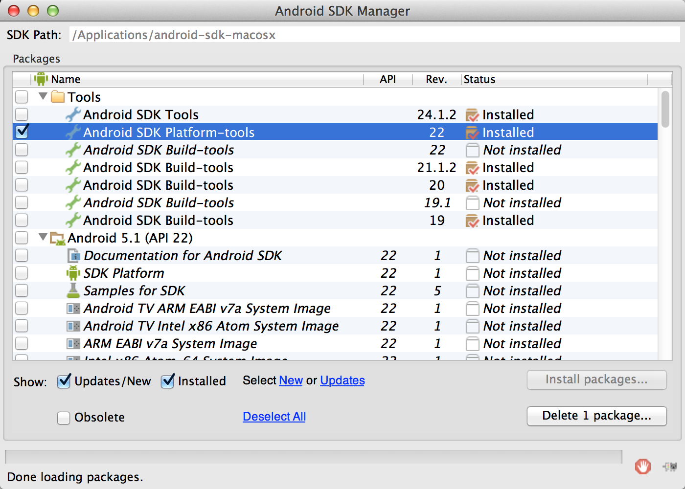

# Android Platform Tool

スマホにアプリをインストールするための「Android SDK Platform-tools」が必要となります。Android Studioをインストールして、SDK Managerによって、取得が可能です。

http://developer.android.com/sdk/index.htmlからインストールファイルを取得します。

ダウンロードの利用規約に同意します。チェックボックスにチェックを入れて下さい。ダウンロードボタンが有効になります、ダウンロードを開始します。

ダウンロードしたファイルをクリックして、インストールを開始します。Applicationsフォルダに登録します。

Android Studioを起動して、右下のNextボタンをクリックして、License Agreementの画面が表示されます。

右下のAcceptの同意をクリックします。

必要なファイルがダウンロードされます。

Welcome画面が開きます。SDK Managerをクリックします。

ToolフォルダのAndroid SDK Platform-toolsにチェックを入れます。他の項目のチェックは外してください。ダウンロードを開始します。

Android SDKのPlatform-toolsがインストールされます。adbファイルがあることを確認します。android-sdkのインストールフォルダの配下の platform-toolsのadbです

~/Library/Android/SDK/platform-tools

