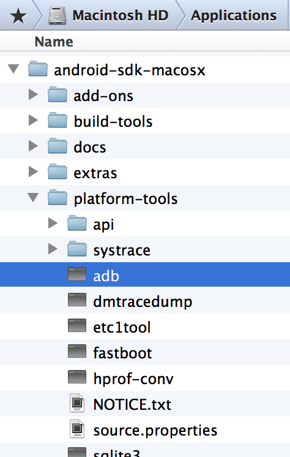

# デバイス用にビルド
CoronaSDKはiOS/Android をターゲットとしたマルチプラットフォームアプリケーション開発のためのSDKです。 iPadやiPhone、iPod touch、AndroidスマートフォンやAndroidタブレット、Kindle等の機器で動作するアプリのバイナリファイル(アプリが配布できる状態にしたファイル)を作成します。

##ビルド
アンドロイドのビルドを実行してみます。Corona Simulatorから File > Build > Androidを選択します。

ビルドダイアログが開きます。Save to Folderの箇所にバイナリファイルが生成されます。下記の設定では、Desktop(デスクトップ）となります。右下のBuild(ビルド)ボタンをクリクします。

Androidアプリの生成が開始されます

完了のダイアログです。Show in Finderのボタンをクリックすると、ビルドしたバイナリファイルのフォルダが開きます。

デスクトップにhelloworld.apkファイルが生成されています。

ターミナル(terminal)アプリを起動します。

Android SDKのPlatform-toolsのadbを使用します。android-sdkのインストールフォルダの配下の platform-toolsのadbです

adbをドラッグしてターミナルにドロップします。

Mac ユーザは、 Applicationsのandroid-sdk-macosxフォルダの中、または Library/Androidの中に入っています。

~/Library/Android/SDK/platform-tools/adb
または
/Applications/android-sdk-macosx/platform-tools/adb

Windowsユーザの場合は、デフォルトで下記のProgram Filesフォルダの中に入っています。

C:¥Program Files (x86)¥Android¥android-sdk¥platform-tools/adb.exe

ターミナルのadbの次にinstallと入力します

デスクトップのビルドしたアプリのバイナリファイルを選択して、ターミナルにドロップします。

ターミナルに以下のコマンドが設定されます。
~/Library/Android/SDK/platform-tools/adb install /Users/ymmtny/Desktop/helloworld.apk

アンドロイドのスマホをUSBでパソコンに接続して、ターミナルで
上記のコマンドを実行（ENTER)キーで開始します。デバイスにアプリがインストールされます。
