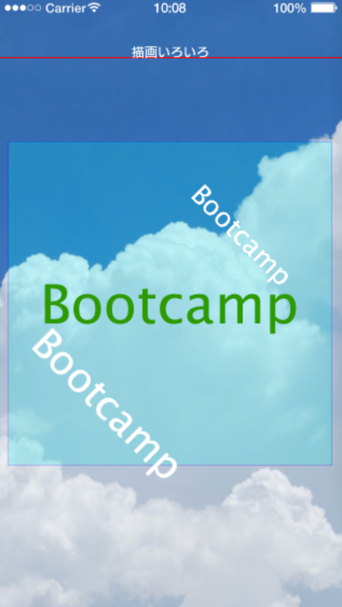

# 描画
文字以外の画像や線、四角形などを描画します。

この画像をダウンロードします。


#### newImage(ファイル名)
下記のコードで画像を表示します。背景画像となります。
```
local cloud = display.newImage("cloud.jpg")
cloud.x, cloud.y = _W/2, _H/2
```
６行目に記述します。


#### display.newLine(x1,y1, x2,y2)
#### setStrokeColor(赤,緑, 青, 透過率)
下記のコードで赤い線を画面上部に描画します。
```
local line = display.newLine(0, _H*0.1, _W, _H*0.1)
line.strokeWidth = 2
line:setStrokeColor(1,0,0)
```

線の上に文字を表示してみます。
```
local text = display.newText("描画いろいろ", _W/2, line.y-12, native.systemFont,24)
```


#### display.newRect(x, y, 幅, 高さ)
下記のコードで四角形を表示します。
```
local rect = display.newRect(_W/2, _H/2, 600, 600)
rect:setFillColor(0,1,1,0.2)
rect.strokeWidth = 2
rect:setStrokeColor(0,0,1,0.2)
```



#### newRoundedRect(x, y, 幅, 高さ, 半径)
角が丸い四角形に書き換えます。
```
local rect = display.newRoundedRect(_W/2, _H/2, 600, 600,10)
rect:setFillColor(0,1,1,0.2)
rect.strokeWidth = 2
rect:setStrokeColor(0,0,1,0.2)
```


#### newCircle(x, y, 半径)
```
local circle = display.newCircle(_W/2, _H/2, 300)
circle:setFillColor(0,0,1,0.2)
```

