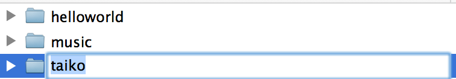
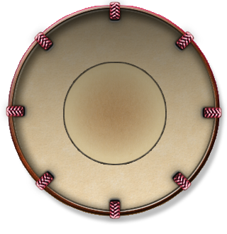
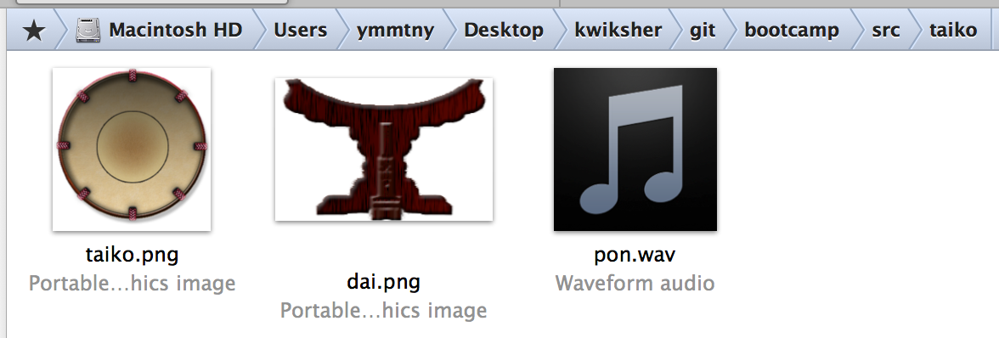
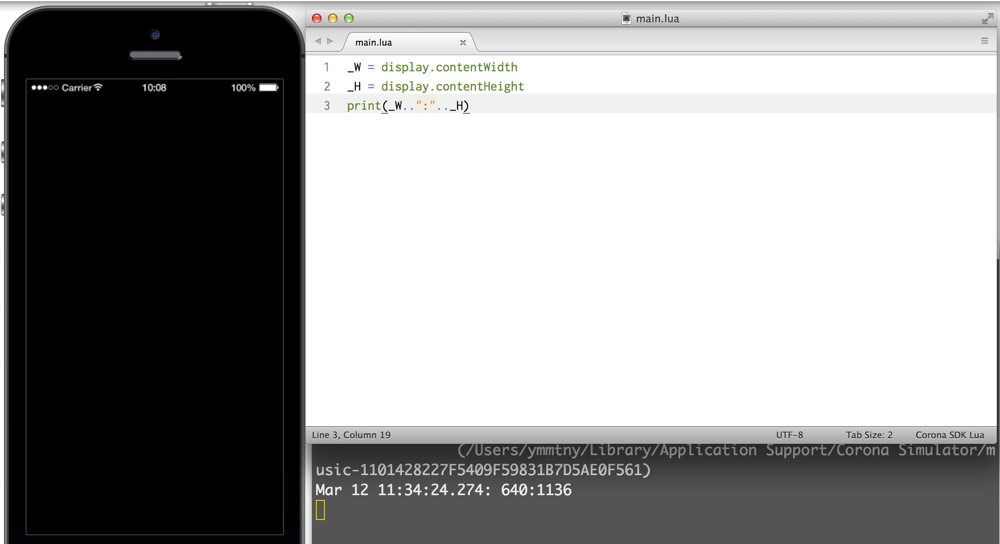
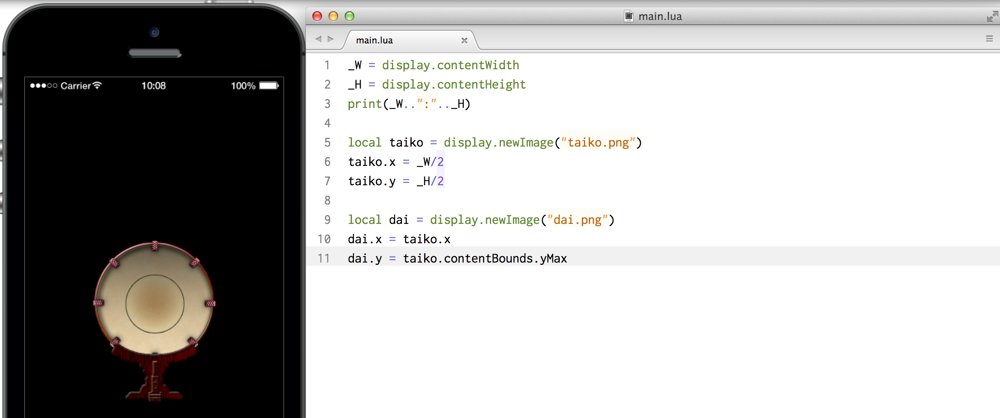
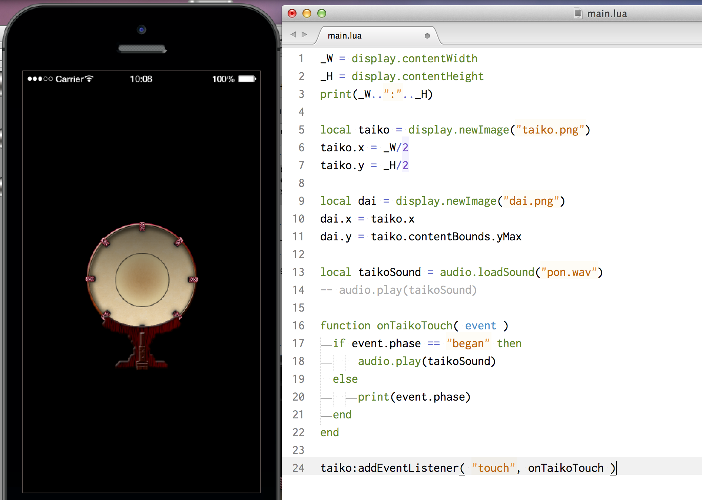

# イベント
指で画面に触れたときのタッチイベントを使って、音を鳴らしてみます。

新しい taikoというフォルダを作成して、main.luaを新規にsublime3で準備します。



下記のdai.pngとtaiko.pngとpon.wavをダウンロードして、taikoフォルダに格納します。



<a href="img/pon.wav" > pon.wav </a>




画面サイズを取得します。
```
_W = display.contentWidth
_H = display.contentHeight
print(_W..":".._H)
```


taiko.pngとdai.pngを表示します。taikoの領域(contentBounds)を取得して、daiのy座標を設定します。
```
local taiko = display.newImage("taiko.png")
taiko.x = _W/2
taiko.y = _H/2

local dai = display.newImage("dai.png")
dai.x = taiko.x
dai.y = taiko.contentBounds.yMax
```




pon.wavの再生をしてみます。
```
local taikoSound = audio.loadSound("pon.wav")
audio.play(taikoSound)
```

#### addEventListener(イベント名, 関数)
タッチイベントを取得する関数を用意します。
```
function onTaikoTouch( event )
    print(event.name)
end
```

この関数をaddEventListenerを使いtaikoに関連付けます。

```
taiko:addEventListener( "tap", onTaikoTouch )
```

onTaikoTouch(event)の中で、音を再生します。指が触れると音が再生します。audio.play(taikoSound)を追加します。
```
function onTaikoTouch( event )
    print(event.name)
    audio.play(taikoSound)
end
```

#### tapとtouch
上記のtaiko:addEventListener( "tap", onTaikoTouch )の"tap"を"touch"に変えてみましょう
touchでサウンドが3回再生されるようになります。touchは、began, move, endedの３つイベントを通知するためです。

* began タッチが開始されたタイミングで通知されます。
* move 画面で指がタッチされたまま移動した状態を通知します。う
* ended タッチが終了したときに通知されます。

#### if then else end
上記のbegan, move, endedを区別するために条件節を使用します。beganのときだけ、taikoSoundを再生するようにします。tapのときに比べて、再生のタイミングが瞬時になります。
```
function onTaikoTouch( event )
  if event.phase == "began" then
    -- 処理
    audio.play(taikoSound)
  else
    -- 処理
    print(event.phase)
  end
end
```

最後に1.5 Building for deviceの章にあるように、スマホで太鼓を鳴らせてみましょう。


