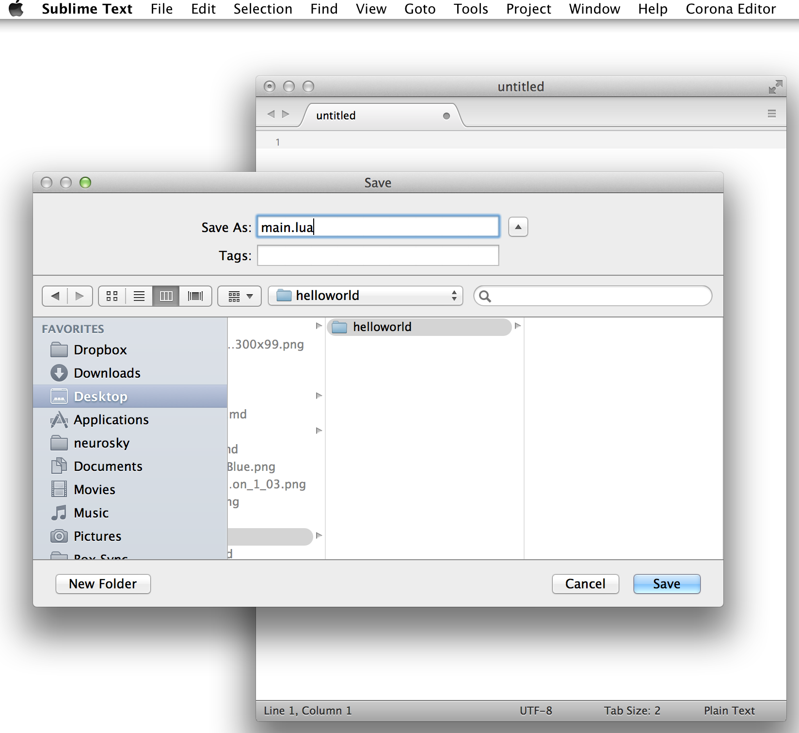
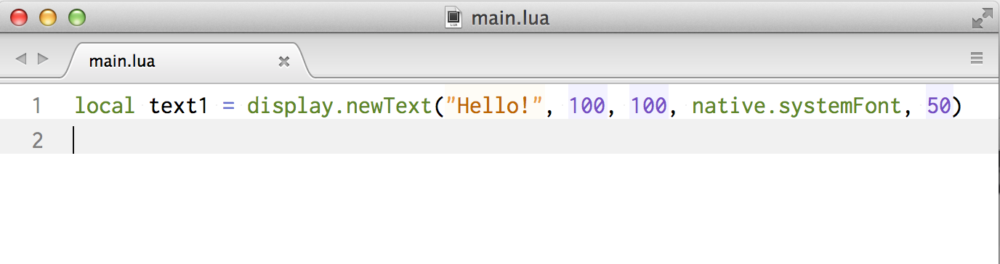
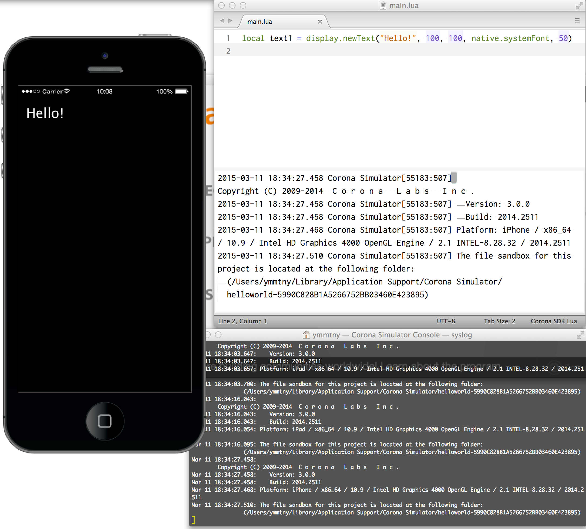
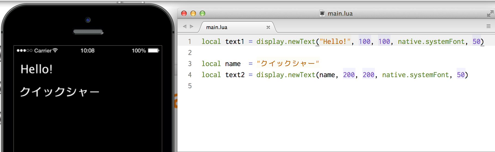

# HelloWorld
最初のCorona アプリを作ります。

Sublime Textで新規ファイルとして、main.lua という名称のファイルを作成します。helloworldというフォルダも新規作成し、その中にmain.luaを作成します。


main.luaファイルに下記の Hello! を表示するコードを入力します。

Hello!という文字列を座標(100,100)に、スマホのフォント(native.systemFont)を使用して、文字サイズ 50ポイントで表示します。
```
local text1 = display.newText("Hello!", 100,100, native.systemFont, 50)
```



マックでは、command + Bのショートカットでビルドします。
ウィンドウズでは、ctrl + Bとなります。
Corona Simulatorが起動します。


もう一行追加してみましょう。name 変数に"クイックシャー"を設定して、display.newTextに設定します。ファイルを保存します。マックでは、command + Sがショートカットキーです。ウィンドウズでは、Ctrl + Sです。

