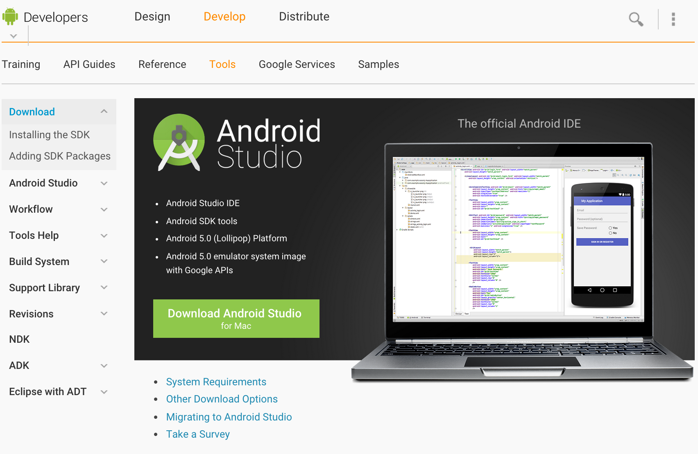

# Install

### 事前準備 - アップル開発者プログラム
作成したバイナリファイルをiPhone/iPadのアプリとして公開するためには、Apple Developer Program(年間契約　11,800円 )の契約が必要です。公開せずに、開発・テストといったプライベートな目的の場合には、年間契約は不要に2015年に規約が変更されました。開発・テストに使用するiPhone/iPad(デバイス)を予め開発者サイトにログインして、登録しておきます、また署名ファイルやプロビジョニングファイルを用意する必要があります。

Apple Developer Program
　https://developer.apple.com/jp/programs/ios/

※iPhone/iPadのアプリのビルドは、アップル社のMacコンピュータが必要です。Windowsマシンでは行うことはできませんので、WindowsでCorona SDKを使用している方は、Androidのアプリのビルドのみしか行えません。

※Androidアプリをビルドするには、特に開発者登録は必要はありません。しかし、アプリをGoogle Playのマーケットに登録する場合は、Googleの開発者登録を行う必要があります。

またスマホにアプリをインストールするための「Android SDK Platform-tools」が必要となります。

* http://developer.android.com/sdk/index.html

