# Corona SDKのインストール
CoronaSDKのインストールパッケージはCorona Labs社のホームページからダウンロードします。 ブラウザを起動して、アドレスバーに下記のURLを入力しCorona Labs社のホームページを開きます。

http://www.coronalabs.com/

1."DOWNLOAD NOW"ボタンをクリックします。
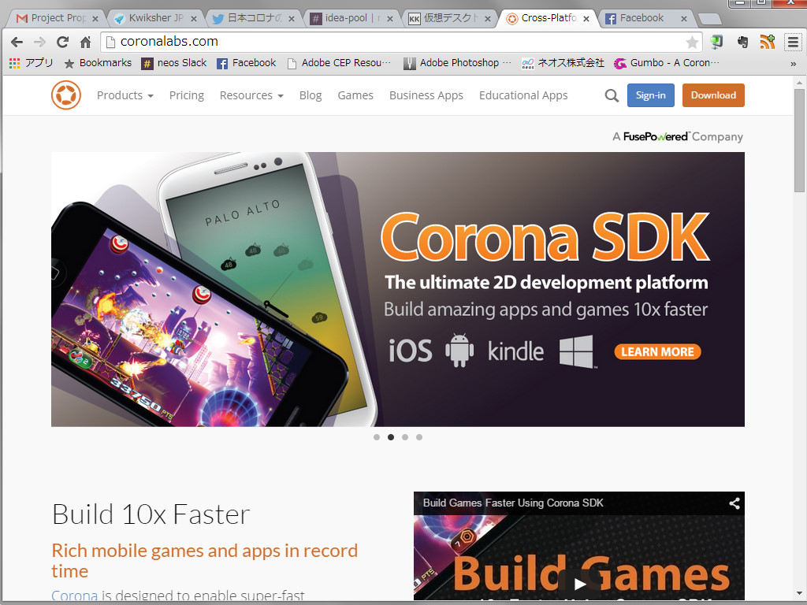

2.アカウントを新しく作成するには右の欄の"Register"の項目のメールアドレスやパスワードを入力して、利用規約に同意のチェックをいれて、Continuteボタンをクリックします。
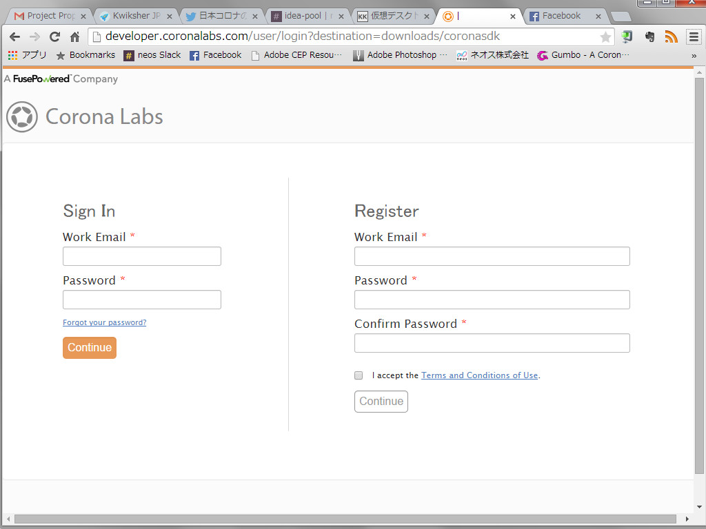

3.入力例は以下です。
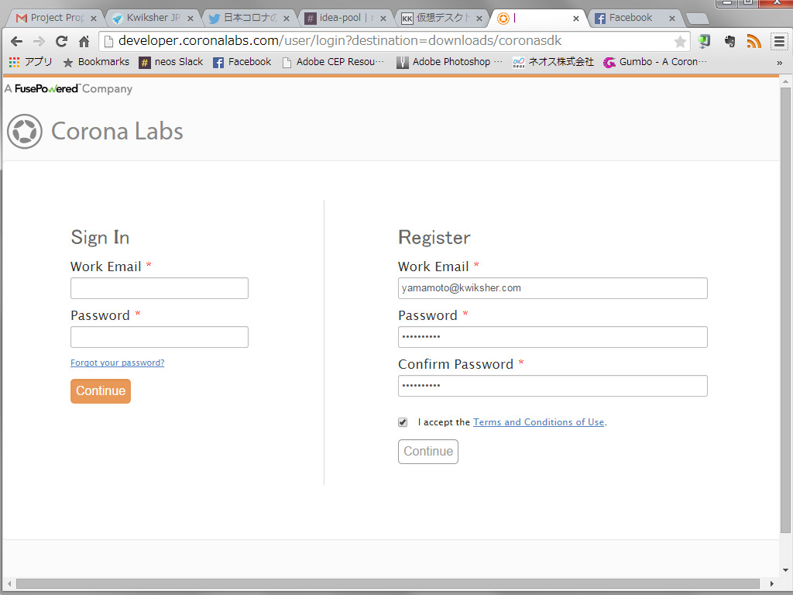

4.アカウントが作成されて、ダウンロードページが開きます。Downloadボタンをクリックするとダウンロードが開始されます。
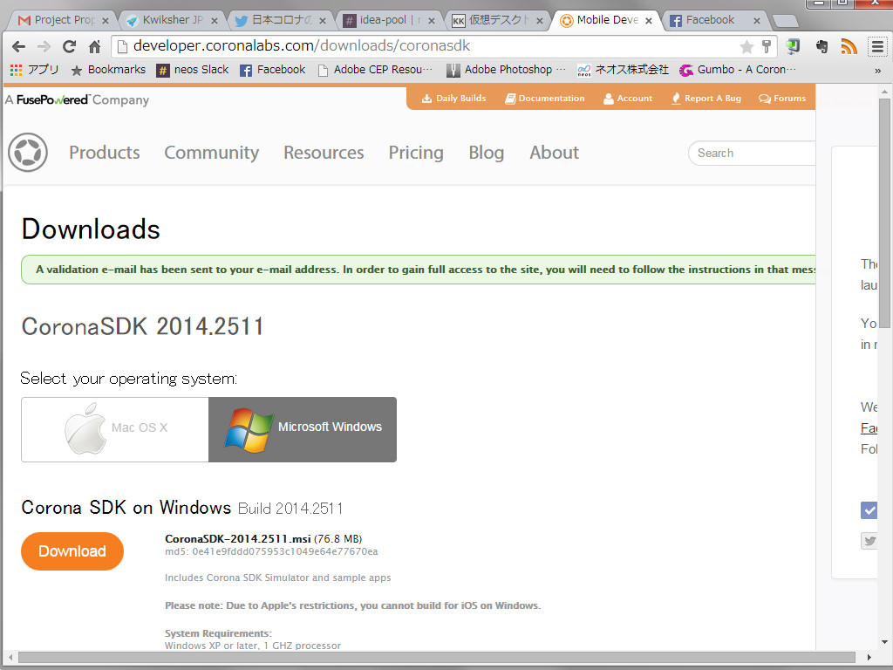

# Corona SDK のインストール (Win)
1.Windowsの場合ですと、CoronaSDK-2014.2511.msiというファイルがダウンロードされます。Macの場合は、CoronaSDK-2014.2511.dmgファイルとなります。
ダウンロードされたインストールファイルをクリックするとインストールが開始されます。

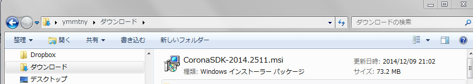

2.インストラーが起動します。Nextボタンをクリックしてください。

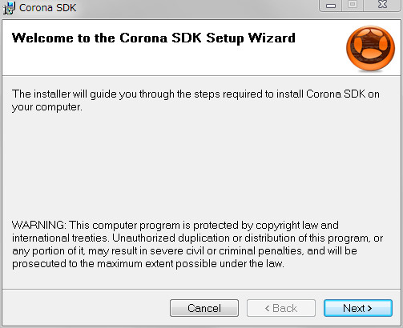

3．利用規約に同意します。I Agreeを選択して、Nextボタンをクリックします。

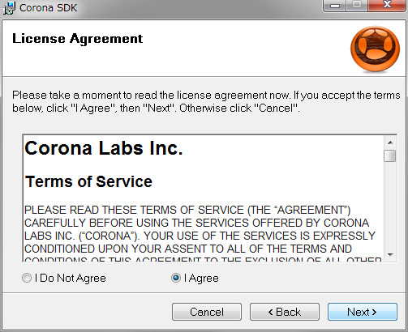

4.インストール先のフォルダは、標準の場所をお勧めします。Windowsでは、C:\Program Files (x86)\Corona Labs\Corona SDKとなります。Macでは　Applcations/Corona Labs/Corona SDKとなります。Nextをクリックしてください。

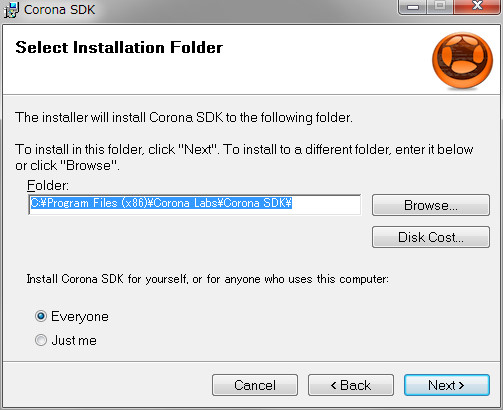

5.インストールの準備ができましたので、Nextをクリックしてインストールを行います。

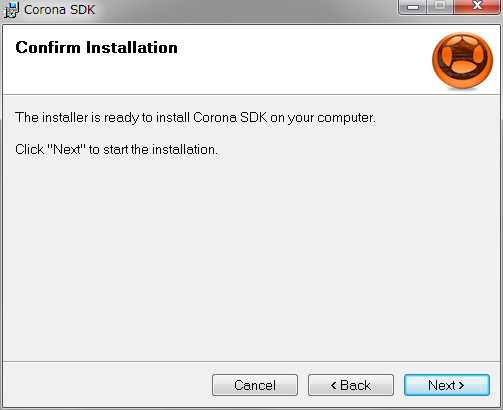

6．ファイルがコピーされます。
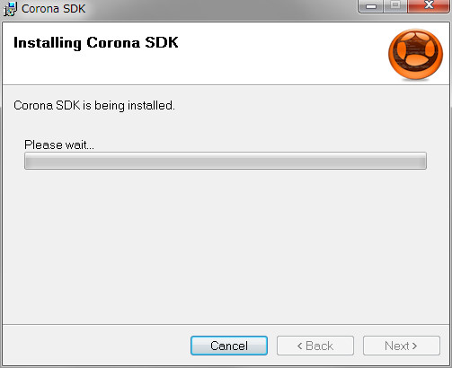

7．完了です。Closeボタンをクリックして終了してください。
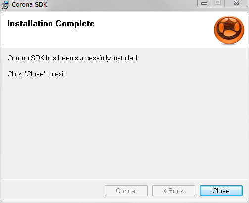

8.アプリケーションの一覧から、Corona SDK >Corona Simulatorを選択して起動します。
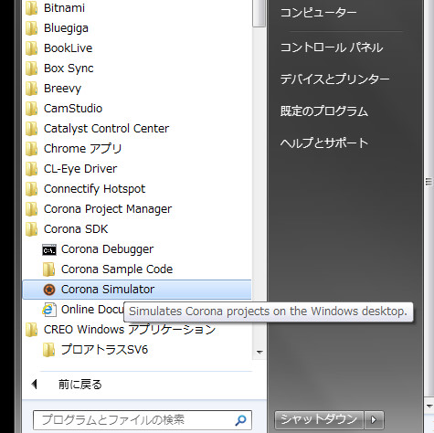

9.起動直後の画面。右のSampleをクリックしてみましょう。
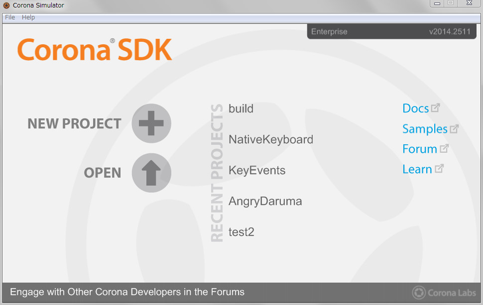

10.サンプルの選択画面が表示されます。3段目のClockを選択してみます。
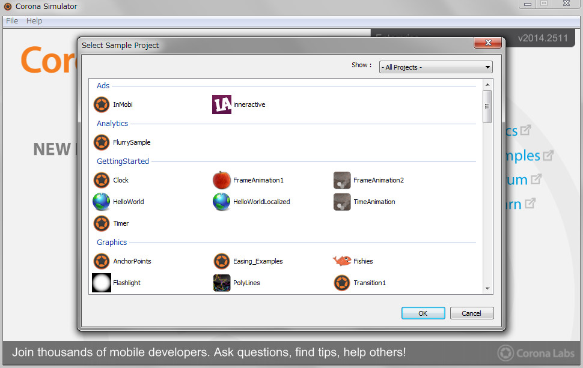

11.時計アプリが起動します。メニューからView > View Asを開くと、様々なデバイスの一覧が表示されます。選択されたデバイスのシミュレータ画面となります。iPhone6を選択してみます。
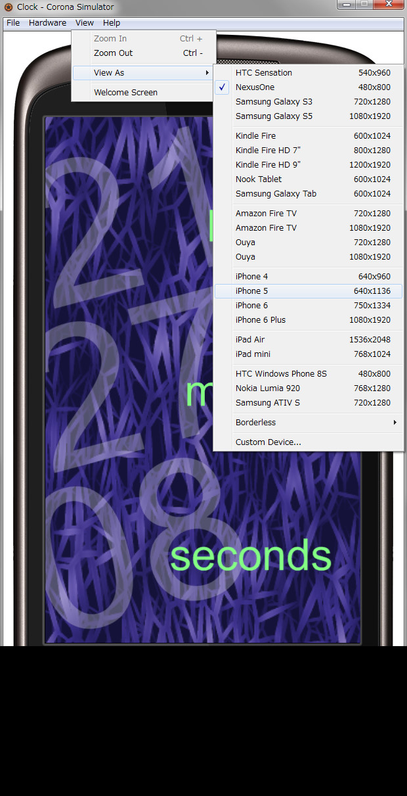

12.iPhone6の画面となりました。

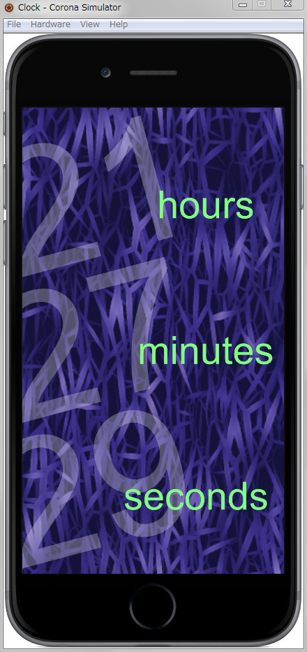

# Corona SDK のインストール (Mac)
1.ダウンロードした"CoronaSDK...dmg"をダブルクリックします。
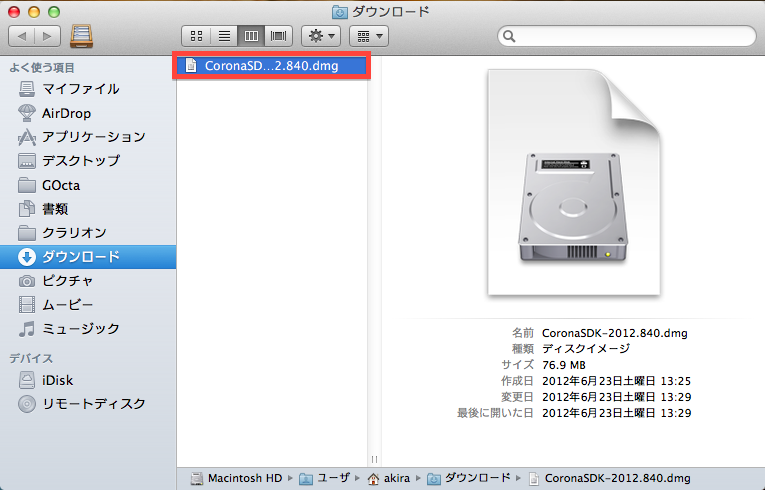

2.使用許諾契約書を読み、"Agree"ボタンをクリックします。
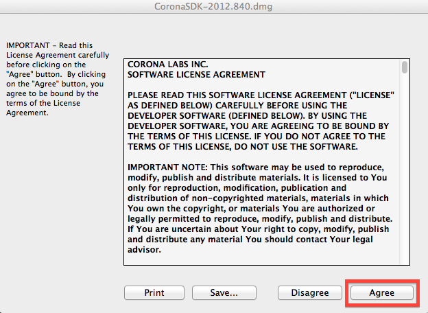

3.オレンジ色のCoronaSDKフォルダのアイコンを水色のアイコン（アプリケーションフォルダ）の上にドラッグします。
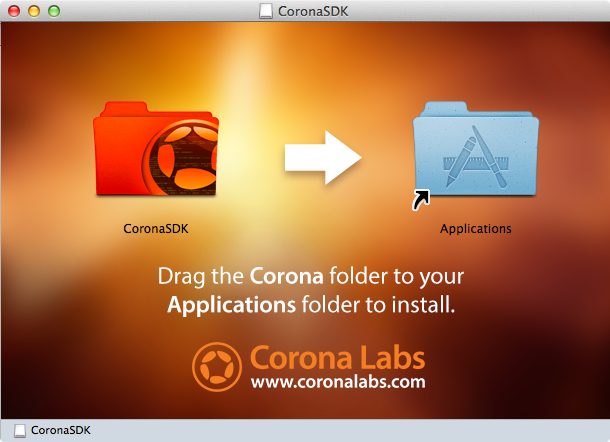

4.アプリケーションフォルダにCoronaSDKのオレンジ色のフォルダが表示されていることを確認します。
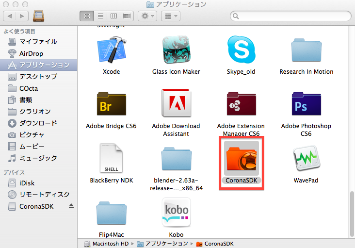

5.アプリケーションフォルダのCoronaSDKのオレンジ色のフォルダをダブルクリックします。

6.Corona Simulatorのアイコンをダブルクリックします。
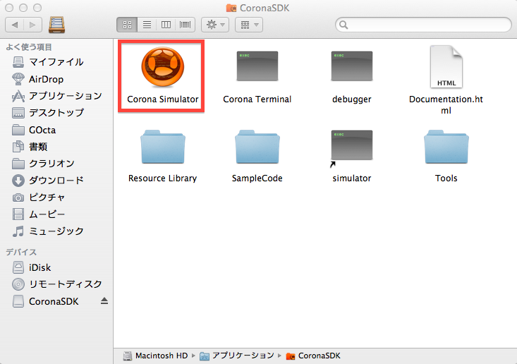

7."開く"ボタンを選択します。
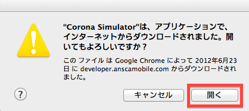

8.この画面が表示されたら成功です!

