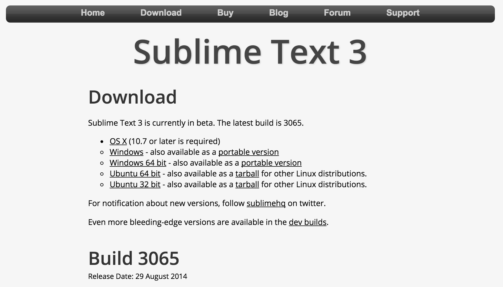
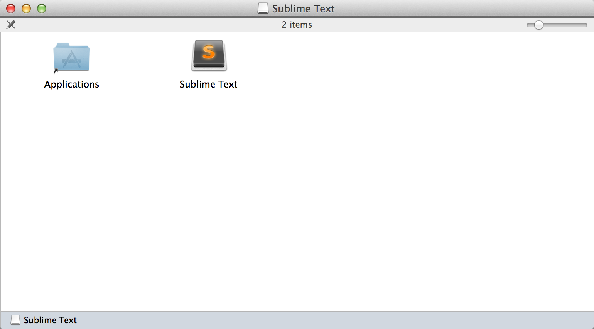
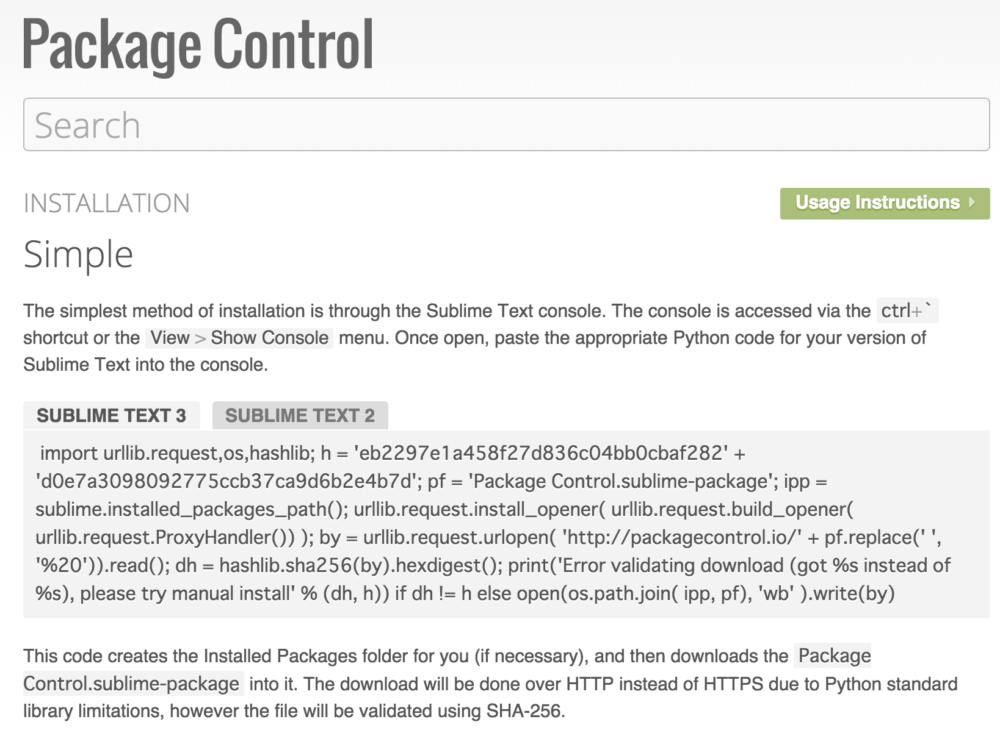
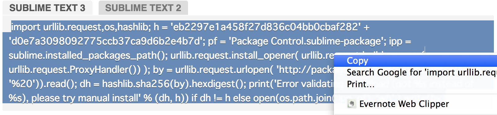
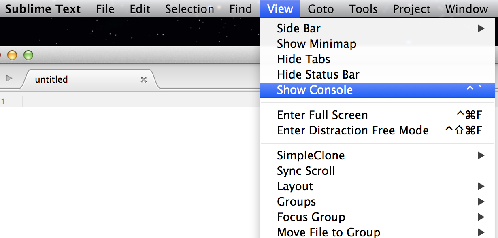
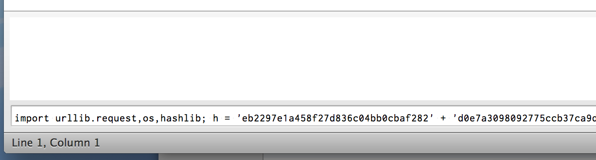
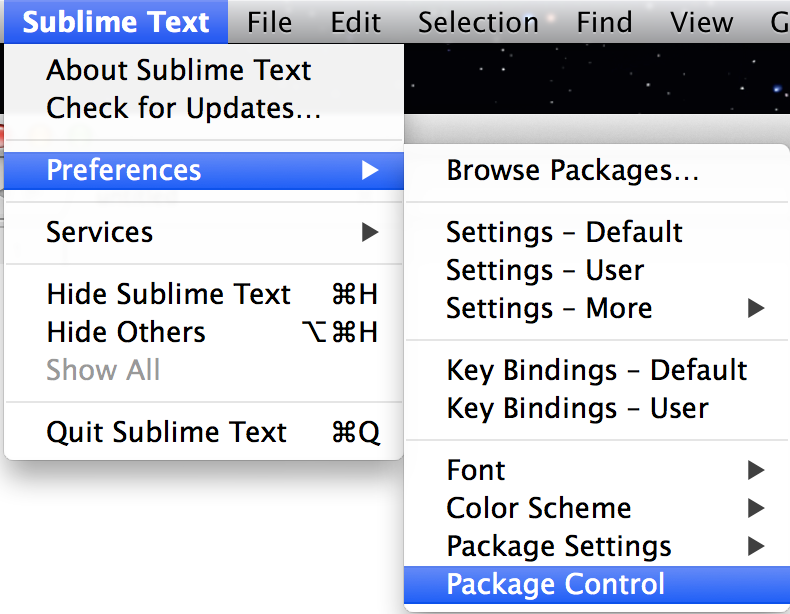
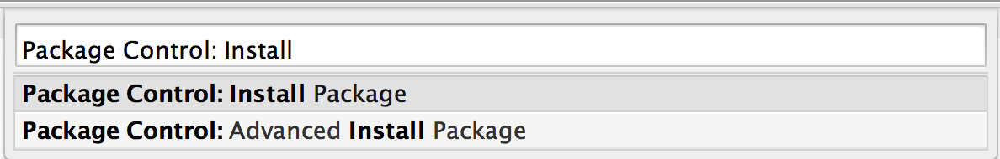
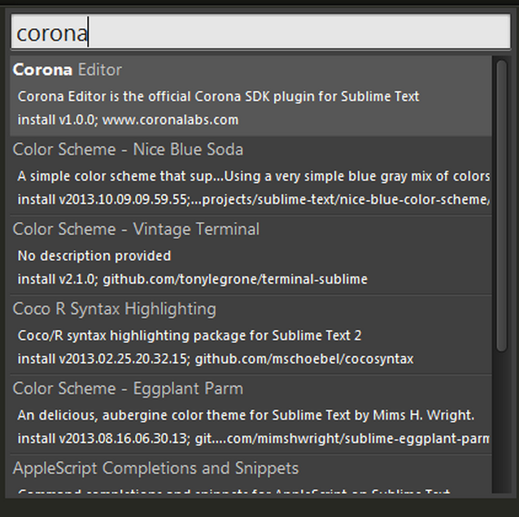
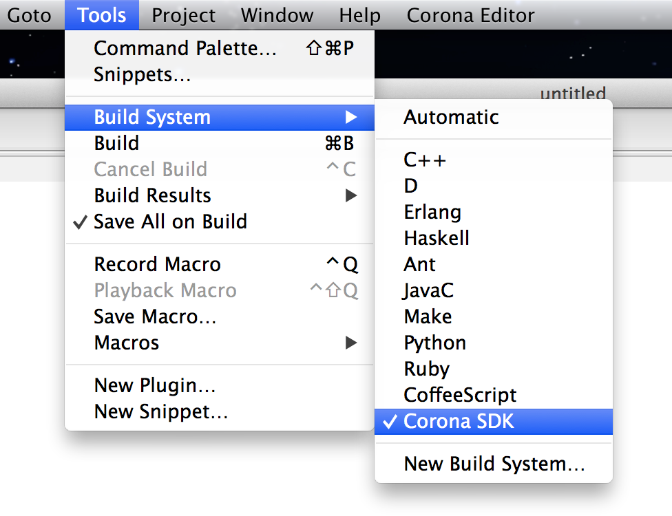

# SublimeとCorona Editorのインストール
Sublime version 3は、高機能なプログラミング用のテキストエディタです。複数カーソルやボックス選択機能、様々なプログラミング言語のマークアップ、コンソールアクセスなどがサポートされています。パッケージという拡張機能によって、Corona SDKためのCorona Editorが利用できます。

* Sublime3　 http://www.sublimetext.com/3
* パッケージ https://packagecontrol.io/installation

使用するパッケージ
* Corona Editor

Sublimeのダウンロードページからインストールファイルを取得します。

マックではダウンロードした .dmgファイルをクリックします。ApplicationsフォルダにSublime Textアプリを移動させます。

パッケージコントロールのサイトを開きます。https://packagecontrol.io/installation

Sublime3のパネルのコマンド文字列を選択して、コピーします。

Sublime3アプリのView > Show Consoleでコンソールを開きます。

コンソールにコマンド文字列をペーストして、実行します。

Sublime3を再起動して、パッケージコントロールが使用可能になります。Preferenes > Package Controlを開きます。

Installと入力して、パッケージのインストール画面を開きます。

Corona Editorと入力して、Corona Editorのパッケージをインストールします。

SublimeのTools Build SystemからCorona SDKが選択可能になります。

