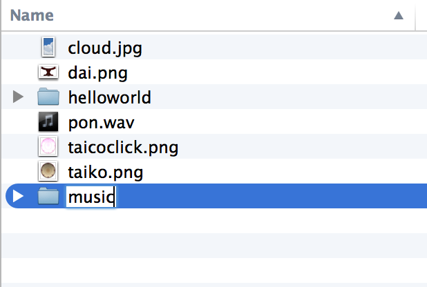
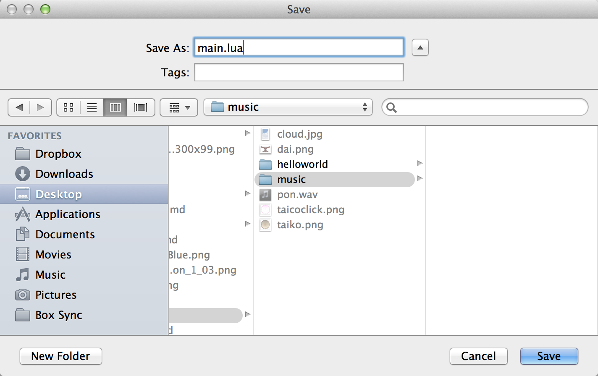

# 音再生
音を鳴らしてみましょう。関数も使ってみます。

新しい musicというフォルダを作成して、main.luaを新規にsublime3で準備します。





下記のtick.wavとbomb.wavをダウンロードして、musicフォルダに格納します。

<a href="img/tick.wav" > tick.wav </a>
<a href="img/bomb.wav" > bomb.wav </a>

#### audio.loadSound(ファイル）
tick.wavを指定して、下記のコードを記述して、サウンド再生の準備を行います。。
```
local tickSound = audio.loadSound( "tick.wav" )
```
#### audio.play(サウンド）
play関数で再生を行います。
```
local tickSound = audio.loadSound( "tick.wav" )
audio.play(tickSound)
```

bomb.wavも再生してみましょう。
```
local bombSound = audio.loadSound( "bomb.wav" )
audio.play(tickSound)
```
#### 関数とイベント
tick.wavの再生が終了したときに、bomb.wavを再生します。
サウンド再生が完了したときに、通知を受け取ります。通知を受け取るbomExplodeという関数を用意します。これをonCompleteに指定することで、tickSoundの完了に関連づけられることができます。

下記のコードを記述して実行してみましょう。

```
local bombSound = audio.loadSound( "bomb.wav" )
local tickSound = audio.loadSound( "tick.wav" )

local function bombExplode( event )
 print(event.name)
 audio.play(bombSound)
end

audio.play( tickSound, { onComplete=bombExplode } )
```

#### timer.performWithDelay(ミリ秒間隔, 関数, 回数)
タイマーでカウントを表示してみます。

5から０になる文字列として、counterを作成します。
```
local counter = display.newText("5", 100,100, native.systemFont, 50)
```

タイマーからの通知を受け取る関数counterTextを作成します。内部で、counter.textを１づつ引き算します。
```
local function counterText()
   counter.text = counter.text - 1
end
```

1000ミリ秒毎にcounterTextを呼び出します。5回呼び出した時点で終了します。
```
timer.performWithDelay( 1000, counterText, 5 )
```


参考
* http://soundbible.com/1258-Tick-Tock.html
* http://soundbible.com/1234-Bomb.html
* http://soundoftext.com/

