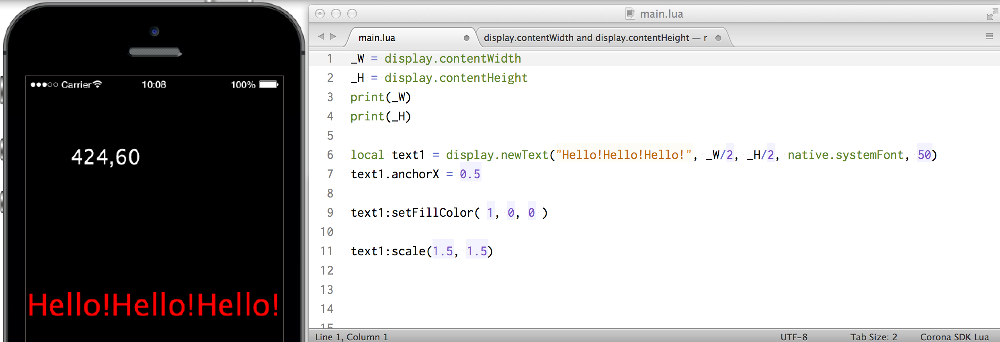

# Text properties
表示した文字列の色やサイズを変更してみます。

画面の横幅と縦幅を取得します。print関数でターミナルに値を出出力します。
```
_W = display.contentWidth
_H = display.contentHeight
print(_W)
print(_H)

ハイフン、マイナス記号を２つ -- を文の先頭に記述すると、コメントと認識されます。６−８行をコメントとして、実行させないようにしてみます。
```


_Wと_Hを使って、位置を指定します。画面の中央は、_W/2と_H/2となります。
```
local text1 = display.newText("Hello!Hello!Hello!", _W/2, _H/2, native.systemFont, 50)
```


anchorXに０を設定すると、文字の先頭が画面中央に位置します。
```
text1.anchorX = 0
```


anchorXに1を設定すると、文字の末尾が画面中央に位置します。
```
text1.anchorX = 1
```


anchorXに0.5を設定すると、文字の中央が画面中央に位置します。
```
text1.anchorX = 0.5
```


text1の領域(contentBounds)を取得します。座標(xMin, yMin)は領域の左上隅となります。右下隅は(xMax, yMax)となります。xMinの値をtext2に表示してみます。
```
text2.text =text1.contentBounds.xMin
```
text2に108と表示されました。


text1のwidth(幅）とheight(縦）をtext2に表示します。文字列の連結を行って、表示します。
```
text2.text =text1.width..","..text1.height
```


text1に色を設定します。R, G, Bの値をそれぞれ 0-1.0の範囲で指定します。
```
text1:setFillColor( 1, 0, 0 )
```


スケールで表示サイズを変更します。x方向とy方向に1.5倍の拡大を行います。
```
text1:scale(1.5, 1.5)
```



フォントサイズを変更します。
```
text1.size = 24
```


９０度回転させてみます。
```
text1.rotation = 90
```


上記のコードを参考に下記と同じ画面を作ってみましょう。


おまけ 余裕のある方は、下記のtransition関数も使ってみてください。
```
transition.to( text1 { time=1000, y=text1.y+100 } )
transition.to( text1 { time=1000, xScale=3.0, alpha=0 } )
transition.to( text1 { time=1000, rotation=360, onComplete= funtion() text1.text = "finished" end} )
```
