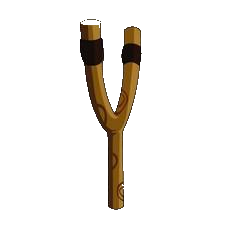
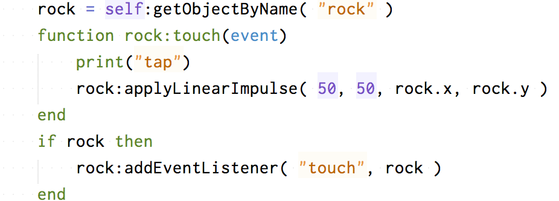

# Angry Daruma
Corona Simulatorで新規プロジェクトを作成します。Composer Sceneを選択して、名前をAngryDarumaとします。

下記の画像をDLして、作成したAngryDarumaのプロジェクトフォルダに入れます。

Composer GUIでscene1を開きます。下記のようなゲーム画面を作成します。

右のObject InspectorのパネルでPhysicsを選択します。

背景の sky.jpg以外を物理物体にします。Physics Enabledにチェックを入れてください。
Body Typeをクリックすると、Kinmatic, Static, Dynamicのタイプを設定するダイアログが表示されます。

- Kinematic:重力の影響を受けない物体です。
- Static:地面や壁といった固定された物体です。
- Dynamic:動的な物体です。

Edit Physics Bodyをクリックすると、物体の形を多角形で指定することができます。多角形は凸型にする必要があります。

左下の一覧画面から、画像のロックや表示・非表示のアイコンが利用可能です。各オブジェクトには、pile(柱)、daruma、rock(石)、catapult(発射台)といった名前を付与します。

### scene1.lua scene:show(event)
下記のコードをshow()関数の中に追加します。タッチしたときに、rockにapplyLinearImpulse関数で衝撃を与えて、(x方向の力，y方向の力)= (50, 50)の加速力で飛ばします。衝撃を与える位置は、(rock.x, rock.y)です。

### 元に戻す
画面をもう一度初期状態に戻すためには、ちょっとしたカラクリが必要です。地面をタップするとscene2を開き、Reloadingの表示を行い、 scene2でscene1を削除、再度開く処理を記述します。

scene1のscene:show()関数の中で、下記の地面（grass)をタッチしたときに、 gotoScene("scene2")する処理を追記します。

次にScene2を作成します。Composer GUIツールで scene2.ccsceneファイルを開き、Reloadingという文字だけの画面を作成します。

Scene2は、Reloadingの文字しか表示しませんので、余分なコードは削除することになります。show関数は下記のtimerのコードのみを含む形となります。

        timer.performWithDelay( 1000, function()
            composer.removeScene(composer.getSceneName( "previous" ))
            composer.gotoScene( composer.getSceneName( "previous" ))
            end)

- composer.getSceneName "current", "previous", または "overlay"を指定します。シーン名が返却されます。
- composer.removeScene シーン名を指定します。
- composer.gotoScene　　シーン名を指定します。

showとhide関数は下記となります。

以上
