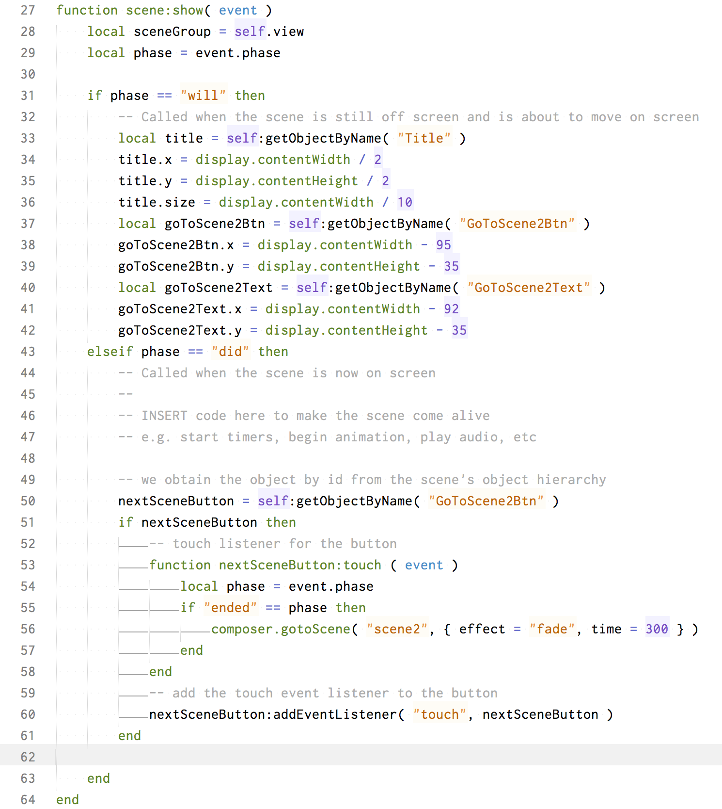

# Composer GUI
Corona Simulator (iOSのみ)に付随するComposer GUIを使用して、複数画面の作成方法を解説します。

### プロジェクトの作成
Corona Simulator > File > New Projectで新規プロジェクトを作成します。

Project Nameは helloGUIとして、Composer Sceneを選択します

helloGUIというフォルダを Desktopの直下に作成しました。

composer GUIのツールが開きます。ダイアログのOpen scene1.ccsceneをクリックします。これが画面１となります。このhelloGUIは画面１と画面２と画面３から構成されています。(
Chooseで画面２や画面３の .ccsceneファイルを開くことができます。)

compoer GUIとCorona Simulatorが開いた状態は下記です。

### Corona Simulator
下記のショートカットキーを試しながら、GUIツールのアイコンをクリックしたりしながら、GUIツールを触ってみましょう。

|ショートカット |	機能	|マウス
| -- | -- |--|
|Cmd+S	    |保存	|保存アイコン
|スペースキー	  |ハンドツールの切り替え|ハンドアイコン
|Cmd+C	    |コピー||
|Cmd+V	    |ペースト||
|Opt+Drag	  |複製の作成||
|Shift+Click	|複数選択	|ドラッグしながらクリック
|Cmd+Z	|取消し	|左周矢印
|Cmd+Shift+Z	|やり直し|右周矢印
|Cmd+(=)	|ズームイン|	Opt+２本指(前)
|Cmd+(-)	|ズームアウト|	Opt+２本指(後)
|Cmd+1	  |ズームを100%||
|Cmd+0	  |ズームデフォルト||

### lua コード
Composer GUIのツールボックス（上部）の{...}をクリックすると、luaファイルのコード編集が開きます。scene1.luaファイルを開くことで、なぜ GUI画面の表示とSimulator画面の表示が違っているのが理解できます。この新規作成したファイルは、サンプルプロジェクトとなっているために、scene1.luaファイルに予め、サンプルコードが記載されているためです。

scene1.ccsecneに対応した.luaファイルは、scene1.luaとなっており、このscene1.luaは main.luaのcomposer.gotoScene( "scene1" )から呼び出される仕組みとなっています。

下記のfunction scene:show( event )を見てみましょう。31行目のphase == "will"の中のコードは、 scene1が表示されようとするときに実行されます。43行目のphase == "did"の中のコードは、画面にすべてのパーツが表示されたときに実行されます。試しに33-42行目をコメント化してみましょう、 cmd+/ で実行しない状態にします。50-61行目を同様にコメント化すると、タッチ処理が無効となりますので、画面遷移が実行されません。

同様に function scene:hide(event)にも 70行目と75行目にphase == "will"とphase == "did"の条件節が存在します。78行目でremoveEventListener関数を実行して、タッチイベントの処理を削除している点に留意してください。scene:showでタッチイベント処理をaddEventListenerで追加していますので、画面が消えるときには削除しておく必要があります。削除しないとタッチイベント処理が毎回 event:showで新たに一つ増えてしまうことになり、不具合が発生します。

### クイズ作成
それでは簡単なクイズを作成してみましょう。各ボタンやテキストの名称を分かり易い単語にしましょう。書きの例ではNeco1, Neco2, Neco3とNeco1Rect, Neco2Rect, Neco3Rectとしました。RectはRectangleです。

scene1:show(event)関数の elseif phase == "did" thenの中のブロックを下記のコードに変更します。

scene1:hide(event)関数の elseif phase == "did" thenの中のブロックを下記のコードに変更します。

ボタンで移動した先のscene2とscene3は、それぞれ不正解と正解を表示するページとなります。「正解」をscene3に表示して、「不正解」をscene2に表示しましょう。

正解のscene3には、理由も付け足します。

### 画像を使用
scene1のテキストを猫の画像にしてみましょう。

上記の猫の画像ファイルを main.luaのあるフォルダ配下にダウンロードして保存してください。

GUIツールの右側に画像のサムネイルが表示されます。

サムネイルから画像をドラッグ＆ドロップして配置します。Shiftキーを押しながら、画像をリサイズすると、縦横比率が保たれます。

テキストやボタンの背景は削除して、猫の画像をNeco1, Neco2, Neco3と命名しました。scene1のNeco1Rect, Neco2Rect, Neco3Rectの部分もNeco1, Neco2, Neco3と修正します。

        neco1Button = self:getObjectByName( "Neco1" )
        neco2Button = self:getObjectByName( "Neco2" )
        neco3Button = self:getObjectByName( "Neco3" )

以上
