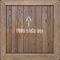
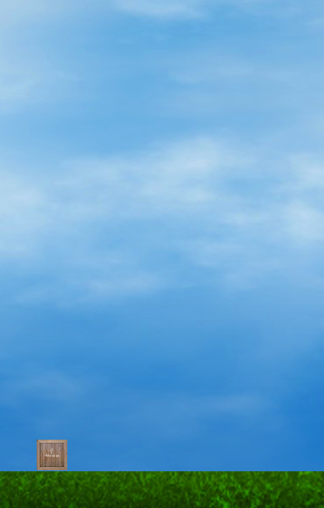

# HelloPhysics
物理アニメーションを行います。新たにphysicsというフォルダを作成して、main.luaを準備します。

sky.pngとground.pngとcrate.pngファイルをダウンロードして、physicsフォルダに格納します。




表示を行います。カンマ(,)を使用すると複数の代入を一行でおこなえます。例 sky.x, sky.y  =_W/2, _H/2

セミコロン(;)を使用すると、一行に複数のコードを記述可能です。 例 crate.x = _W/2; crate.y = 100;

```
_W = display.contentWidth
_H = display.contentHeight
print(_W..":".._H)

local sky = display.newImage( "sky.png" )
sky.x, sky.y  =_W/2, _H/2

local ground = display.newImage( "ground.png" )
ground.x = _W/2
ground.y = _H-50

local crate = display.newImage( "crate.png" )
crate.x = _W/2; crate.y = 100; crate.rotation = 5
```

#### start()
物理(physics)を導入します。physicsを開始(start)しておきます。
```
local physics = require( "physics" )
physics.start()

```

#### addBody(対象, タイプ, { friction=摩擦係数, bounce=反発係数, density=質量 } )

地面(ground)は、動かない静的なものであるので、静的(static)を指定します。

箱(crate)は、動的なものであるので、デフォルトの"dynamic"な物体となります。
```
physics.addBody( ground, "static", { friction=0.5, bounce=0.3 } )
physics.addBody( crate, { density=3.0, friction=0.5, bounce=0.3 } )
```

friction（摩擦）, bounce(反発)やdensity(質量）の値を変化させてみましょう。


