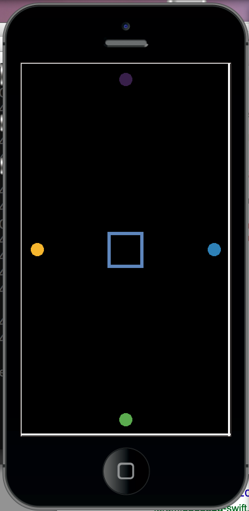

# Making Codes

作成の手順を解説します。




手順1　画面の縦と横サイズを取得
```
_W = display.contentWidth
_H = display.contentHeight
```

手順2　ステータスバーを消す
```
display.setStatusBar( display.HiddenStatusBar )
```

手順３　真ん中に四角
```
rect = display.newRect(_W/2, _H/2 , 100, 100)
```

手順４　四角は縁だけにする
```
function myRandom()
	return math.random(100)/100
end

rect:setStrokeColor(myRandom(), myRandom(), myRandom())
rect.strokeWidth = 10
rect:setFillColor(0, 0, 0, 0)
```

手順５　グループの作成
```
group = display.newGroup()
```

手順６　グループに円を四つ作成追加
```
group:insert(display.newCircle(_W/2,    50, 20))
group:insert(display.newCircle(_W/2, _H-50, 20))
group:insert(display.newCircle(  50,  _H/2, 20))
group:insert(display.newCircle(_W-50, _H/2, 20))
```

手順７　グループの各円を塗りつぶす
```
for i=1, group.numChildren do
  group[i]:setFillColor(myRandom(), myRandom(), myRandom())
end
```

手順８　ボタンの呼び出し関数を作成
```
function buttonFunc(event)
  print("tap")
end
```

手順９　グループの各円をボタンにする。手順７のforループに追加してください。
```
for i=1, group.numChildren do
  --追加
  group[i]:addEventListener("tap", buttonFunc)
end
```

手順１０　音をロード
```
soundID = audio.loadSound( "beep.wav" )
```

手順１１　ボタンが押されたら音。手順８のbuttonFuncに playBeepを追加します。
```
playBeep = function()
  print("beep")
  audio.play( soundID )
end

function buttonFunc(event)
　--追加
  playBeep()
end
```

手順１２　物理を追加。main.luaの最初のほうに追加してください。前章の完成しているコードを参考。
```
physics = require("physics")
physics.start()
```

手順１３　グループの各円を物理オブジェクトにする。手順７のforループに追加してください。
```
for i=1, group.numChildren do
  --追加
  physics.addBody(group[i])
end
```

手順１４　無重力にする
```
physics.setGravity(0,0)
```

手順１５　ボタンが押されたら、衝撃を発生。手順８のbuttonFuncに追加します。
```
function buttonFunc(event)
  --追加
  event.target:applyLinearImpulse(10, 10, event.x, event.y)
end
```

手順１６　真ん中の円をセンサーにする
```
physics.addBody(rect, {isSensor = true})
```

手順１７　真ん中の円は検知すると色がランダムに変わる
```
rect:addEventListener("collision",
	function(event)
		rect:setFillColor(myRandom(), myRandom(), myRandom())
		playBeep()
	end)
```

手順１８　壁も作成
```
rect1 = display.newRect(_W/2,    0, _W,  5)
rect2 = display.newRect(0,    _H/2,  5, _H)
rect3 = display.newRect(_W-5, _H/2,  5, _H)
rect4 = display.newRect(_W/2, _H-5, _W,  5)
```

手順１９　壁なのでスタティク（静的）に設定
```
physics.addBody(rect1, "static")
physics.addBody(rect2, "static")
physics.addBody(rect3, "static")
physics.addBody(rect4, "static")
```

手順２０　BGMも流しましょう
```
ch1Stream = audio.loadStream("loop1.wav")
audio.play( ch1Stream, {loops=-1 } )
```
