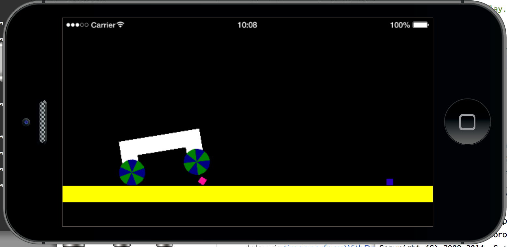
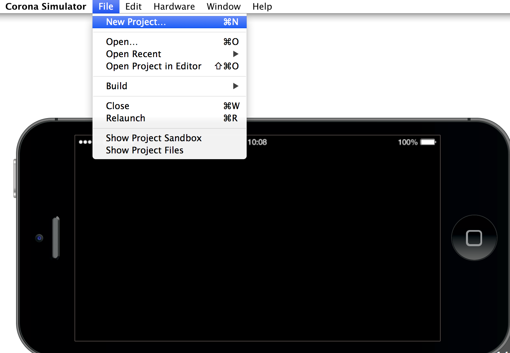
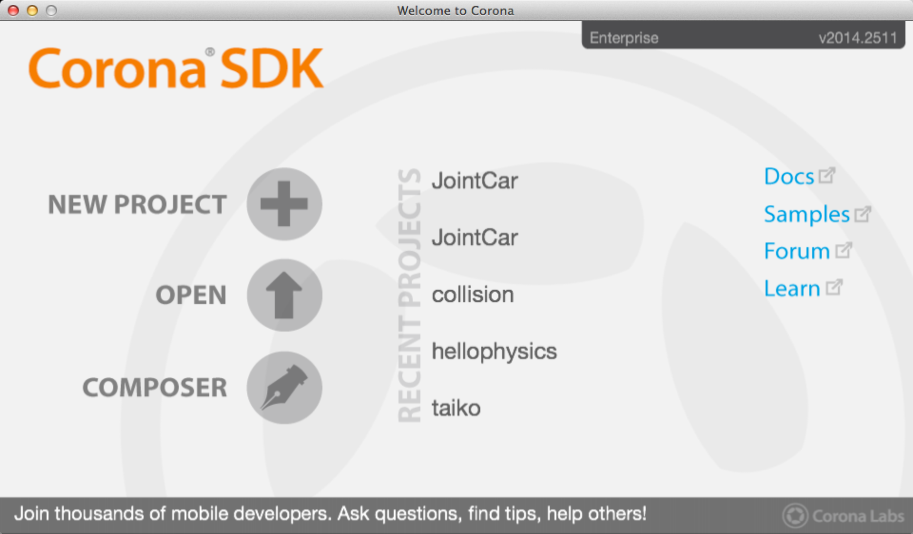
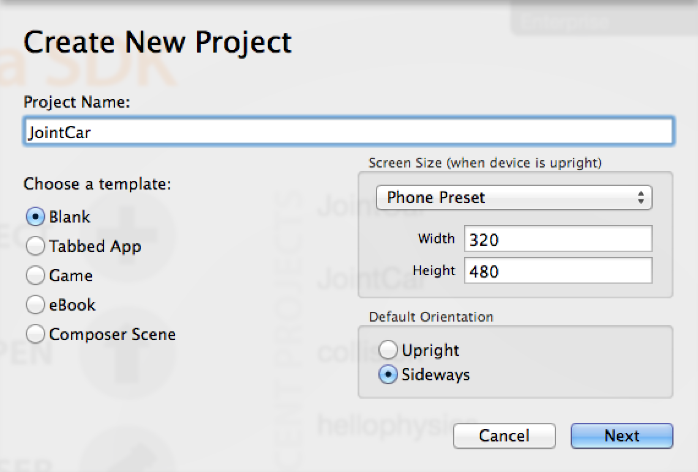
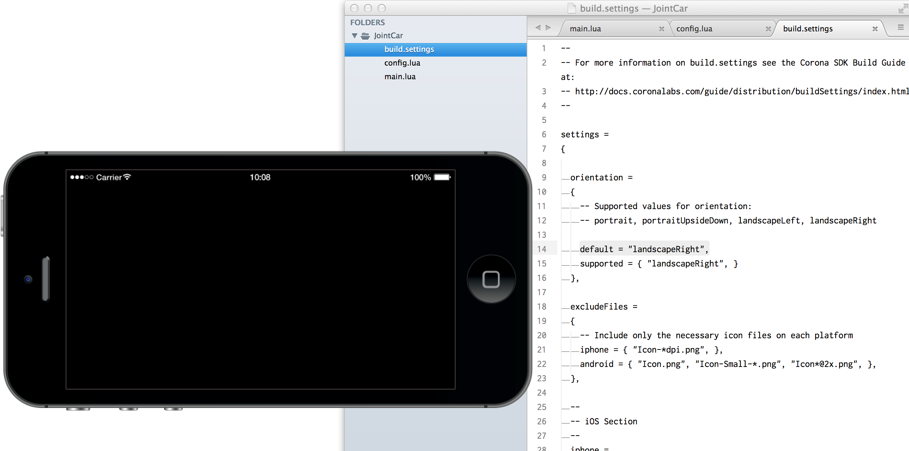
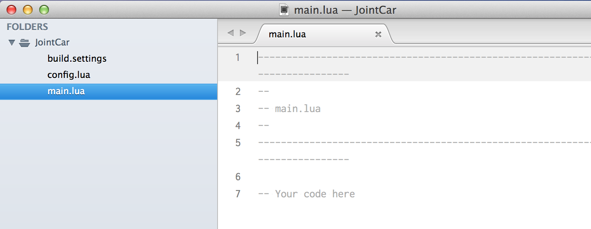
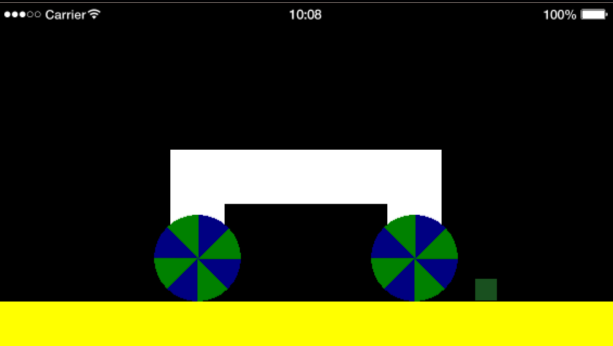
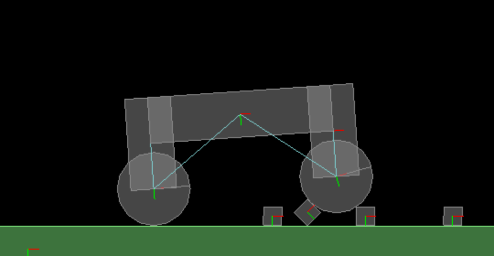

# ジョイント
物理の物体同士を結合するジョイントを作成します。



### Corona Simulator
新規プロジェクトをCorona Simulatorから作成してみます。File > New Projectをクリックします。



ダイアログからNEW PROJECTをクリックします。



Create New Projectが表示されたら、プロジェクト名にJointCarと入力します。右下のDefault Orientationで右下のSideways(横方向）を指定します。これで画面が横向きになります。



main.luaとconfig.lauとbuild.settingsの３ファイルが作成されます。build.settingsのファイルにLandscapeRightが設定されました。



main.luaにコードを記述する準備が完了しています。



この車輪のwheel.pngファイルをダウンロードして下さい。


下記の車を作成します。右下に小さい緑色の四角形が障害物となります。




```
_H = display.contentHeight
_W = display.contentWidth

-- 地面
local ground = display.newRect(0, _H-20, 10000, 50 )
ground:setFillColor( 1, 1, 0 )

-- 車の車体
local top   = display.newRect(_W/2, 0, 200, 50 )
local tail  = display.newRect(top.contentBounds.xMin, top.contentBounds.yMax, 50, 100 )
local front = display.newRect(top.contentBounds.xMax, top.contentBounds.yMax, 50, 100 )

-- 車のタイヤを作成する
local wheel1   = display.newImage("wheel.png")
wheel1.x = tail.x
wheel1.y = tail.contentBounds.yMax
local wheel2   = display.newImage("wheel.png" )
wheel2.x = front.x
wheel2.y = car.front.contentBounds.yMax

local wheel1   = display.newImage("wheel.png")
wheel1.x = tail.x
wheel1.y = tail.contentBounds.yMax
local wheel2   = display.newImage("wheel.png" )
wheel2.x = front.x
wheel2.y = tail.contentBounds.yMax

--障害物
local  barrier = display.newRect(400, _H-200, 20, 20 )
  barrier:setFillColor( 0, 0 ,1 )

```


物理物体の設定を行います。
```
local physics = require "physics"
physics.start()

-- 物理エンジンに地面を追加する
physics.addBody( ground, "static", {density=1.0, friction=1.5, bounce=0.2} )

-- 障害物を物理物体にする
physics.addBody( barrier, {density=1.0, friction=1.0, bounce=0.2}

-- 車の各パーツを物理物体にする
physics.addBody( top, {density=0.2, friction=0.5, bounce=0.2} )
physics.addBody( tail, {density=0.2, friction=0.5, bounce=0.2} )
physics.addBody( front, {density=0.2, friction=0.5, bounce=0.2} )
physics.addBody( wheel1, {density=1.0, friction=1.5, bounce=0.2, radius = 40} )
physics.addBody( wheel2, {density=1.0, friction=1.5, bounce=0.2, radius = 40} )
```

#### physics.newJoint(タイプ, 物体A, 物体B, 位置x, 位置y)
車の車体を溶接(weld)して、接続(Joint)させます。
```
local weld1 = physics.newJoint( "weld", top, tail, tail.x, tail.contentBounds.yMax )
local weld2 = physics.newJoint( "weld", top, front, front.x, front.contentBounds.yMax)
```

車のタイヤを結びつけるために、ピボット(pivot)の接続を指定します。
```
local pivot1 = physics.newJoint( "pivot", wheel1, tail, wheel1.x, wheel1.y )
local pivot2 = physics.newJoint( "pivot", wheel2, front, wheel2.x, wheel2.y )
```

#### setDrawMode(モード)

"hybrid"または"debug"を指定することで、物理物体の形やジョイントのワイヤーフレームを確認することができます。

```
physics.setDrawMode("debug" )
```



タイヤに回転を設定します。モータ(isMotorEnabled)、トルク(maxMotorTorque, motorTorque)と速度(motorSpeed)を指定します。
```
pivot1.isMotorEnabled = true
pivot2.isMotorEnabled = true
pivot1.maxMotorTorque = 100000
pivot2.maxMotorTorque = 100000
pivot1.motorSpeed = -200
pivot2.motorSpeed = -200
pivot1.motorTorque = 200
pivot2.motorTorque = 200
```

#### enterFrame
画面外に車が移動していきます。車の移動に従って、画面を左にスクロールさせることによって、車を中央に表示しつづけます。車、障害物と地面をグループに登録して、グループ全体を移動させることによって、実現させます。

車の各パーツもグループ(car)に登録しておきます。local topの変数が、car.topに変更されている点に注意してください。
各パーツの参照も変更してください。
```
local car = display.newGroup()

car.top   = top
car.tail = tail
car.wheel1 = wheel1
car.wheel2 = wheel2

car:insert(car.top)
car:insert(car.tail)
car:insert(car.front)
car:insert(car.wheel2)
car:insert(car.wheel1)
```

stageというグループを作成します。地面(ground), 障害物(barrier)と車(car)を登録します。

```
local stage = display.newGroup()
stage:insert(ground)
stage:insert(barrier)
stage:insert(car)
```

enterFrameのイベントは、描画更新のタイミングで発生します。addEventListenerで登録された関数が呼び出されます。この仕組みを利用して、stageグループのx座標の値を更新することで、画面全体が右から左に移動することになります。右に移動したcar.topのx値をマイナスします。

```
local function enterFrame( event )
  stage.x = 200 -car.top.x
end
Runtime:addEventListener( "enterFrame", enterFrame )
```

障害物を２５個に増やしてみます。色もランダムに変更します。barriersというテーブル（配列）に各障害物を格納しました。
```
local function myRandom()
	return math.random(100)/100
end

local barriers = {}
for i = 1,25 do
  barriers[i] = display.newRect(math.random(10000), _H-200, 20, 20 )
  barriers[i]:setFillColor( myRandom(), myRandom(), myRandom() )
  stage:insert(barriers[i])
end
```

barries[1]には、一個目の障害物が格納されています。

barriersテーブルの値を取り出すには、for キー, 値 in pairs(テーブル) do endの形式も可能です。
```
for key, value in pairs( barriers ) do
  print(key)
  physics.addBody( value, {density=1.0, friction=1.0, bounce=0.2} )
end
```


