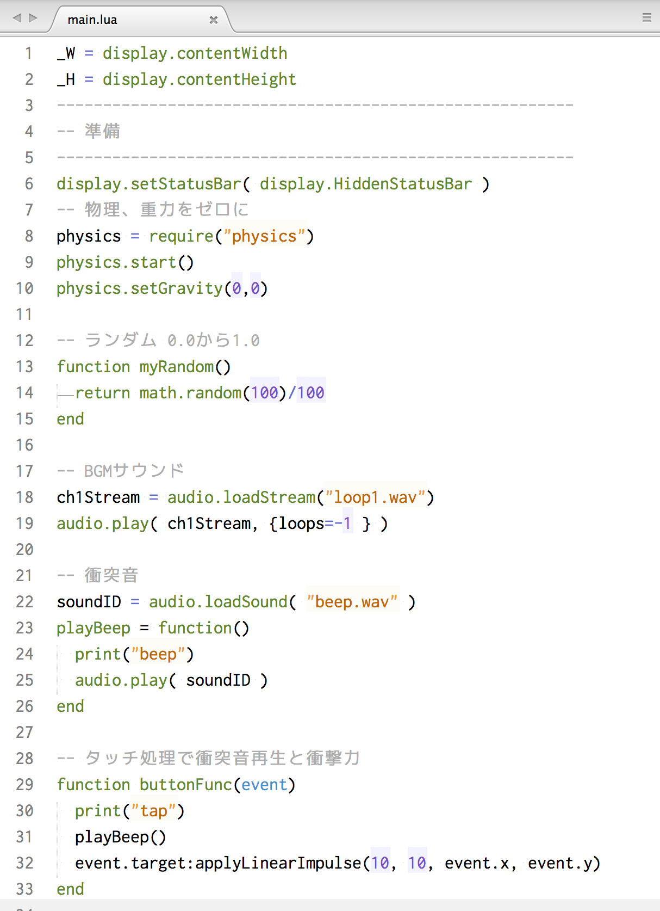
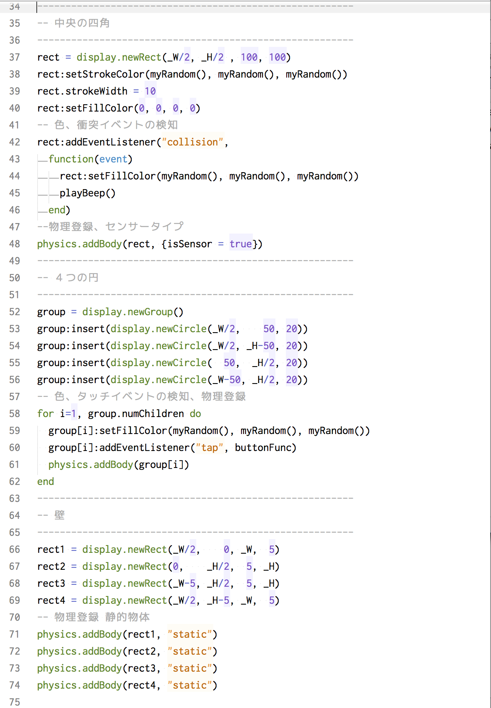

# Reading Codes
サンプルコードを読み解いてみます。次章でプログラミングの手順を解説します。

<a href="img/collision.zip"> collision.zip </a>をダウンロードして、zipファイルを展開します。main.luaファイルをsublimeで開いて、corona simulatorで動かしてみましょう。

6行目で画面上部のシグナルや電源アイコンといったステータスバーの表示を行わないようにしました。

8-10行　物理環境を準備します。重力をゼロに設定しています。

13行 R, G, Bの値をランダムに返却するために、0から1.0の間の値を返却する関数を準備します。

18行 BGMサウンドを再生します。

22行 衝突音を再生する関数です。

29行 タッチされたときに衝突音を再生し、タッチされた対象に障衝撃を加えて、動かします。

#### applyLinearImpulse(x方向の力, y方向の力, 衝撃位置x, 衝撃位置y)

37行 中央の四角を表示します。

42行 addEventListenerで衝突(collision)を検知するように関数を登録します。色変更と22行目のplayBeep関数を実行します。

48行 中央の四角をセンサーという物理物体のタイプとして登録します。センサーは、物理法則で動いたりしませんが、衝突の検知が可能となります。

52行 周囲の４つの円を格納するグループを作成します。
#### display.newGroup(), numChildren

53-56行でグループに挿入(insert)すると、58行目のfor文での処理が可能になります。for 文内でgroup[i]で各円にアクセスしています。各円にタッチイベントをaddEventListenerで付与します。29行buttonFuncが呼び出されます。

最後に周囲の壁を作成して、物理物体として、静的(static)なタイプを指定しました。

