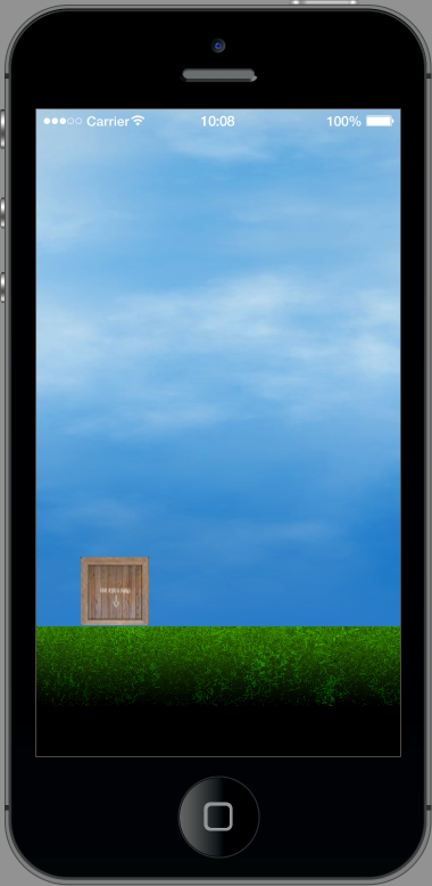
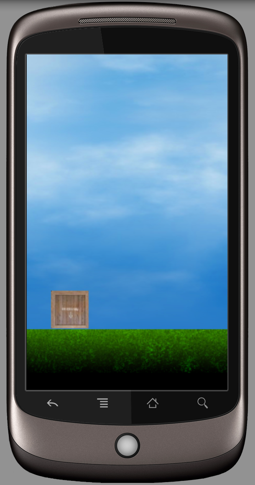
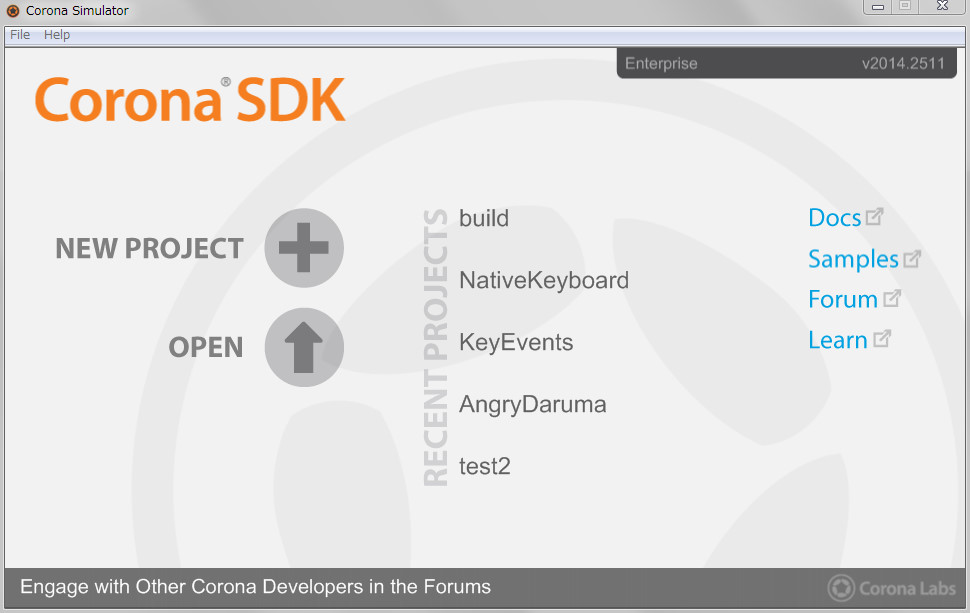
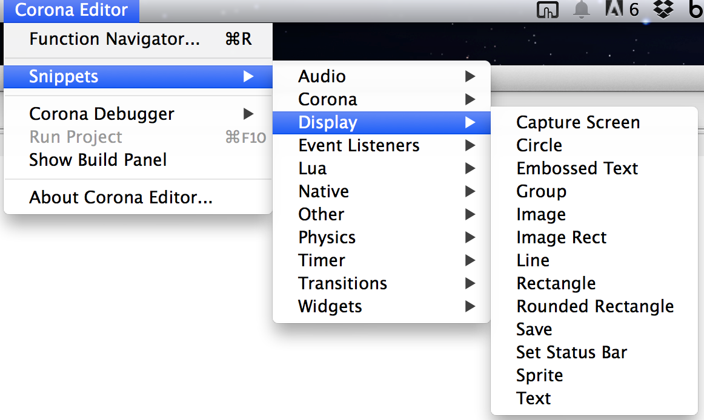
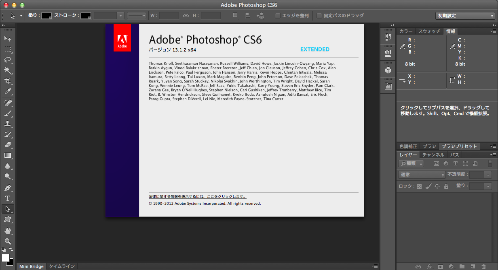
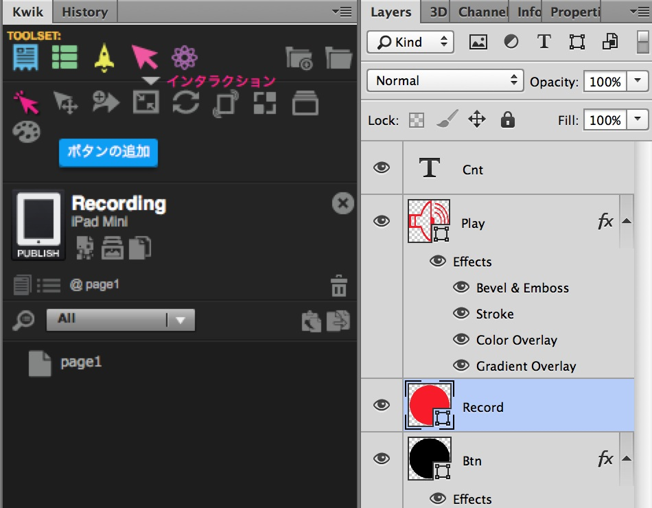

# 環境解説
アプリケーション制作をする前に、開発環境を整えましょう。iPhoneとアンドロイドスマホのアプリ開発として、下記のソフトウェアを利用します。

* CoronaSDK
* SublimeとCorona Editor
* Adobe Photoshop
* Kwik
* XCodeとiTunes Connect
* Android SDK

また実際にアプリをインストールするiPhone、iPadまたはアンドロイドのスマフォ・タブレットが必要です。

### Corona SDK
Corona SDKは、Windowsパソコンでも、マックのパソコンでも動作します。 Corona SDKには、 Corona simulatorやサンプルコードが含まれています。 Corona simulatorは、 プログラムコードをパソコン上で動作させる機能とiPhone/iPadとAndroidのアプリをビルドする機能を持っています。

### SublimeとCorona Editor
Sublime 3は、高機能なプログラミング用のテキストエディタです。複数カーソルやボックス選択機能、様々なプログラミング言語のマークアップ、コンソールアクセスなどがサポートされています。パッケージという拡張機能によって、Corona SDKためのCorona Editorが利用できます。

* Sublime3　 http://www.sublimetext.com/3
* パッケージ https://packagecontrol.io/installation

使用するパッケージ
* Corona Editor
* Japanize 日本語メニュー

### Adobe Photoshop
Creative Suite 5以上のフォトショップが必要となります。簡易バージョンであるエレメンツではKwikを使用することができません。フォトショップの様々な画像編集機能を使い、アプリで使用するアイコンや画像ファイルを作成することができます。

※ここではアドビフォトショップがインストールされていることを前提に話を進めていきます
 * photoshop  https://helpx.adobe.com/jp/x-productkb/policy-pricing/cs6-product-downloads.html

### Kwik
フォトショップのプラグインです。 実際のアプリケーションの作成はフォトショップ上でこのプラグインを利用して作業します。

### XcodeとiTunes Connect
Xcodeはアップル社の提供する iOSのアプリ開発環境です。iPhoneアプリだけでなく、デスクトップのマックアプリケーションも開発可能です。Xcodeの機能として、アプリをiPhoneにインストールしたり、動作状況を確認することができます。

アップル社が提供するiTunes Connectを利用して、開発したアプリをストアに登録することができます。

* Xcode  https://developer.apple.com/jp/xcode/downloads/
* iTunes Connect https://itunesconnect.apple.com

### Android Studio
Google社が提供するAndroidアプリの開発環境です。スマホにアプリをインストールする機能や動作状況を確認することが可能です。

* http://developer.android.com/sdk/index.html

