#ページの追加
PictureBook.zipファイルを展開するとpage1.psdからpage5.psdが格納されています。
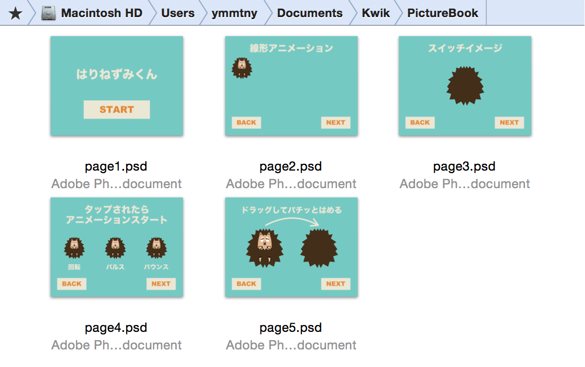

page1.psdファイルをPhotoshopで開きます。page1.psdを使った新規Kwikプロジェクトを作成します。

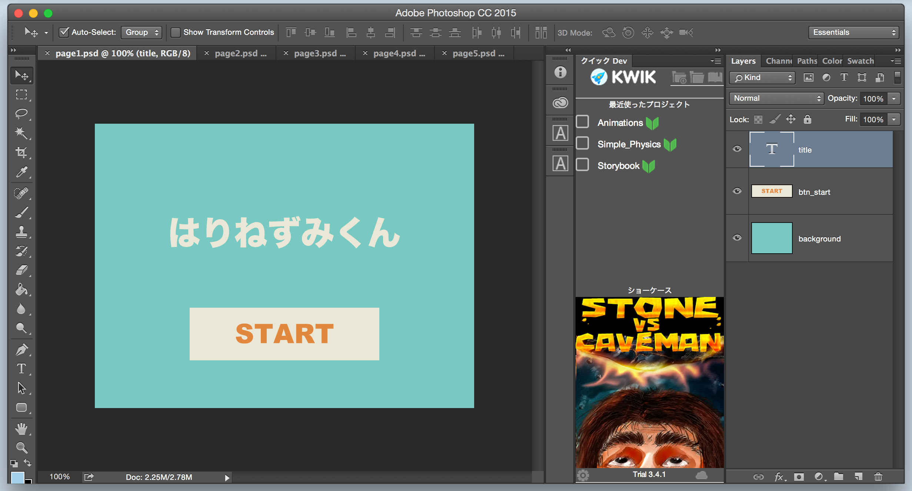

page1.psdが開いたら、Kwikのパネルから新規のアイコンをクリックします。

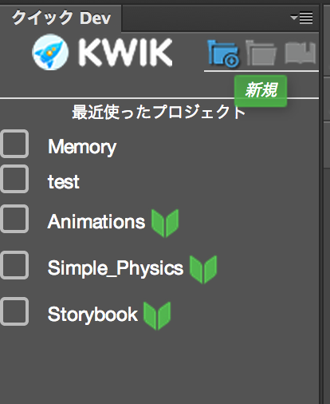

デバイスはiPad Miniを選択してください、 page1.psdの画像がiPad miniのサイズで用意されているためです。Use page1.psdにチェックが入った状態で、作成ボタンをクリックします。
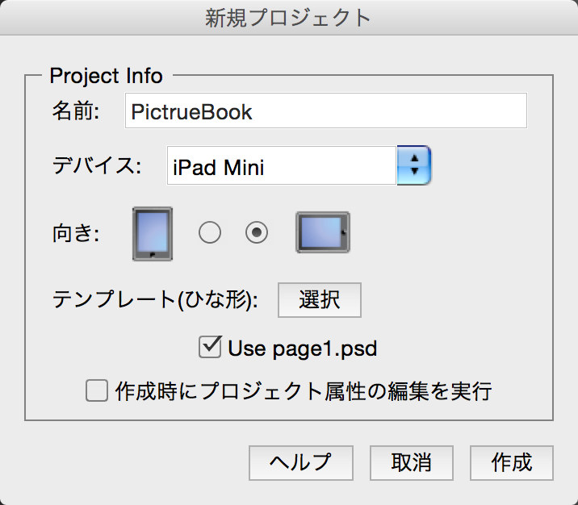

page1が登録された状態で、PictureBookのプロジェクトが作成されました。
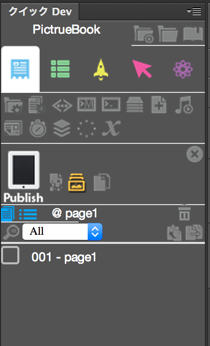

次に page2.psdを開きます。
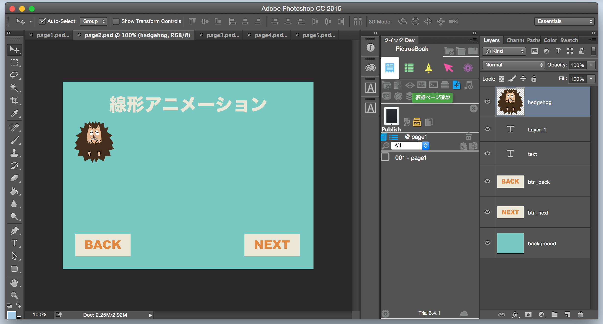

page2.psdが開いたら、新規ページ追加をクリックして、登録します。

Use page2.psdのチェックが入った状態でOKをクリックします。

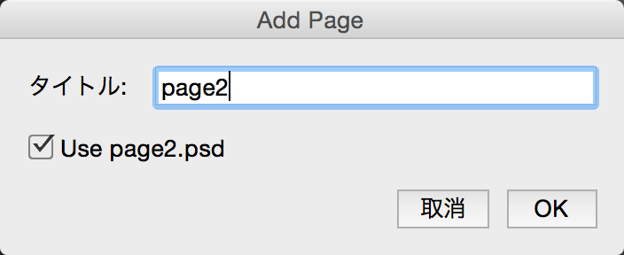

次に page3.psdを開きます。

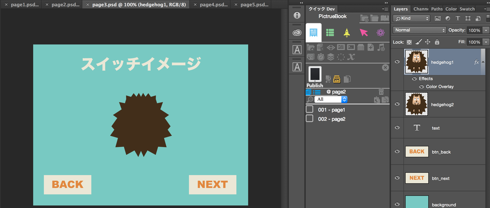

page2のときと同じように追加します。

page4.psdとpage5.psdも同様にKwikに登録してください。
page4
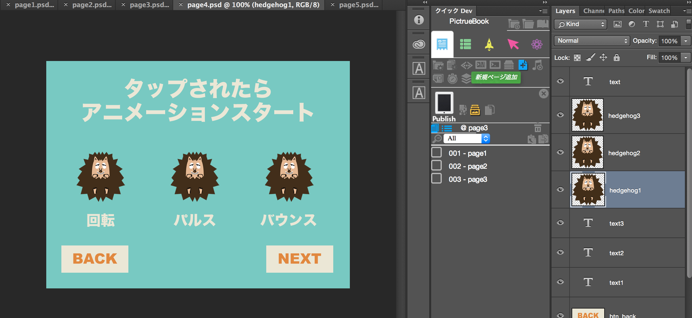
page4
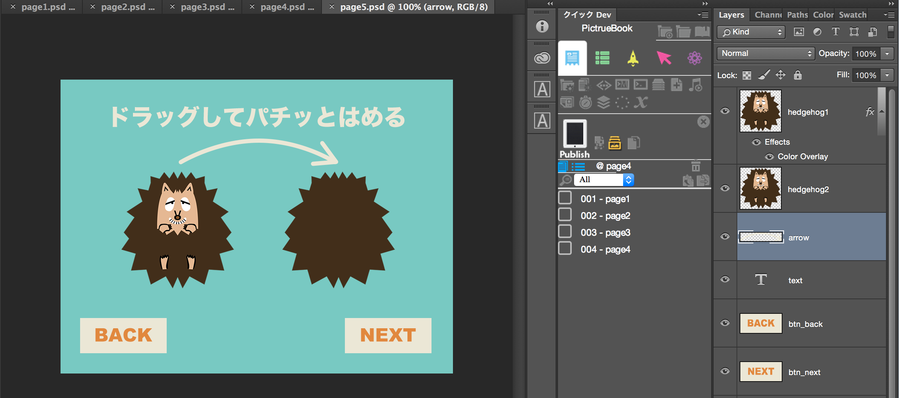

登録が完了したら、パブリッシュアイコンをクリックします。
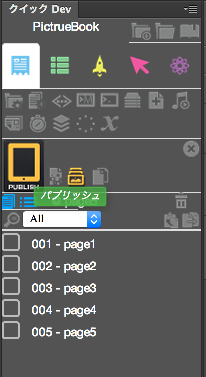

パブリッシュが完了するとメッセージが表示されます。
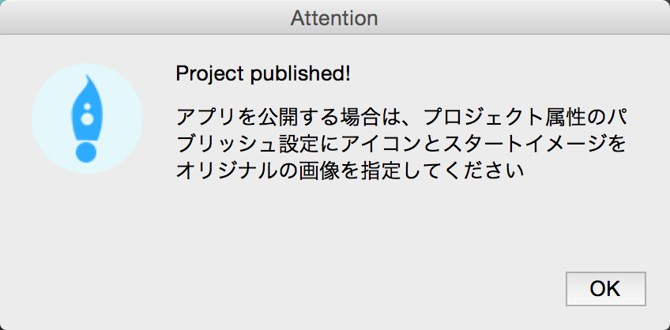

下記の設定がされていると、Corona Simulatorが自動で起動します。chmod a+xの下記のコマンドを既に実行している場合は、次回からのメッセージを表示しないの項目にチェックをいれてしまいましょう。
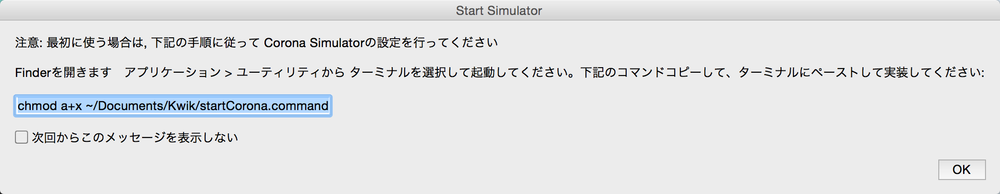

Corona Simulatorが起動します。起動しない場合は、Appications > Corona Labs > Corona Simulatorを起動します。Corona Simulatorのファイルメニューを開き、PicureBook/buikd/main.luaを選択してください。
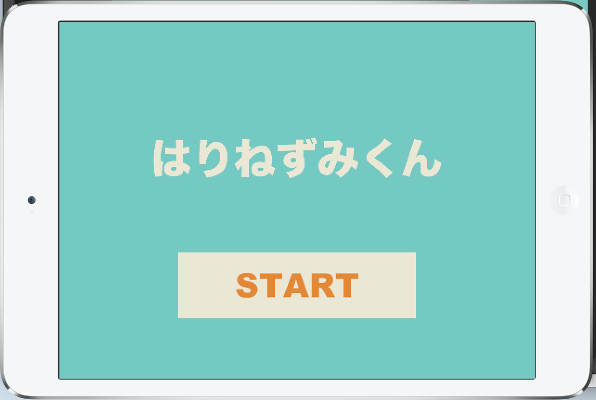
画面上でマウスを使って、スワイプ（クリックしながら左右のどちらかにマウスを移動させる）とページが切り替わります。
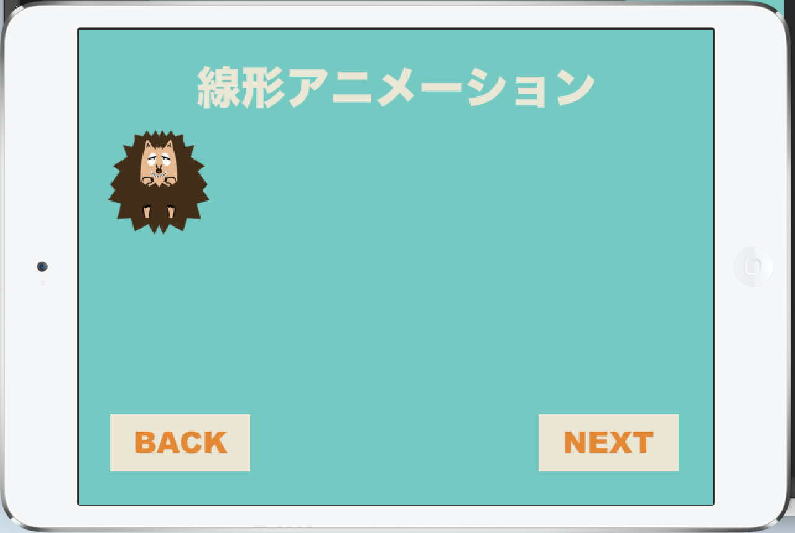

プロジェクト属性をクリックして、アイコンやスタート（起動時）の画像設定を行ってみましょう。
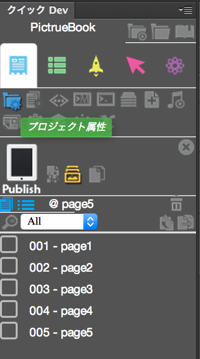

パブリッシュのタブのスタートイメージのアイコンをクリックします。
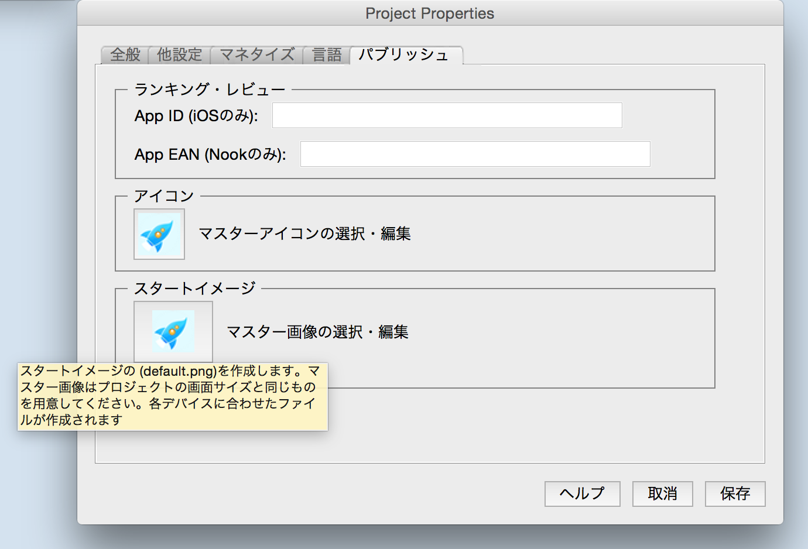

ファイル選択の画面が開きますので、事前に準備してあるlaunch.pngを選択してください。
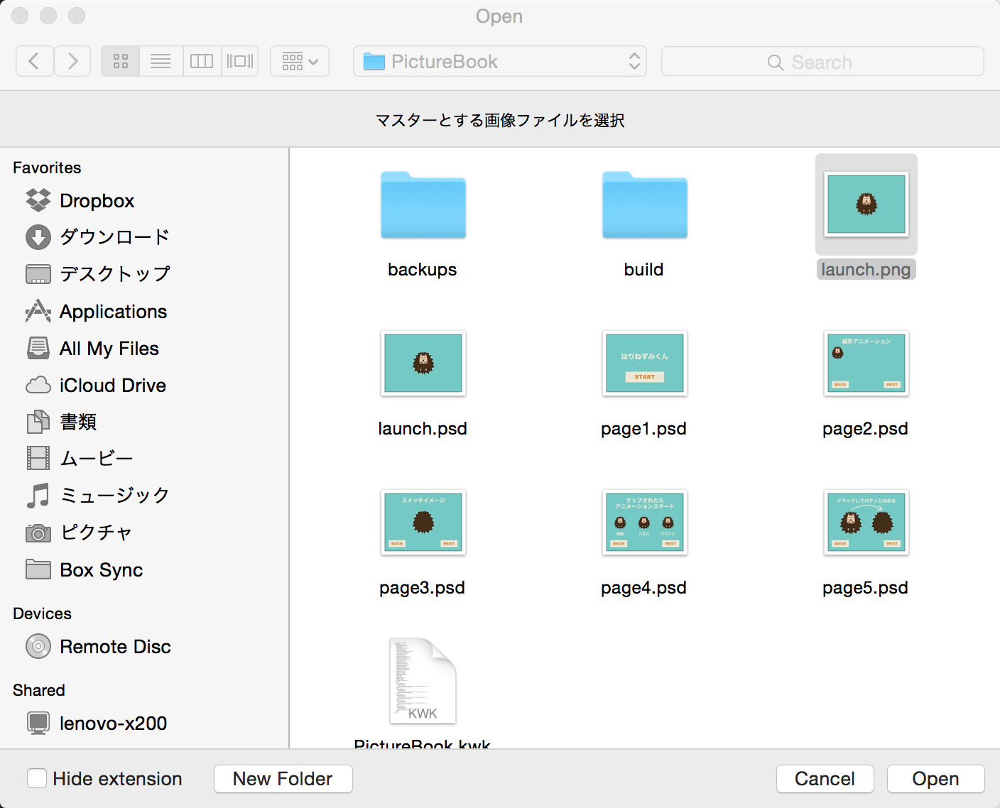

次にアイコンを設定します。画像の部分をクリックすると、ファイル選択画面が開きます。

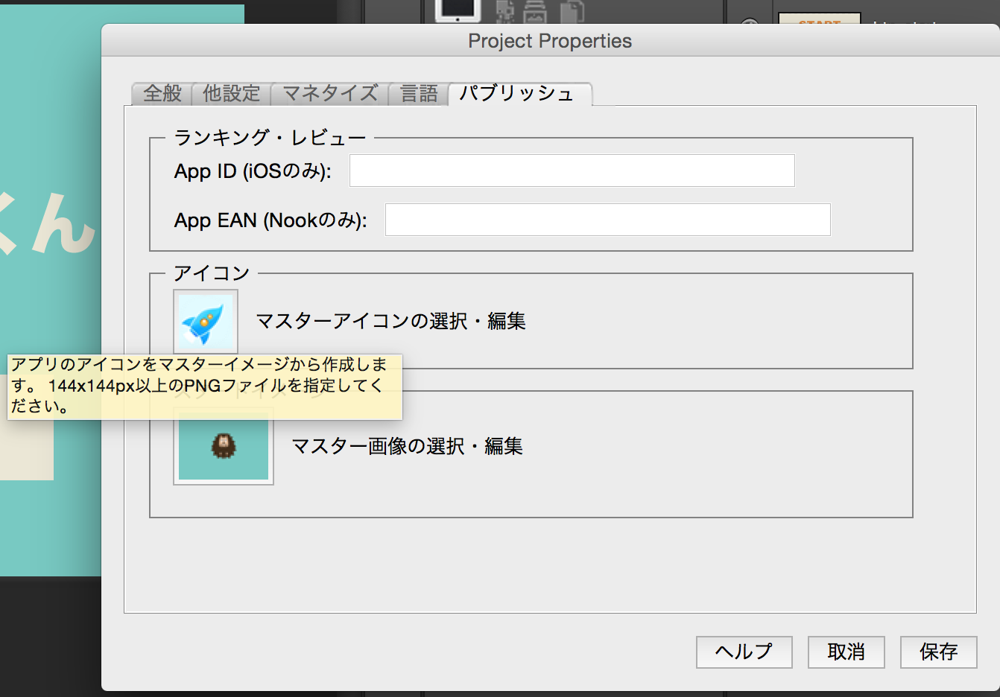

先ほどのスタートイメージが生成されるときに、Default-Master.pngファイルが同時に作成されました。Defualt-Master.pngを選びます。
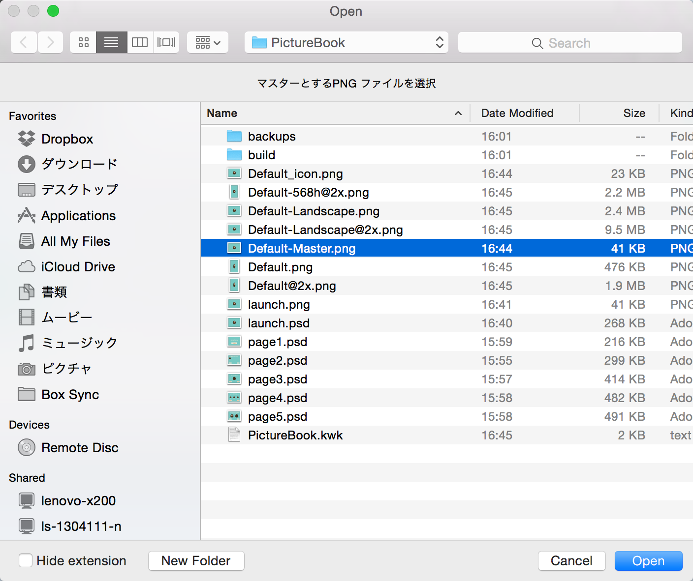

アプリをiPhoneやスマホに入れて、確認してみてください。
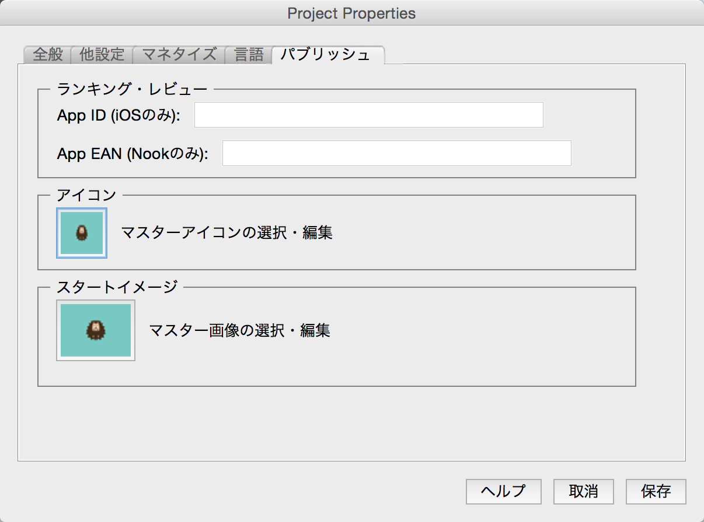

