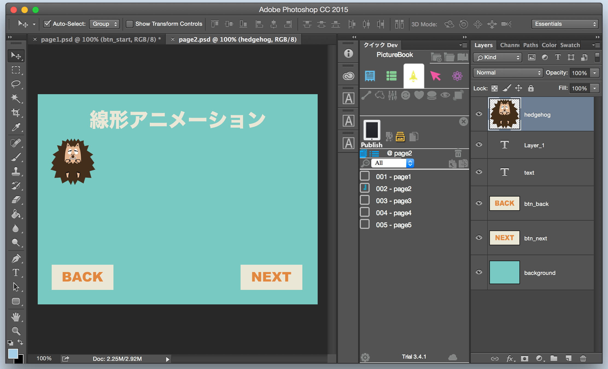
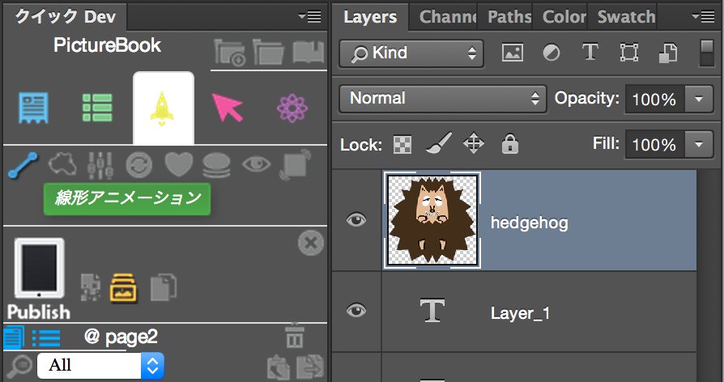
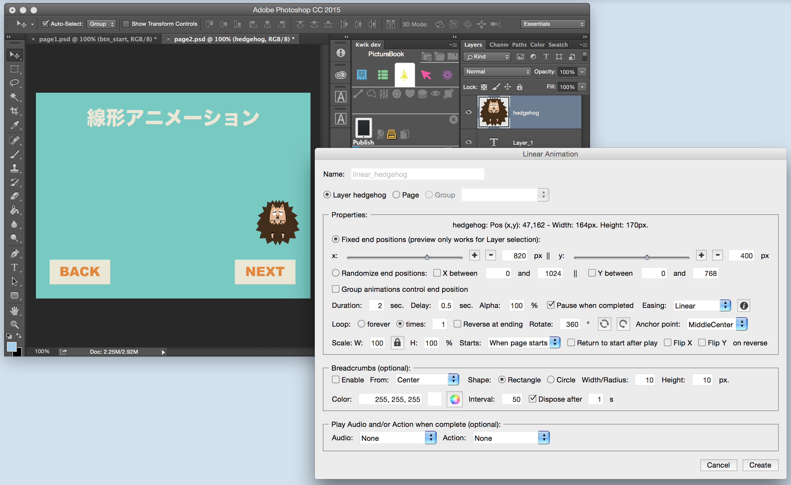
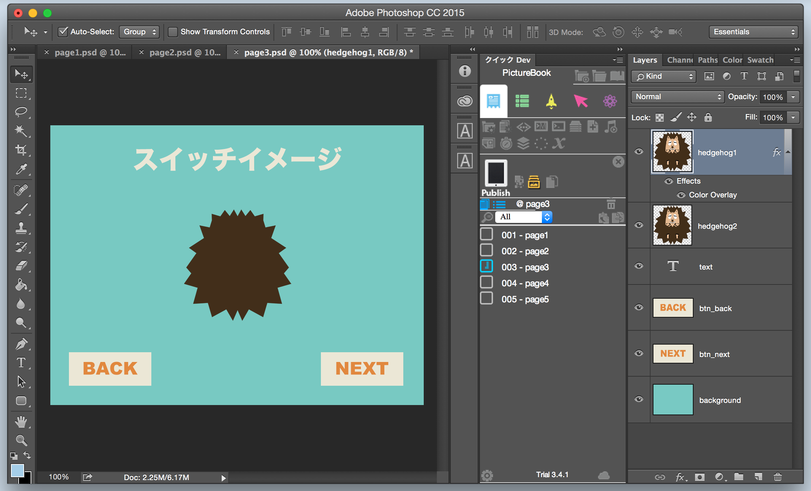
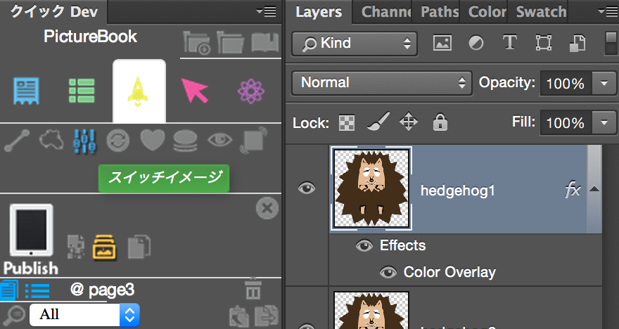
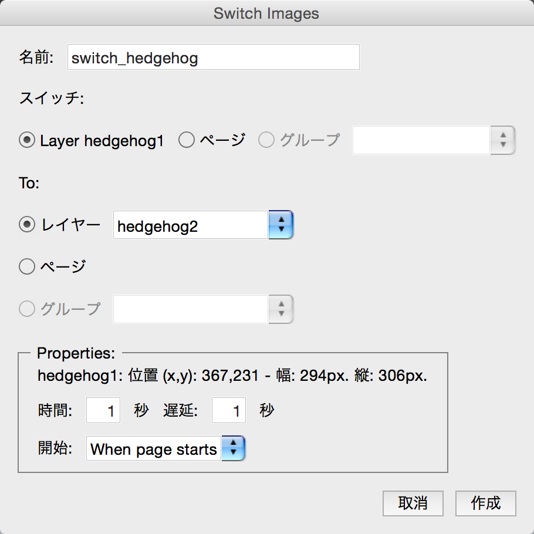

# Animation
page2を開きます。ハリネズミを動かすアニメーションを作成してみます。

ハリネズミのレイヤー hedgehogを選択した状態で、線形アニメーションをクリックします。

アニメーション設定のダイアログが開きます。ハリネズミをA地点からB地点に移動させるには、X方向とy方向のスライダーを動かして、B地点を指定します。

細かな設定がいろいろありますが、時間２秒、回数１回が指定されている箇所に注目してください。

Page３を開きます。ハリネズミのレイヤーが２つ用意されています。レイヤーパネルの目の形をしたアイコンをクリックすると、レイヤーの表示・非表示が切り替わりますので、最初のハリネズミのレイヤーをひっ非表示にすると、２番目のハリネズミのレイヤーが現れます。

このレイヤーの切り替えをKwikで行ってみます。最初のhedgehog1のレイヤーを選択した状態で、スイッチイメージをKwikのパネルからクリックしてください。

設定画面が開きます。スイッチがhedgehog1から、To:hedgehog2に切替わる設定にして、作成をクリックします。

KwikのPublish(パブリッシュ)アイコンをクリックして、Corona シミュレーターで動作を確認しましょう。