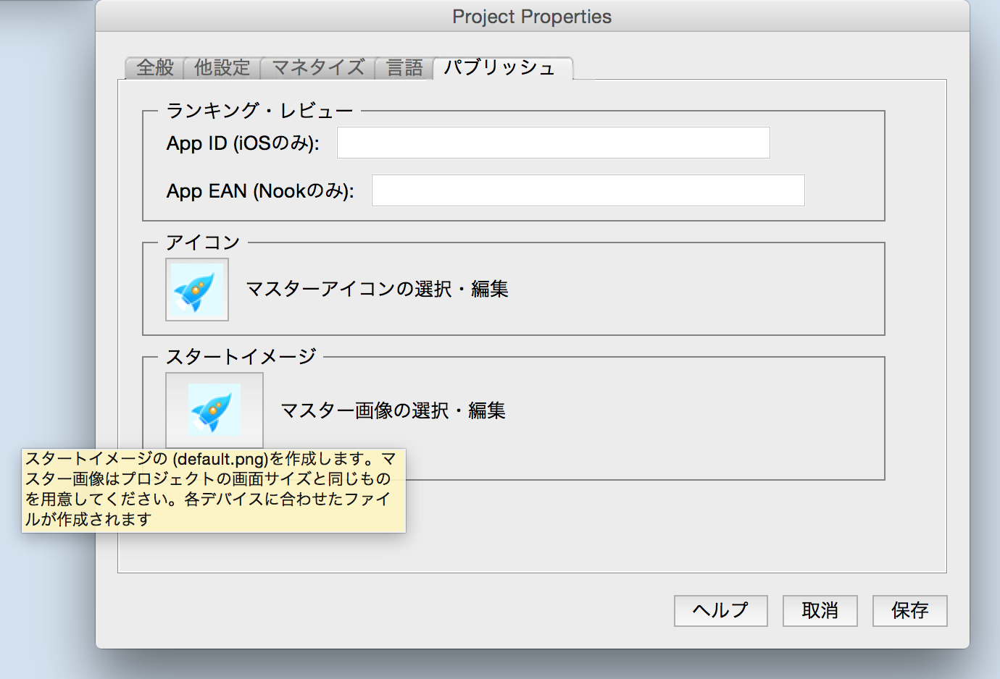
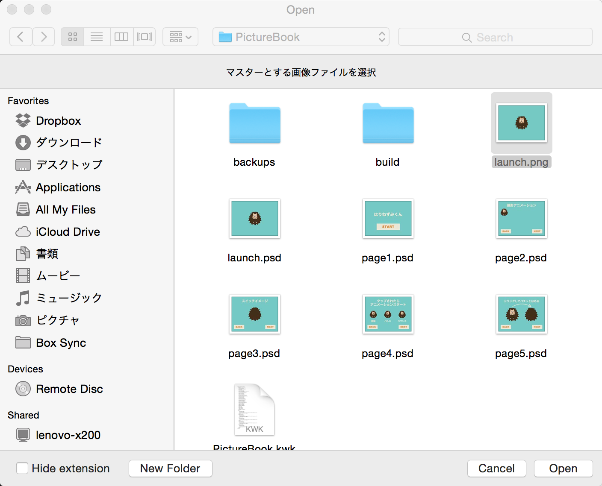
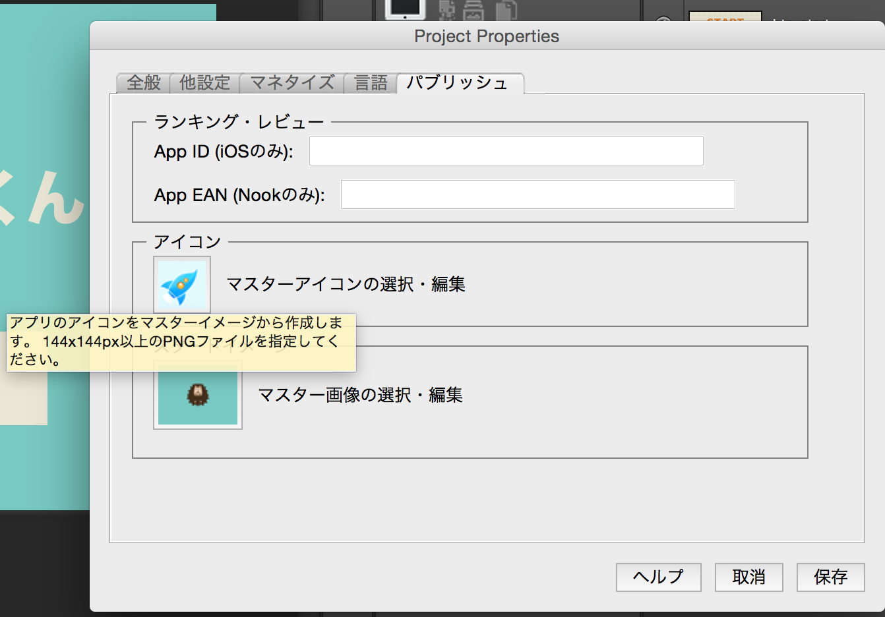
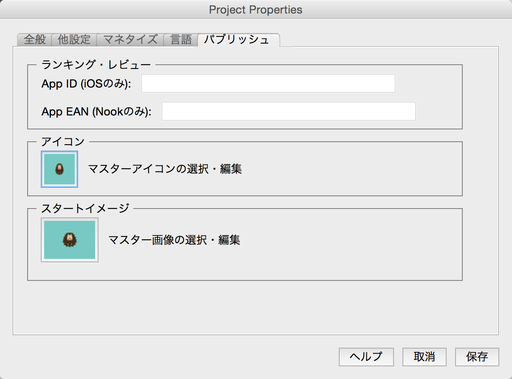

#アイコン、スタート画像
プロジェクト属性をクリックして、アイコンやスタート（起動時）の画像設定を行ってみましょう。

パブリッシュのタブのスタートイメージのアイコンをクリックします。

ファイル選択の画面が開きますので、事前に準備してあるlaunch.pngを選択してください。

次にアイコンを設定します。画像の部分をクリックすると、ファイル選択画面が開きます。

先ほどのスタートイメージが生成されるときに、Default-Master.pngファイルが同時に作成されました。Defualt-Master.pngを選びます。

アプリをiPhoneやスマホに入れて、確認してみてください。

