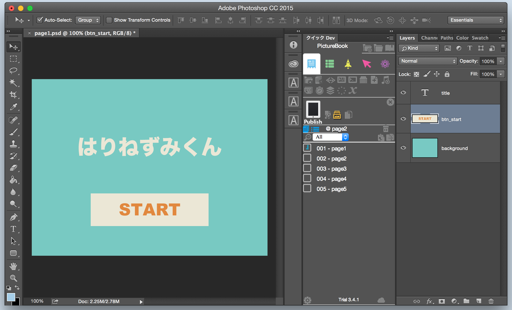
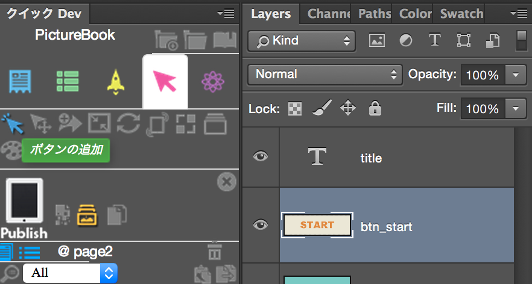
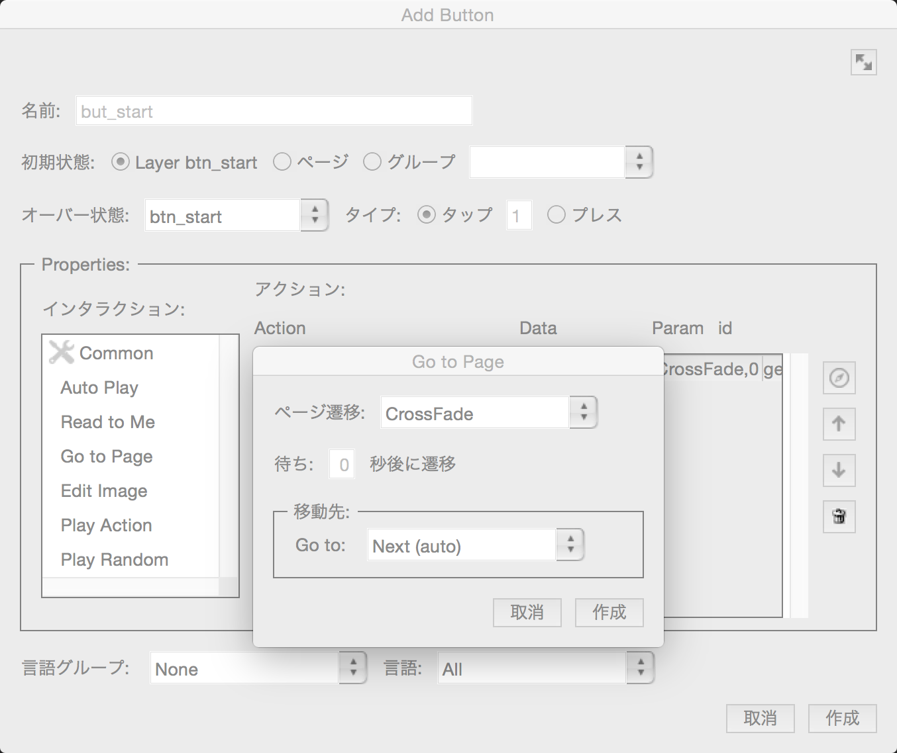
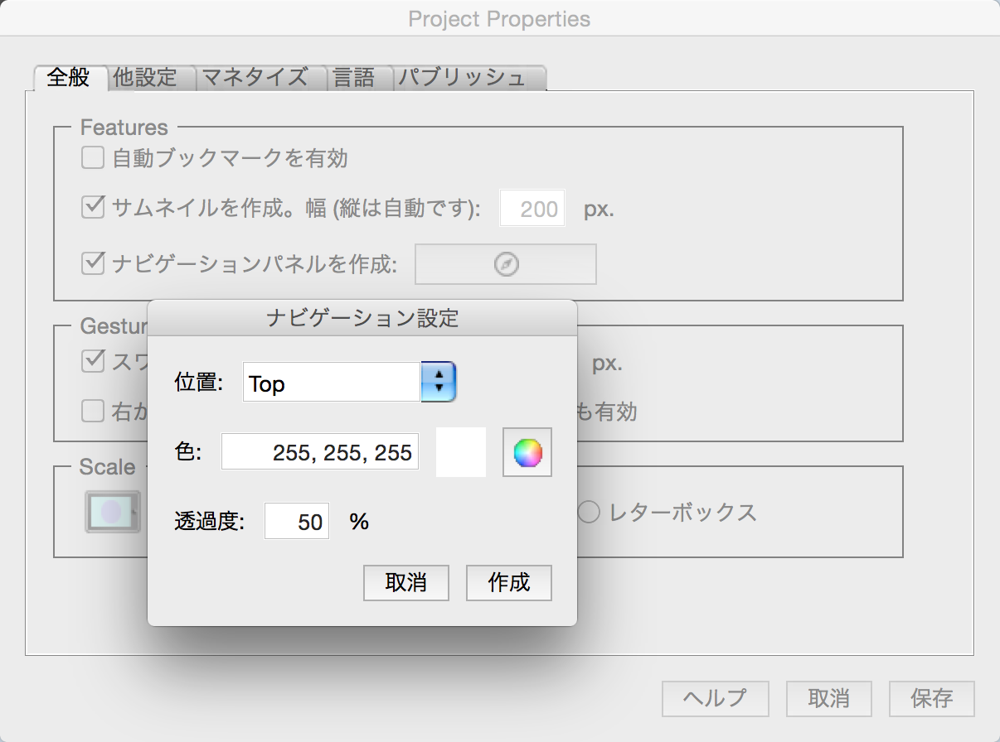
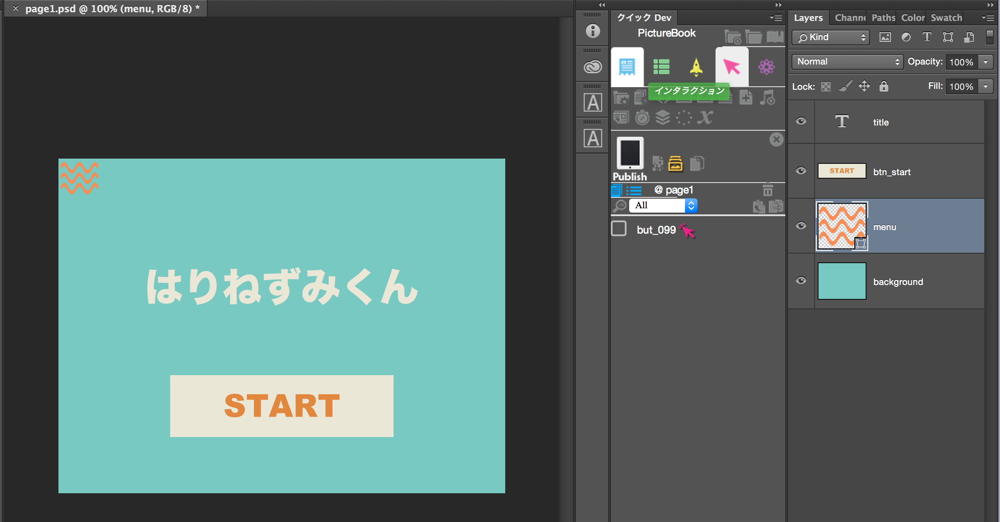
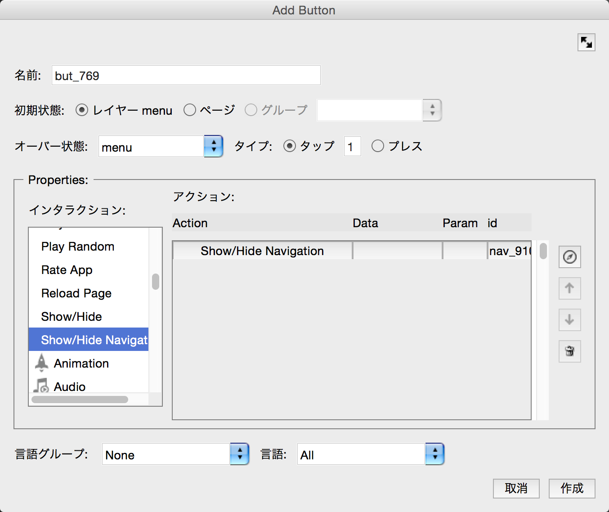
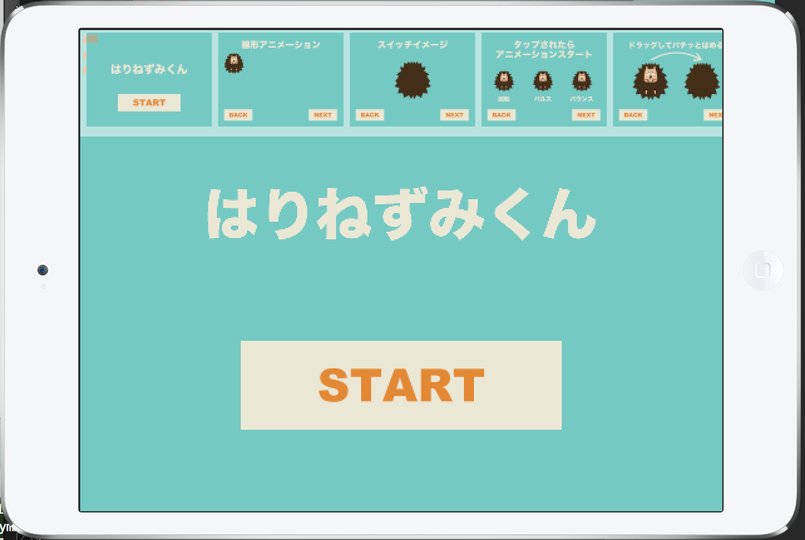

# Button

Page1を表示します。スタートボタンに次のページに移動する設定を行います。レイヤーパネルで、 btn_startレイヤーを選択した状態にします。

btn_startレイヤーを選択した状態で、Kwikのパネルからボタンの追加をクリックします。

ボタンの設定画面が表示されます。左のインタラクションからCommonをクリックして、Go to Pageを選択してください。Go to Pageの設定が開きます。移動先をNext(auto)にして、作成をクリックします。

ナビゲーションメニューを作ってみます。
プロジェクト属性の全般のタブをクリックします。サムネイルを作成とナビゲーションパネルを作成にチェックを入れます。ナビゲーションパネルを作成の横のアイコンをクリックしてください。位置や色、透過度を指定できます。作成ボタンを押して、終了します。プロジェクト属性を保存します。

ナビゲーションメニューを開く、ボタンが必要です。
 page1.psdにメニューボタンを作成します。フォトショップのシェイプでMenuというレイヤーを作成してください。

menuレイヤーを選択した状態で、Kwikのパネルからボタンの追加を行います。CommonからShow/Hide Navigationを選択してください。これで、menuをクリックしたときに、ナビゲーションメニューの表示の切り替えが行われます。

Publishして動作確認を行います。

