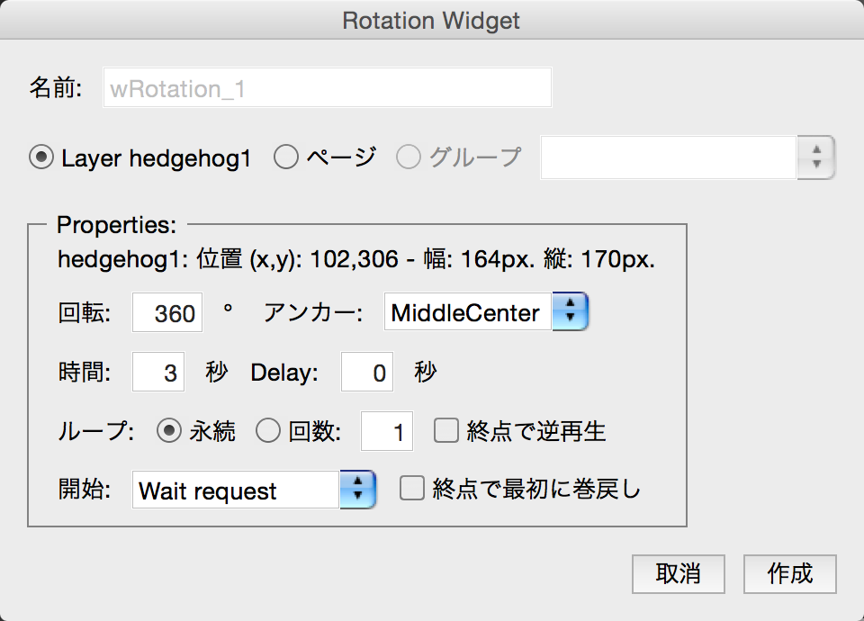

# Button and Animation

Page4を開きます。ボタンをタップしたら、アニメーションがスタートする仕組みを解説します。アニメーションとしては、回転やパルス、バウンスを試してみます。まずアニメーションを作成、次にボタンにアニメーションを関連づけします。

回転(Rotation)を作成します。hedgehog1のレイヤーを選択した状態で、回転をKwikのパネルからクリックします。

開始のリストボックスで、Wait requestを指定してください。これによって、ボタンのクリックといった関連づけを待つことになります。

パルス(Pulse)を作成します。hedgehog2のレイヤーを選択した状態で、パルスをKwikのパネルからクリックします。

開始のリストボックスで、Wait requestを指定してください。これによって、ボタンのクリックといった関連づけを待つことになります。

バウンス(Bounce)を作成します。hedgehog3のレイヤーを選択した状態で、バウンスをKwikのパネルからクリックします。

開始のリストボックスで、Wait requestを指定してください。これによって、ボタンのクリックといった関連づけを待つことになります。

以上でアニメーションが準備できました。では、ボタンの追加を行います。 hedgehog11のレイヤーを選択して状態で、ボタンの追加をクリックします。

ボタンの設定画面が開きます。左のインタラクションから、Animationを開き、Play Animationをクリックすると、先ほど作成したアニメーションを指定可能です。hedgehog1なので、wRotation_1の回転するアニメーションを指定して、作成を押します。ボタンの設定画面を作成ボタンで終了します。

同様にhedgehog2のレイヤーを選択して、ボタンの追加を行います。アニメーションにはPulseを指定します。

最後にhedgehog3のレイヤーを選択して、ボタンの追加を行います。アニメーションにはバウンスを指定します。
