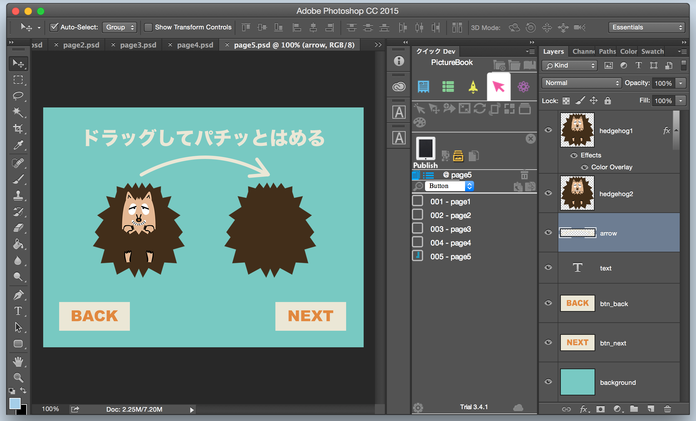
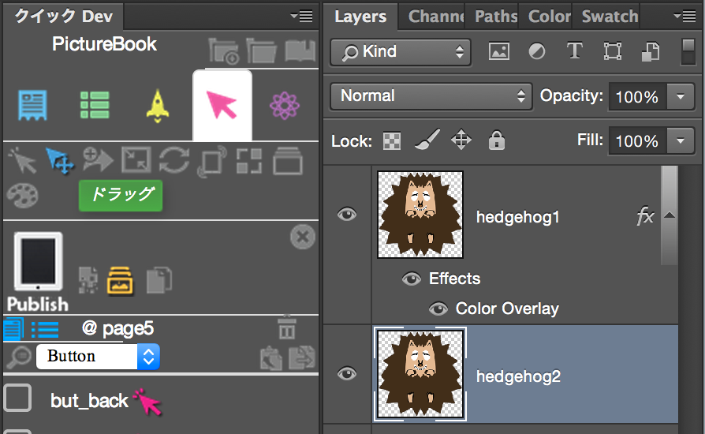
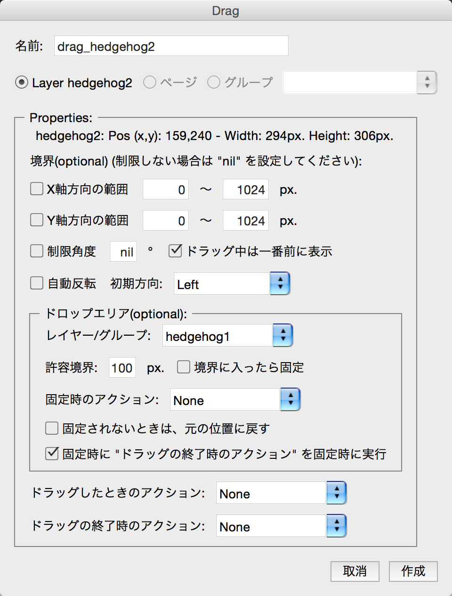

# Drag

Page5を開きます。ハリネズミをドラッグさせる設定を行います。

左のハリネズミ hedgehog2を右のhedgehog1に移動させて、型にはめる動作を作成してみます。ドラッグさせる hedgehog2レイヤーを選択した状態で、Kwikのパネルからドラッグをクリックしてください。

ドラッグの設定画面が開きます。ドロップエリアのレイヤー/グループに右のhedgehog11を指定します。

以上です、Publish(パブリッシュ)して、Corona シミュレーターで動作を確認してみましょう。

waite requstのアニメーションを作成しておき、ドラッグしたときのアクションやドラッグ終了時のアクションに指定することも可能です。トライしてみてください。