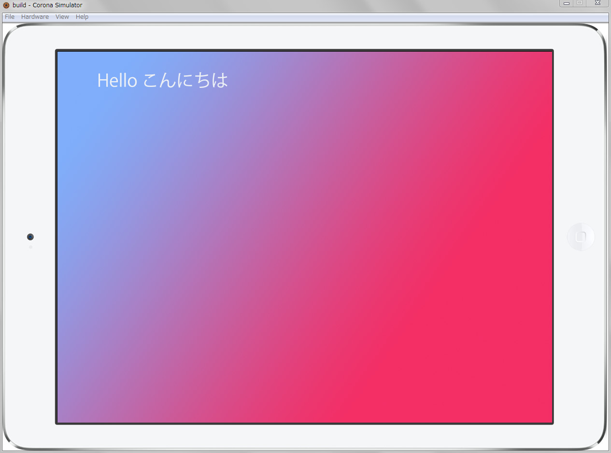

# HelloWorld

### HelloWorldのページ作成

kwikのパネルから、新規Kwikプロジェクトを作成します。このプロジェクトには、フォトショップのページ　.psd が登録されます。この .psdのページに "Hello こんにちは"という文字を表示します。

文字は通常と同じフォトショップのツールを使って作成します。文字レイヤーの名前をKwikが認識できる英語名にして、 Kwikのパブッリシュ機能を使用すると、Corona Simulatorで読み込み可能なプログラムが出力されます。

この出力されたプログラムを Corona Simulatorで開きます。

### 1.新規プロジェクト作成
新しいプロジェクトを作成します。
* フォトショップを起動し、メニューから　ウィンドウ＞エクステンション＞Kwikを選択しKwikのパネルを開きます。
* 右上の新規作成のフォルダアイコンをクリックします。


### 2.タイトルとiPadを選択
プロジェクトのタイトルとデバイスを選択します。


* Title欄にタイトルを入力します。ここでは “HelloKwik” としました。
* デバイスを選択します。ここでは”New iPad”を選択しました。
* 向きを選択します。ここでは横向きを選択しました。
* 作成ボタンをクリックしてください。


### 3.レイヤー名の警告
レイヤー名には注意が必要です。という内容のAlertダイアログが開きます。
* レイヤー名が同じレイヤーを作成してはいけません。
* 日本語、記号、カンマ、ペリオドやシンボルをレイヤー名に含まないでください。
* 数字だけのレイヤー名も不可です。
* レイヤー名は2文字以上にしてください。


### 4.レイヤー名を変更、文字作成
表示する画面を編集しましょう。
* レイヤー１の名称を “backgroud” に変更します。
* 塗りつぶしツールで背景色を設定します。
* レイヤーを追加します。
* テキストツールで “Hello こんにちは” を入力します。
* レイヤー名を “helloTxt” に変更します。


* レイヤー１の名称を “backgroud” に変更します。


* 塗りつぶしツールで背景色を設定します。
* レイヤーを追加します。
* テキストツールで “Hello こんにちは” を入力します。
* レイヤー名を “helloTxt” に変更します。


### 5.Kwikのパネルの設定
設定画面を開きます。Kwikパネルの左下の歯車アイコンをクリックすると、設定画面が表示されます。


Publishタブの一番上の画像出力のチェックボックスにチェックが入っていることを確認し、右下の「OK」ボタンをクリックします。

### ６.Kwik パネルでパブリッシュ
KwikパネルのPublishボタンをクリックし、画像とプログラムコードの出力を行います。


### ７.パブリッシュ完了
ビルド完了すると以下の内容のメッセージが表示されます。


### 8.Coronaシミュレータで表示
Coronaシミュレータから出力されたファイルを選択し実行するために、Corona SDKのSimulatorが開きます。
開かない場合は、アプリケーションメニューから、Corona Labs > Corona Simultaorを実行してください。

Windows: C:¥Program Files(x86)¥Corona Labs¥Corona SDKに Corona Simulator.exeが格納されています。

Mac: Applications/CoronaSDKのCorona Simulatorまたは、Corona Terminalを起動してください。

Coronaシミュレータを起動し、先ほどパブリッシュしたファイルをOpenする必要があります。OPENボタンをクリックしてください。またはメニューのFile > Openを選択します。


Kwikがパブリッシュしたファイルは、デフォルトでは、
```
~/Documents/Kwik
```

フォルダのプロジェクトのフォルダに格納されています。“HelloKwik” フォルダを開き、さらにbuildフォルダの中のmain.luaを選択します。

ドキュメント > Kwik > [[HelloKwik]] > build > main.lua


HelloWorldがシミュレータで表示されます。フォトショップで作成した画面がシミュレータに表示されます。


Viewから、iPadAirを選択しましょう。


iPad Airのシミュレータに切り替わりました。



以上


