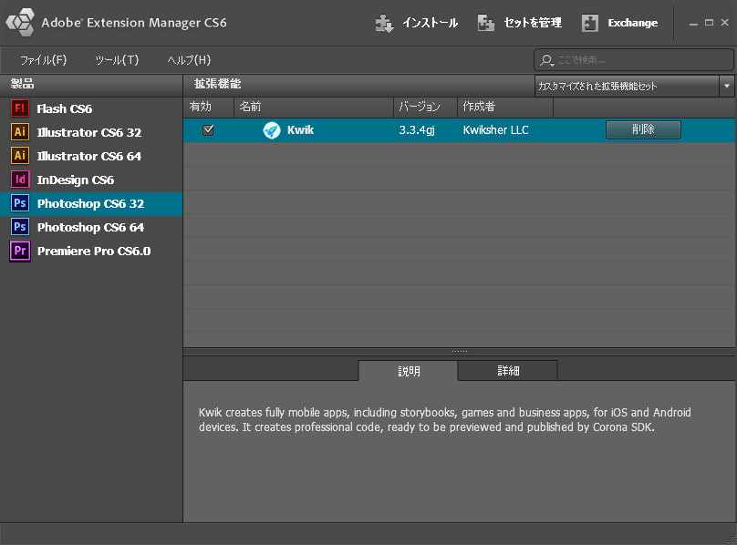
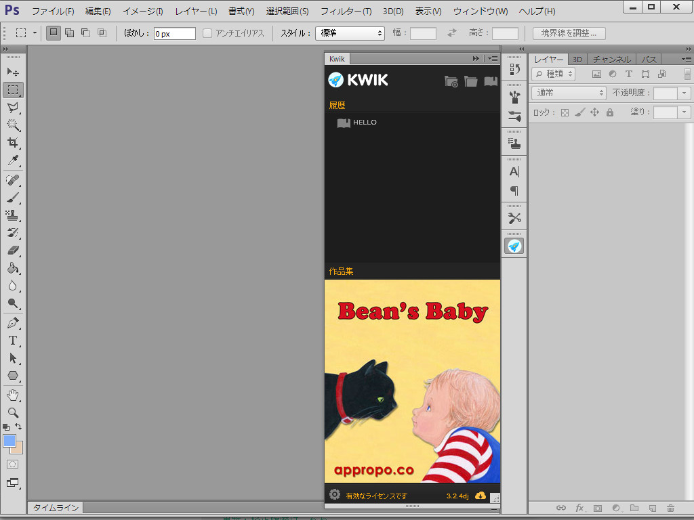

# Kwikとは

### Kwikのインストール
KwikはKwiksherのサイトからダウンロードします。ブラウザを起動して、アドレスバーに下記のURLを入力しKwiksherの日本語ホームページを開きます。
http://www.kwiksher.com/jp/

1. メニューから“ダウンロード”をクリックします。


2. ダウンロードするにはユーザ登録が必要となります。右上の”LOGIN"をクリックするか、”ログインする”から登録ページへ進みます。


3.名前とメールアドレスを入力して“登録”ボタンをクリックします。


4. ユーザが登録が行われました。再度メニューから、”ダウンロード”をクリックしてください。


5. ダウンロードのページから、緑色の”DOWNLOAD"ボタンをクリックします。


6. kwikj.zipファイルがダウンロードされます。これを解凍してください。


７．解凍して展開するとkwikj.zxpファイルがありますので、クリックしてください。アドビエクステンションマネージャが起動します。


８．Adobe Extension Managerが起動します。免責事項を確認して、“承諾する”ボタンをクリックします。


９．公開元を確認できませんのダイアログが開きます。右下の”インストール”を選択してください。


10.管理者権限での続行のダイアログが出ます。”はい”を選択して、続行してください。


11.Kwikがインストールされました。“有効”にチェックが入っていることを確認して、Adobe Extension Managerを閉じます。



12.フォトショップを起動します。ウィンドウメニューから、エクステンションのKwikを選択します。


13. KwikのWelcome画面が開きます。Welcome画面の右の画像は、「パネルサイズが小さい場合は、縦幅を長くしてください」とのメッセージとなっています。


14. Kwikの設定画面が開きます。Corona SImulatorのファイルパスとKwikのプロジェクトを格納するフォルダのパスがデフォルトの値で設定されています。
Windowsの場合、Corona Simulatorのパスは、

```
C:\Program Files (x86)\Corona Labs\Corona SDK\Corona Simulator.exe
```
プロジェクトフォルダは、
```
C:\Users\{ユーザ名}\Documents\Kwik
```

Macの場合は、　Corona Simulatorのパスは、
```
Application\Corona Labs\Corona SDK\Corona Simulator
```

プロジェクトフォルダは、
```
Users\{ユーザ名}\Documents\Kwik
```


15.下記のようにKwikのパネルが縦に短く表示された場合は、マウスを使い、縦幅をドラッグして長くしてください。


16.正常な状態のKwikパネルの初期状態は下記となります。



17.フォトショップのレイヤーパネルのオプション設定でサムネイル表示にしておきましょう。


