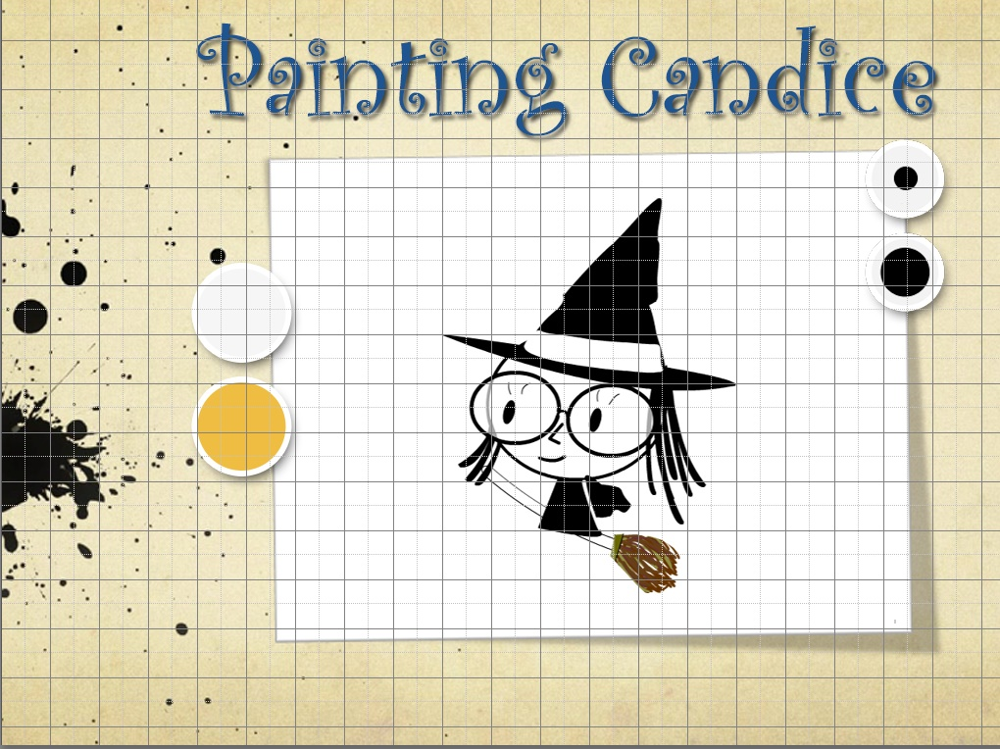

## Coloring Books

キャンバスに色を塗ります。

魔法使いが描かれたキャンバス、青と白とオレンジの色のパレット、それと塗りのサイズの大と小、カメラのアイコンからなるフォトショップのPSDファイルは下記のリンクからダウンロードできます。
http://www.kwiksher.com/tutorials/Multi/SocialCanvas_Sample.zip

### プロジェクトの作成
SocialCanvas_Sample.zipの中に含まれているcanvas.psdファイルを開き、Kwikのパネルから新規プロジェクトを作成します。

名前(Name)は、Coloring Book, デバイス(Device)は iPad,　向き(Orientation)は横向き、Use canvas.psdを有効にして作成します。

ユーザは、魔法使いの描かれたキャンバス(bigCandice)の上に色をつけることができます。色は青(butBlue)と白(butWhite)とオレンジ(butOrange)のパレットから選択し、塗りのサイズも選択(butMiddle, butLarge)することができます。できあがったときには、カメラアイコン(butCamera)をクリックすることで、スクリーンショットが撮影されて、デバイスの写真フォルダに格納されます。描かれたキャンバスの塗りをすべて消すためには、デバイス自体をシェイク（振る）といったインタラクションを利用します。

上記の動作を可能にする作業は行う前に何も作業をしないままパブリッシュしておきます。

Corona Simulatorで正しく表示されるかを確認します

### Disable Export Image
各レイヤーの画像ファイルが正しく出力されたことが確認できたら、KwikのパネルのPublishボタンの横のの画像のエクスポートを無効にしておきます。アイコンをクリックして、オレンジ色から灰色にします。画像は先ほどのパブリッシュで作成されたので、キャンバスの塗りのインタラクションのロジック部分だけのパブリッシュを行う設定で作業を行います。

画像出力が無効になっている状態

## インタラクションの設定

### 塗りのサイズーMedium
塗りのサイズを切り替えるボタンを設定します。レイヤー butMedium を選択して、インタラクション(Interaction)からボタン作成（Add button)を行います。

Add Button ウィンドウが表示されます。

名前として but_mediumと入力しました。
CanvasからBrash Sizeを選択して、Brush Selectionのダイアログで、サイズ 15, 透明度 100%を指定します。

### 塗りのサイズーLarge
塗りのサイズを切り替えるボタンを設定します。レイヤー butLarge を選択して、インタラクション(Interaction)からボタン作成（Add button)を行います。

Add Button ウィンドウが表示されます。

名前として but_Largeと入力しました。
CanvasからBrash Sizeを選択して、Brush Selectionのダイアログで、サイズ 30, 透明度 15%を指定します

### ScreenShot
レイヤー butCameraを選択して、インタラクション(Interaction)のボタン作成（Add Button）をクリックします。

Add Button ウィンドウが表示されます。

名前として but_screenShotと入力しました。
CanvasからTake Screenshotを選択して、シャッター音のチェックを有効にし、ダイアログはデフォルトの文字列が表示されます。

### 色ーBlue
レイヤー butBlueを選択して、インタラクション(Interaction)のボタン作成（Add Button）をクリックします。
Add Button ウィンドウが表示されます。

名前として but_blueと入力しました。
CanvasからBrush Colorを選択して、ブラシ色のダイアログで青色を設定します。

### buttonWhite
レイヤー butWhiteを選択して、インタラクション(Interaction)のボタン作成（Add Button）をクリックします。

Add Button ウィンドウが表示されます。

名前として but_whiteと入力しました。
CanvasからBrush Colorを選択して、Brush Colorのダイアログで白色を設定します。本当に純粋なRGB 255,255,255ではなく、それに近い白に設定したほうがよいでしょう。上記の例では２５５、２５５、２５２となっています。

### buttonOrange
レイヤー butOrangeを選択して、インタラクション(Interaction)のボタン作成（Add Button）をクリックします。

Add Button ウィンドウが表示されます。

名前として but_orangeと入力しました。
CanvasからBrush Colorを選択して、Brush Colorのダイアログでオレンジ色を設定します。

### キャンバスの消去-Erase
キャンバスに塗られた色を消去するためには、デバイスを振る（Shake) インタラクションを利用します。
まずキャンバスを消去するアクションを登録しておきます。

### Actionの登録
プロジェクトとページのアクションをクリックします。

Add Actionのウィンドウが表示されます。CanvasのErase Canvasを選択します。

### インタラクションの設定
InteractionのEnable shakeをクリックします。

Enable Shakeのダイアログで先ほど設定した アクションを選択します。

## Canvasの設定
最後にbigCandiceのレイヤーをキャンバスとして設定します。

### 領域について
bigCandiceのレイヤーの作りについて解説します。塗りが行われ部分は、bigCandiceのレイヤーです。

bigCandiceは、レイヤー backという白い紙を模したグラフィクスの上に配置されています。
bigCandiceのレイヤー自体は、背景が透過となっているレイヤーとなっています。このbigCandiceのレイヤーの領域の中で透過されている部分に塗りが適用されます。魔法使いの帽子や服といった既に色が描かれている部分は、ユーザの操作で色が塗られて上書きされることはありません。

bigCandiceのレイヤーの左上隅と右下隅の角に白い小さな四角形が描かれています。この白い小さな四角形がキャンバスの範囲を指し示す場所となります。Kwikは透過色のエリアの左上と右下にあるこの白い小さな四角形の位置の座標をキャンバスとして認識ますので、キャンバスとなるレイヤーには必ずこの2つの小さい四角形を配置しておいてください。１ピクセルでもよいので小さい四角形が必要です。

### Set Canvas
bigCandiceのレイヤーを選択して、インタラクションのキャンバスの設置をクリックします。

Set Canvasのウィンドウが表示されます。

幅と縦には、bigCandiceの左上と右下の小さな四角形の位置から計算された数字が設定されています。
キャンバスの色はデフォルトでは白です。
ブラシサイズ：１５ｐｔがデフォルトの値です。
ブラシ色:デフォルトの塗りの色を指定してください。キャンバスと同じ色が塗りに設定されると塗っても分かりませんので、注意してください。

## パブリッシュ
パブリッシュして、Corona Simulatorで動作確認を行います。

色を塗ります。パレットや塗りのサイズを切り替えることができます。

Corona SimulatorのメニューのHardwareからShakeを選択すると インタラクションとしてデバイスを振ったと同じことが起こります。

Shakeを選択すると、キャンバスの塗りが消去されます。

左下のカメラアイコンをクリックすると、スクリーンショットが撮影されます。

