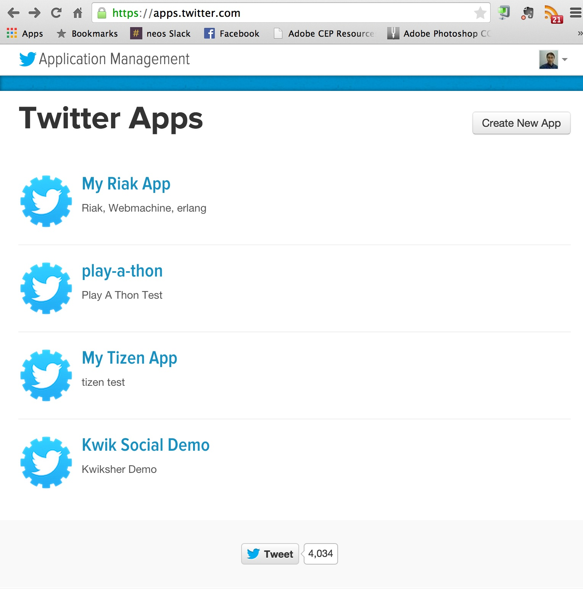
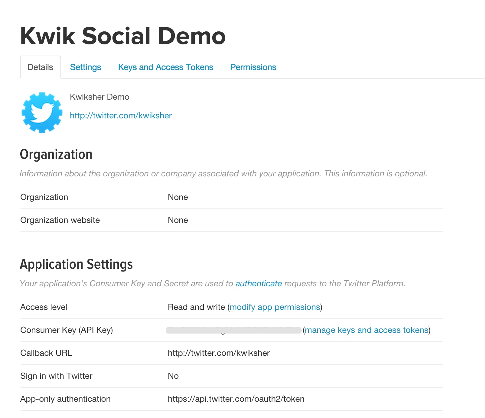

# Social Posting

http://www.kwiksher.com/tutorials/Multi/SocialCanvas_Sample.zip

事前準備として、9 Coloring Booksのチュートリアルを実施することをお勧めします。

外部コードの仕組みを使って、フェイスブックとツイッターに投稿してみます。
ツイッターとフェイスブックのREST APIを使用しますので、開発者サイトにログインして、ウェブアプリとして登録します。

https://apps.twitter.com
https://developers.facebook.com/apps

## Twitter
 https://apps.twitter.com を開いて、Create New Appからアプリ作成に進みます。

下記の例では kwik Social Demo appを作成しました。Callback URL には http://twitter.com/kwiksherを指定しました

Keys and Access Tokensのタブを開くと, Consumer key(API key) とConsumer Secret(API Secret) が表示されます。このキーを外部コードのcontroller/twiilter.luaに設定します。

## Facebook =====
https://developers.facebook.com/apps にいき、Add a New Appからアプリを登録します。

下記の画面ではWebsiteを選択してください。

下記の例ではKwik Social Demoアプリが作成されました. Site URL iには http://coronalabs.com/%E3%80%80となっていますが、任意のURLで構いません。
SettingsからApp IDと App Secretのキーコードを取得して、外部コードのcontoller/facebook.luaに設定します。

SocailNetwork_Sample.zipには下記の外部コードが含まれています。
* lib/
* controller/
* main_code.lua
* logout_code.lua
* post_fb_code.lua
* post_tw_code.lua

controller フォルダ開き、twitter.lua とfacebook.lua をテキストエディタで開きます。開発者サイトで作成したツイッターのconsumer_key、consumer_secretのキーコードをtwitter.luaに設定します。facebook.luaにはAppIDとAppSecretを設定します。

libとcontroller フォルダーをbuild フォルダにコピーしてください。

プロジェクトとページから、Main.luaに外部コードを追加をクリックします。

SocialCanvas_Sample.zipのmain_code.luaを指定してください。名前はcode_require_socialとしました。

ツイッターとフェイスブックボタンを作成します。Add Buttonのウィンドウでは、CodeのExternal Codeを指定します。.
フェイスブックには、post_fb_code.luaを指定してください。

同様にツイッターボタンを作成します。post_tw_code.luaを指定して下さい。

ログアウトボタンを作成します。logout_code.luaを設定してください。

以上です。Publishして、corona simulatorでお試しください。

