# Audacity

Kwikの読み上げ機能は、オーディオファイルの再生位置に応じてテキストの色を変えることで、テキストを読み上げているような見せ方をするものです。
読み上げ機能では、オーディオファイルと、読み上げのタイミングを指定する為のラベルファイルが必要になります。Kwikでの作業に入る前に、音声ファイルとラベルファイルの準備をしましょう。

読み上げ用のオーディオファイルを作成するため、レコーディング・サウンド編集ソフトウェアをAudacityのサイトからダウンロードしましょう。 Mac版とWindows版の両方が利用可能です。
http://audacity.sourceforge.net/

### Audacityを起動します

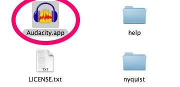

起動時に「ようこそ」画面を表示しない場合は、Don' t show this amain at start upにチェックを入れてOKボタンをクリックします。

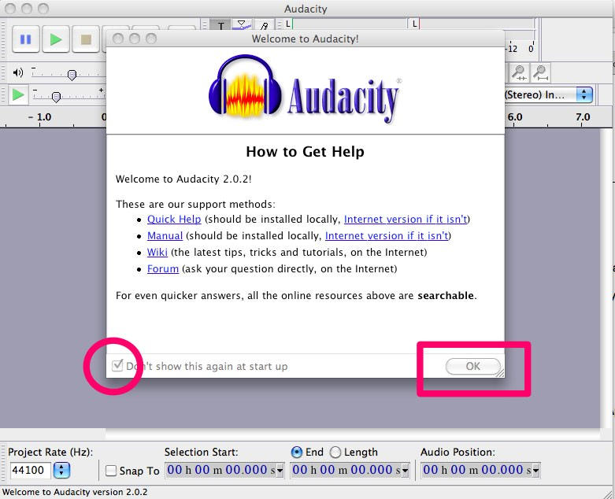

### Audacityで録音
1.録音ボタンをクリックして、「こんにちは、Kwikで読み上げしましょう」と発音して、録音します
2.ストップボタンで録音を止めます。

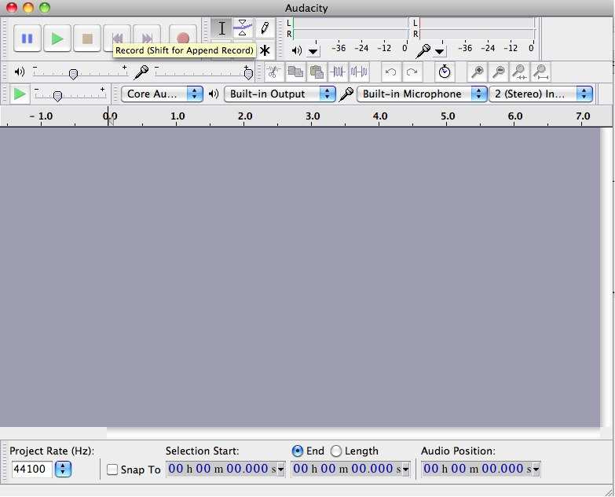
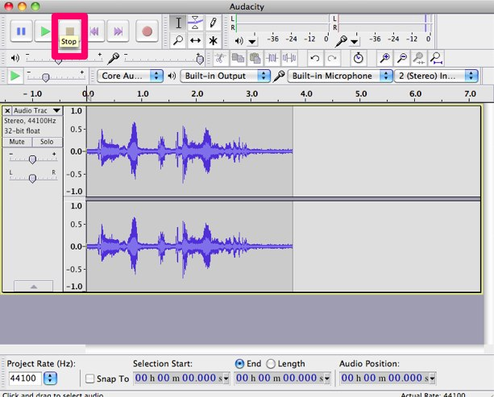

### MP3ファイルで出力
ファイルメニューから書き出しを選択します

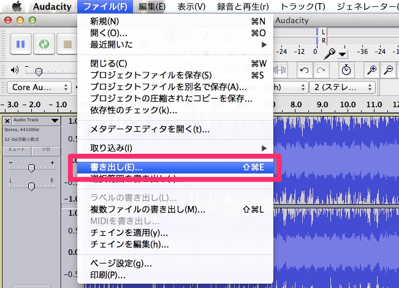

### 保存ダイアログ
以下の通り保存します。ファイル名は英数字で入力してください。
* ファイル名：Kwik_readme
* 出力フォーマット：MP3 ファイル
* 保存先：Documents/Kwikにreadmeというフォルダを作成して選択します。

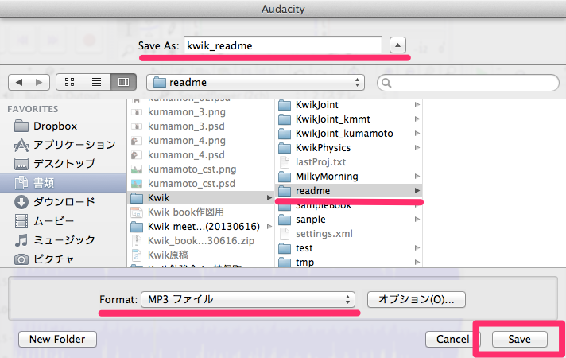

### メタデータ編集ダイアログ
OKをクリックします

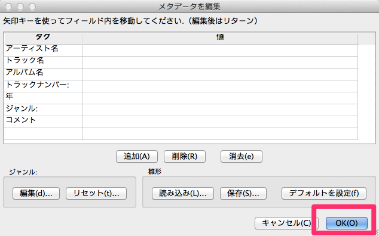

### AudacityでMP3を出力
Lameのインストールが完了したら、Audacityの画面に戻ってOKボタンをクリックします。

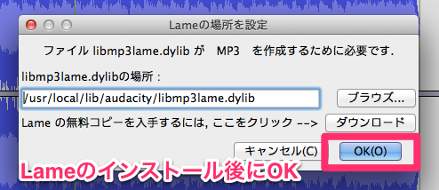

### 12.MP3ファイルを確認
12-1.MP3ファイルが出力されたことを確認します

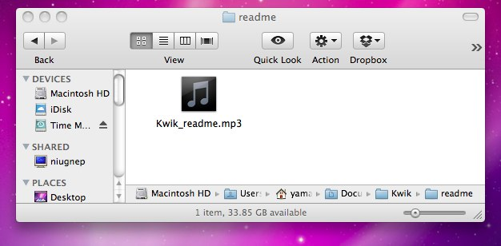

### ラベルを作成
「こんにちは」　「Kwikで」　「読み上げしましょう」の3箇所にラベルを付けます。
1.ラベルを付けたい範囲をマウスで選択します
2.Command+Bでラベルを挿入します
3.ラベルに名前を付けます

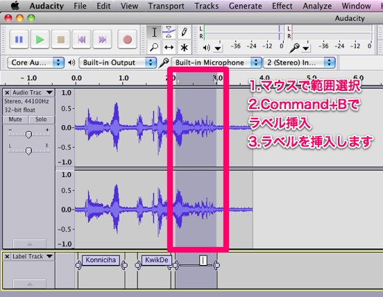

### 14.ラベルをエクスポート
ファイルメニューからラベルの書き出しを選択します

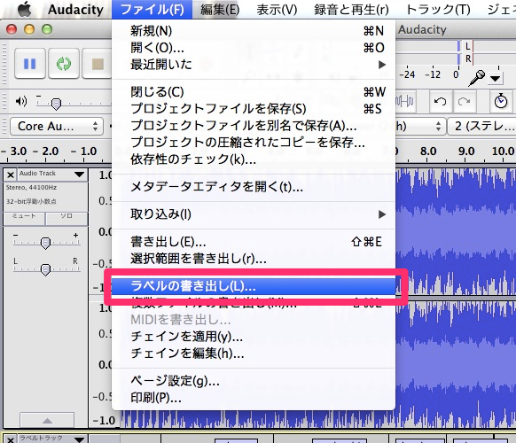

## ラベルファイルの保存ダイアログ
MP3ファイルと同じフォルダに、MP3ファイルと同じ名前でテキストファイルとして保存します
※ファイル名の末尾が.txtになっていないとKwikへ読み込むときに上手く行かない場合があるので注意してください。

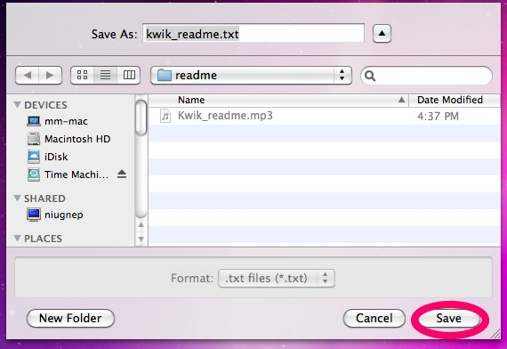
