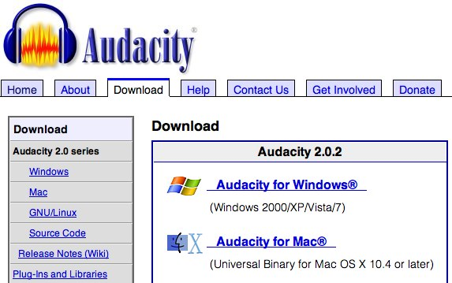
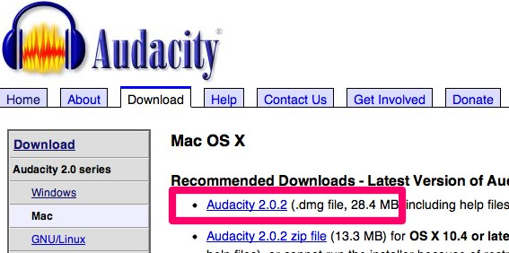
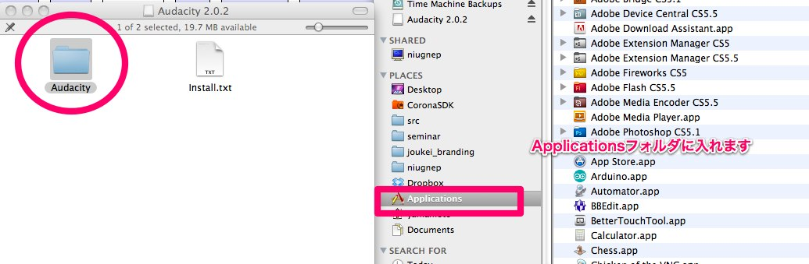
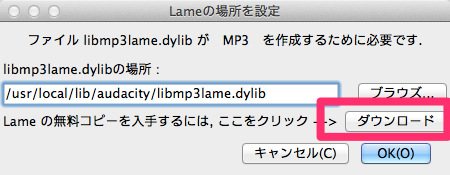
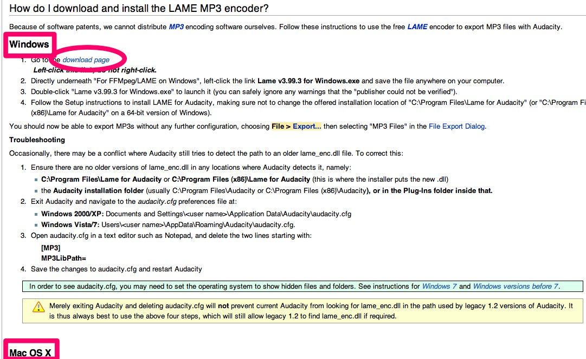
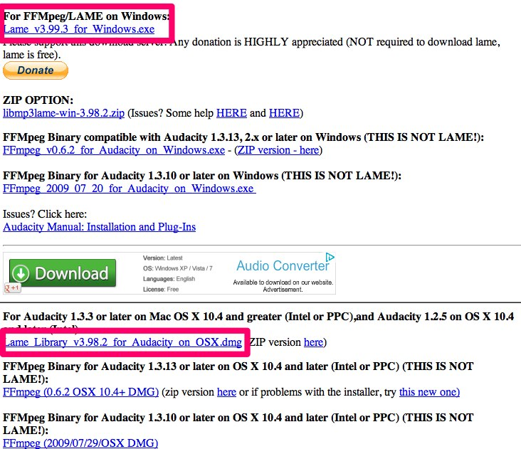
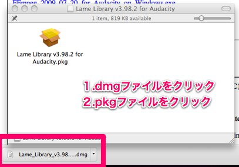

# Install

## 1.Audacityをダウンロード
Downloadから使用しているOS用のインストールファイルをダウンロードします。

## 2.Audacityをインストール
* Macの場合は、Applicationsフォルダに入れます。
* Windowsの場合は、インストールファイルをダブルクリックして、インストールします。

## 3.MP3作成の補助ファイルをダウンロード
MP3ファイル作成に必要な外部モジュールをダウンロードします（Macの場合は、libmp3lame.dylib）。ダウンロードボタンをクリックします。

## 4.Lameをダウンロードします
表示されたサイトから、使用しているOS用のインストールファイルをダウンロードします。

## 5.Lameをインストールします

