# Multilingual
英語とスペイン語とポルトガル語と日本語の４つの言語に対応したプロジェクトの作成について解説します。
このチュートリアルで使用するファイルはこちらからダウンロードできます。

http://www.kwiksher.com/tutorials/Multi/Multi_Lingual_Sample.zip

Multi_Lingual_Samplei.zipを解凍して、展開すると下記のファイルが含まれています。
フォトショップのファイル
* page1.psd
* page2.psd

読み上げの音声ファイル
* en_narration.mp3
* ja_narration.mp3
* pt_narration.mp3
* sp_narration.mp3

読み上げのタイミング（Audacityのラベル）のファイル
* en_labels.txt
* ja_labels.txt
* pt_labels.txt
* sp_labels.txt

### １ page1.psdをフォトショップで開きます。

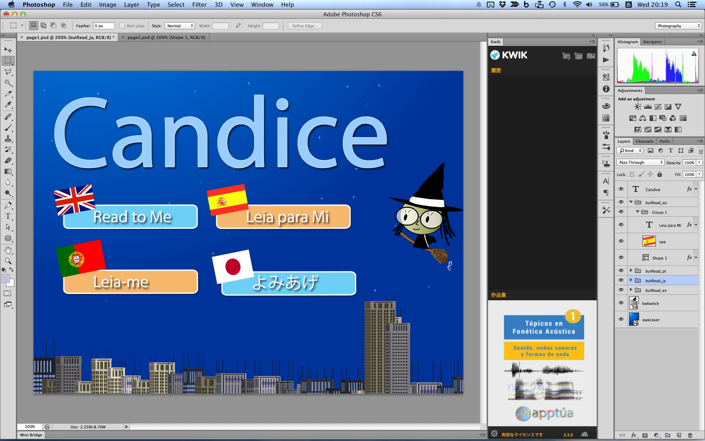

### 2 Kwikのパネルから新規プロジェクトを選択します。

新規プロジェクトのダイアログで以下の内容を設定します。

名前：Multi_Lingual
デバイス：iPad Mini
向き：横向き
Use page1.psd にチェックを入れます。

### ３ Page2を開き、ページの追加を行います。

プロジェクトとページから新規ページ追加をクリックしてください

ページ追加のダイアログでタイトルにpage2と入力して、Use page2.psdにチェックをいれて、OKをクリックします。

ページ一覧を表示して、001-page1と002-page2が登録されていることを確認します。

page1は下記のレイヤーを含んでいます。
* langTxt  現在設定されている言語情報を表示します。
* Candice　タイトル文字列です。
* butRead_sp スペイン語のボタン
* butRead_pt ボルトガル語のボタン
* butRead_ja 日本語のボタン
* butRead_en 英語ののボタンです。
* kwkwitch　魔法使いの画像です。
* kwkcover 背景画像です

page2は下記のレイヤーを含んでいます。
* father_ja　日本語のテキスト文字列です。
* father_pt　ポルトガル語のテキスト文字列です。
* father_sp　スペイン語のテキスト文字列です。
* father         英語のテキスト文字列です。
* butFlyOver_jp　日本語のボタンが押されたときのボタンオーバの画像。
* butFly_ja          日本語のボタン
* butFlyOver_pt　ポルトガル語のボタンが押されたときのボタンオーバの画像。
* butFly_pt          ポルトガル語のボタン
* butFlyOver_sp　スペイン語のボタンが押されたときのボタンオーバの画像。
* butFly_sp          スペイン語のボタン
* butFlyOver　　 英語のボタンが押されたときのボタンオーバの画像。
* butFly              英語のボタン
* witch　       英語の魔法使い
* witch_sp　  スペインの魔法使い。
* witch_ja　  日本の魔法使い。
* witch_pt　  ポルトガルの魔法使い。
* kwkcover 　背景画像です。

### ４ パブリッシュ
画像ファイルの出力を最初に行います。ボタンやアニメーションへのアクションやイベントの作業は、画像ファイルのパブリッシュを行った後に行います。Kwikのパネルの画像の出力のアイコンがオレンジ色になっていることを確認して、Publishをクリックしてください。

い

PNG画像の圧縮をしておきます。PNG画像の圧縮をクリックしてください。

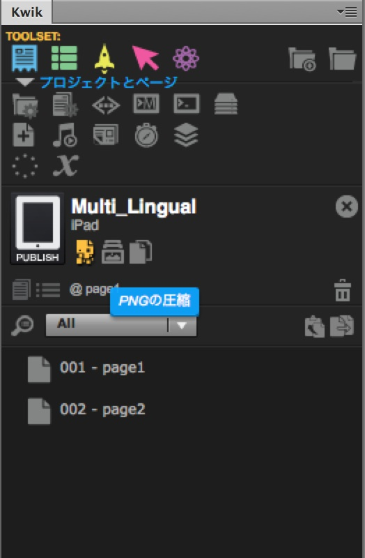

Corona Simulatorで確認します。ＯPENからドキュメントフォルダの配下の  Kwik > Multi_Lingual > buildからmain.luaを選択します。

画面をマウスでスワイプしてみましょう。

ii

画像が正しくパブリッシュされていることが確認できたら、画像出力のアイコンを灰色の状態して、画像出力をオフの状態にしておきます。画像出力をオフにした状態で、パブリッシュを行うと、ボタンやアニメーション設定などプログラムに関わる部分のみの処理となるので、パブリッシュ処理が迅速に終了します。

※レイヤーを追加や画像を変更した場合は、画像出力のアイコンを灰色のオフの状態にしたまま、追加・変更したレイヤのみを出力する機能が用意されています。画像出力したいレイヤーをレイヤーパネルで選択した状態で、Shift(シフト）キーを押したまま、マウスでパブリッシュをクリックすることで、選択されたレイヤーのみが画像出力されます。

### ５ 言語設定
複数言語に対応したKwikプロジェクトにするために、使用する言語を登録します。プロジェクト属性をクリックして開きます。

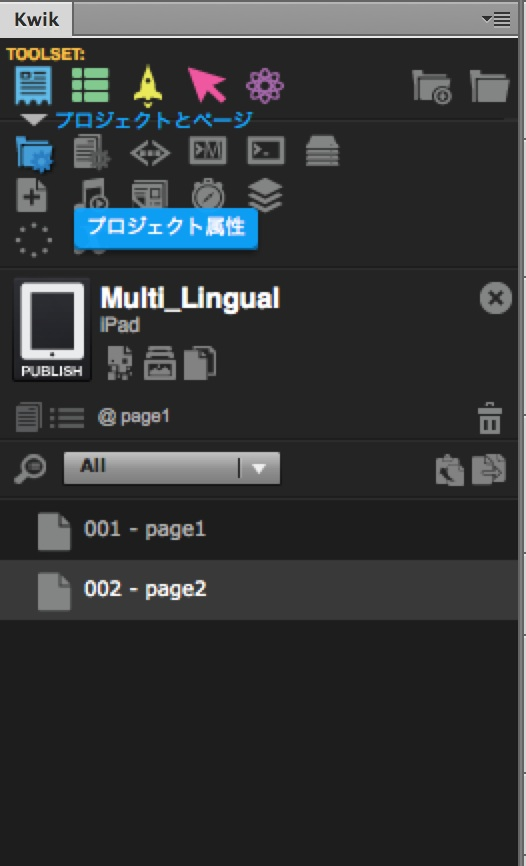

言語パネルを選択してください。

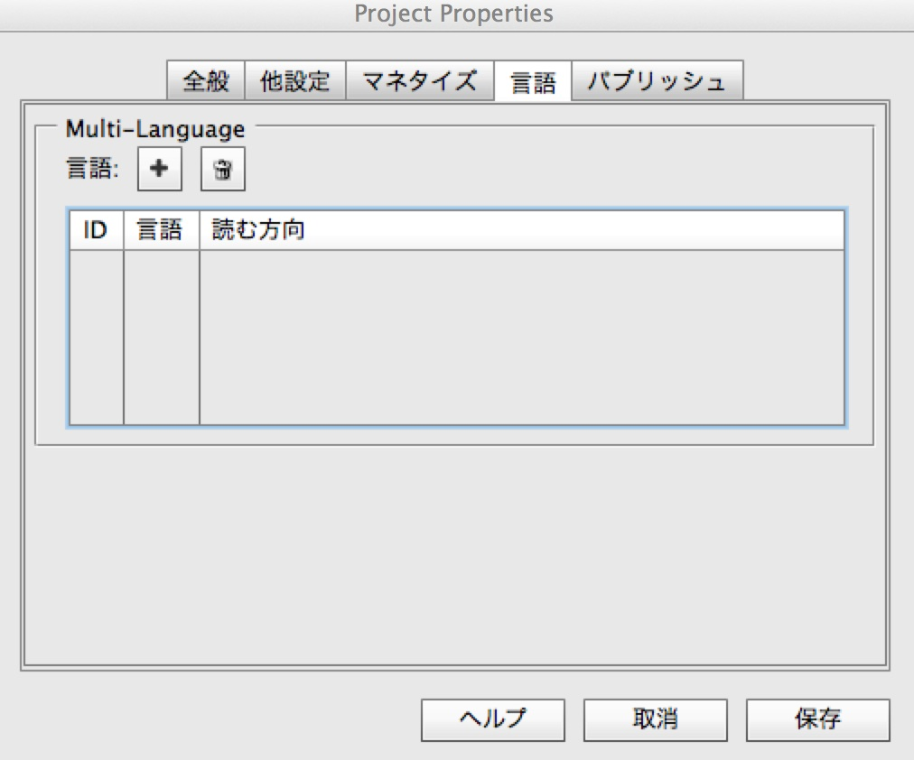

言語の横の＋アイコンをクリックして、言語を追加します。Add New Languageの入力ボックスが表示されます。

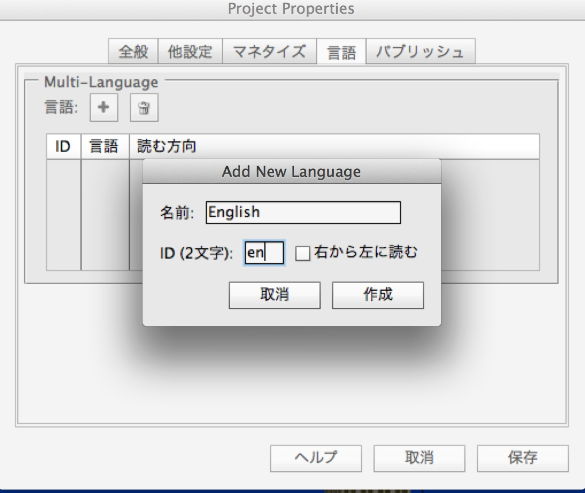

Name：名前に "English"を入力します。
ID(2 chars): 言語のIDとして、"en"を設定します。"en"は、英語のIDです。
右から左のチェックは無効にします。英語は、左から右に読む言語ですので、チェックは必要ありません。

英語が追加されたれ、スペイン語、ポルトガル語、日本をを同様に追加します。

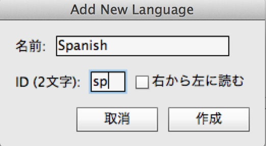
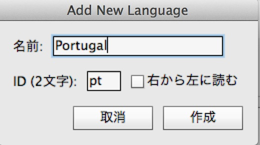
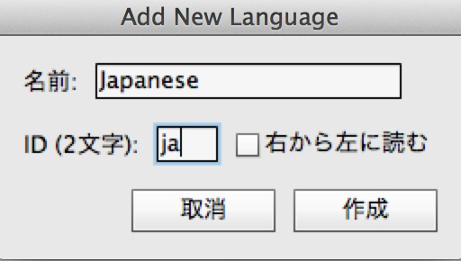

4各国語の言語が登録されました。保存をクリックします。

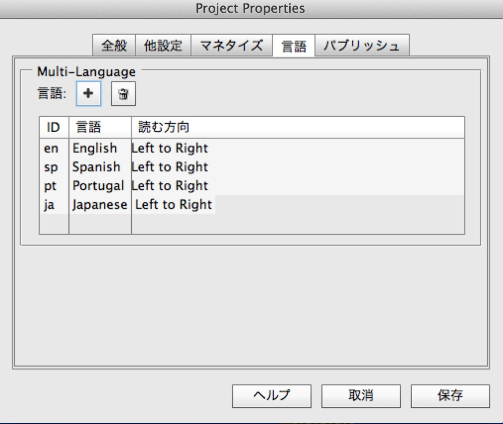

注意すべき点として、言語のIDである 英語のenやスペイン語のspは、デバイスのOSで定義されているものであることが必要です。日本語のIDは、jaです。もしも該当の言語が見つからなかった場合は、一番上に設定されている言語が使用されます。上の例ですと、en のEnglishがデフォルトの値です。ポルトガル語は、ptとpt-BR（ブラジル）の２つがiOSでは定義されています。この点については、最後の補足事項で説明します。

### ６ 言語選択ボタン
page1を開きます。英語のRead to Meのボタンを設定します。レイヤーのbutRead_enをレイヤーパネルで選択します。

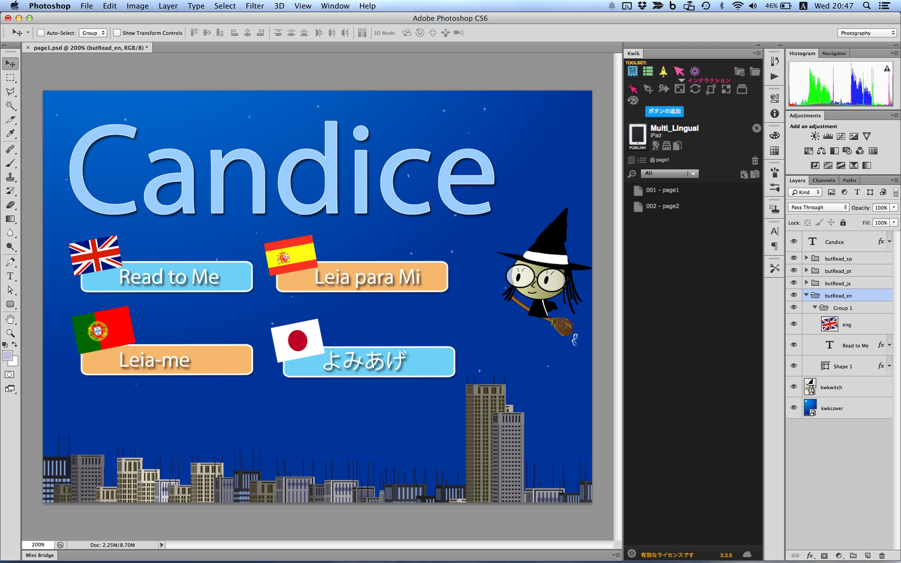

次にKwikのパネルから、インタラクション > ボタンの追加をクリックします。

Add Buttonウィンドウが開きます。Nameをbut_enに設定します。Language から Set Languageをクリックします。

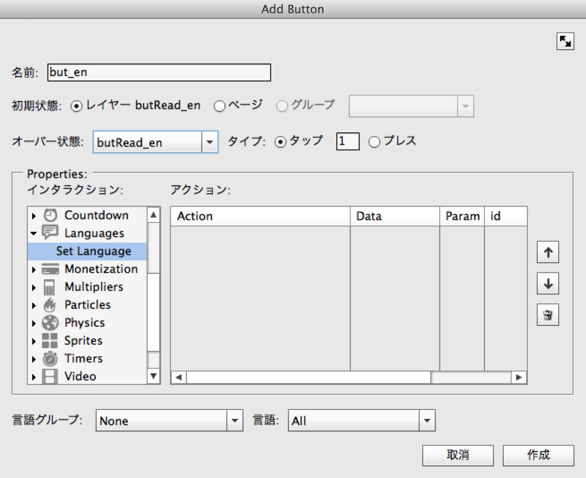

SetLanguageでは言語のEnglishを選択します。再読込みのチェックは、無効にしてください。page1はタイトルページですので、ページを再読み込み(Reload)はせずに、page2に移動する設定を次に行うためです。

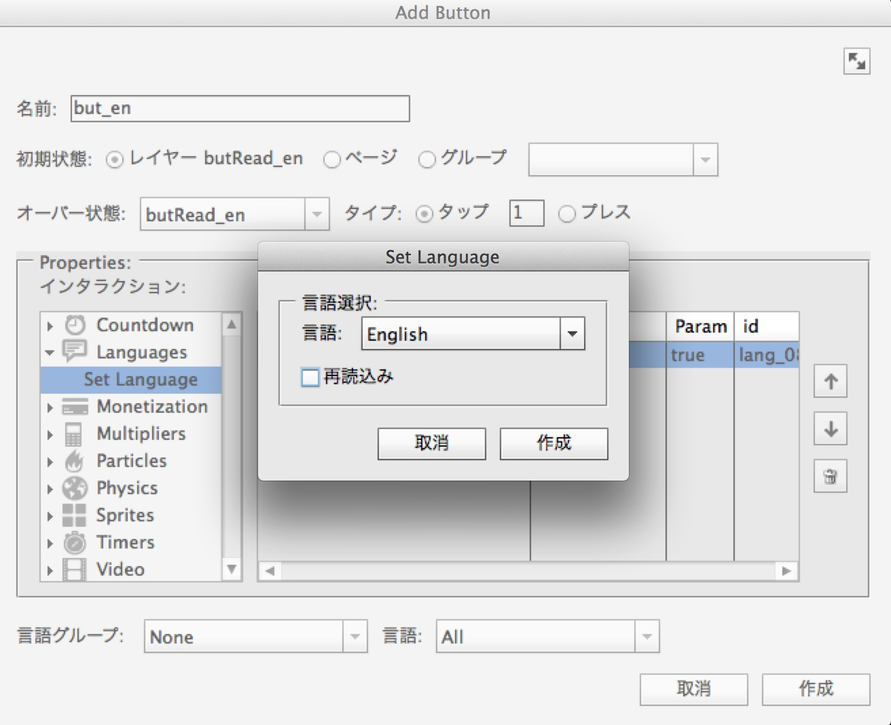

レイヤー butRead_enをクリックしたときに、Set LanguageでEnglishが登録されるボタンとなります。次に、このAdd buttonのダイアログを開いたまま、左のCommon > Read to Meを選択します。

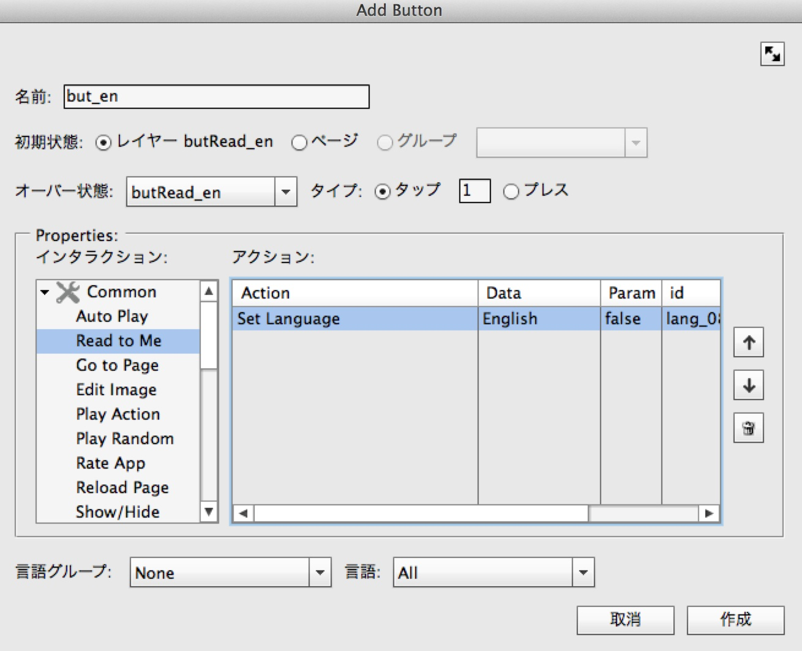

Read to Meのアクションを登録します。Set Read to Meの入力ボックスでは、読み上げを有効にします。次のページに自動で遷移も有効にします。

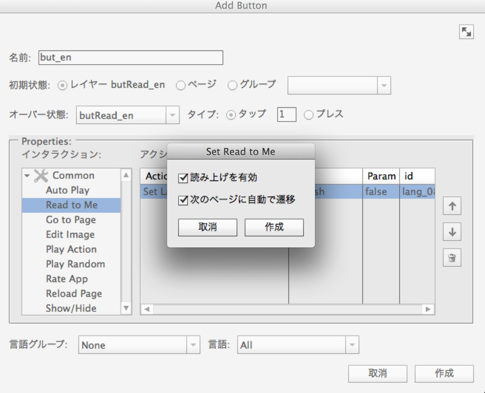

Set LangugaeとRead to Meが登録されたら、作成をクリックして、Add Buttonのダイアログを閉じます。

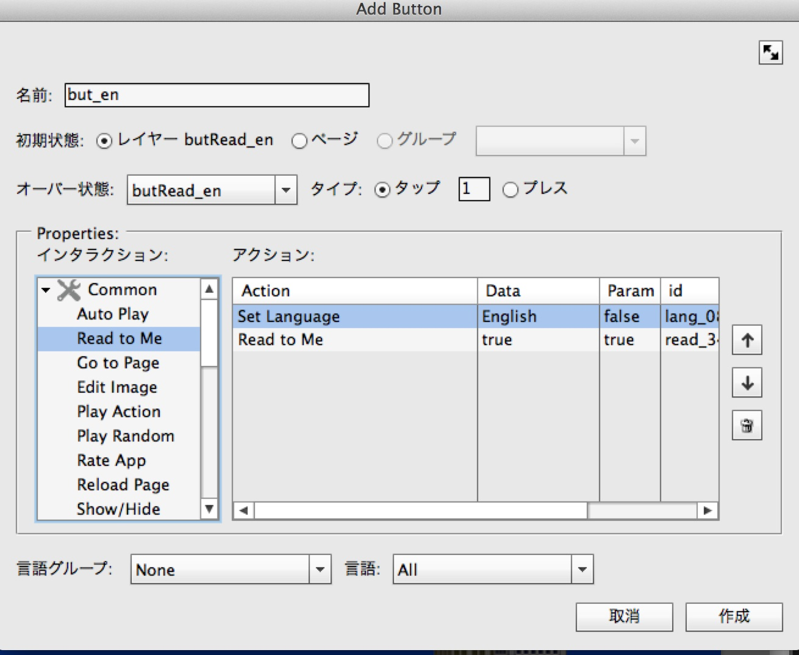

同様に日本語、スペイン語、ポルトガル語の各ボタンを作成します。

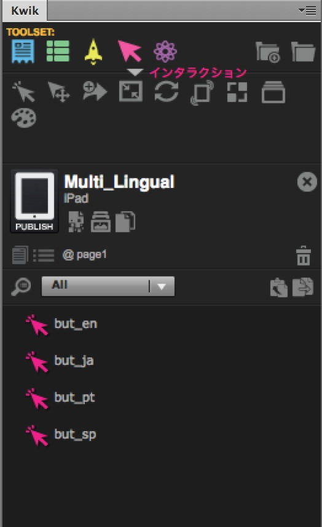

### 7 読み上げ音声ファイル - Page2
読み上げの音声ファイル(.mp3)は、ファイル名の先頭に言語のIDの2文字から始まっている必要があります。

* en_narration.mp3
* ja_narration.mp3
* pt_narration.mp3
* sp_narration.mp3

page２を表示します。

プロジェクトとページ　> サウンド追加をクリックします。

Add Audioのウィンドウが開きます。英語の読み上げファイル en_narration.mp3を登録します。

ファイルに英語のen_narration.mp3の読み上げファイルを選択します。
読み上げのチェックを有効にします。
ページ開始で再生のチェックを有効にします。
ループの回数を1回に設定します。
言語の設定をEnglishにします。
保存します。

同様に各言語の読み上げ音声ファイルを登録します。

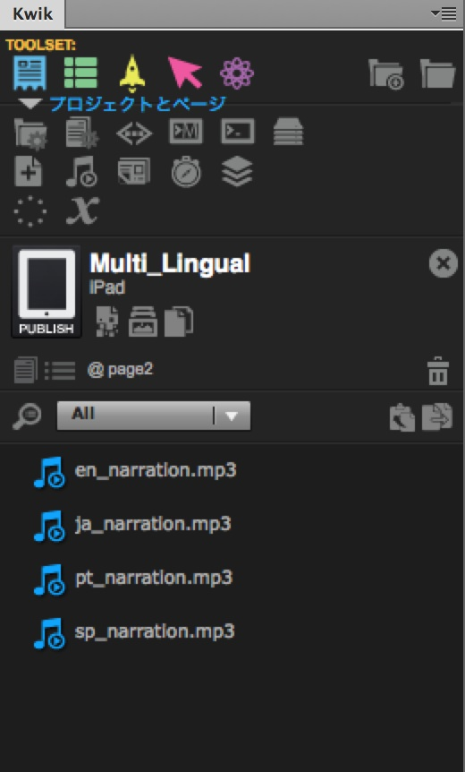

==### 8 読み上げファイルの登録==
スペイン語の音声ファイルとAudacityのラベルファイルは以下となります。
* sp_labels.txt
* sp_narration.mp3

英語の音声ファイルとAudacityのラベルファイルは以下となります。
* en_labels.txt
* en_narration.mp3

日本語の音声ファイルとAudacityのラベルファイルは以下となります。
* jp_labels.txt
* jp_narration.mp3

ポルトガル語の音声ファイルとAudacityのラベルファイルは以下となります。
* pt_labels.txt
* pt_narration.mp3

レイヤー fatherに英語の読み上げを設定してみましょう。レイヤーパネルから、fatherのレイヤーを選択します。

レイヤーと置換 > 音声とテキストの同期に置換をクリックします。Sync Audo and Textのウィンドウが表示されます。

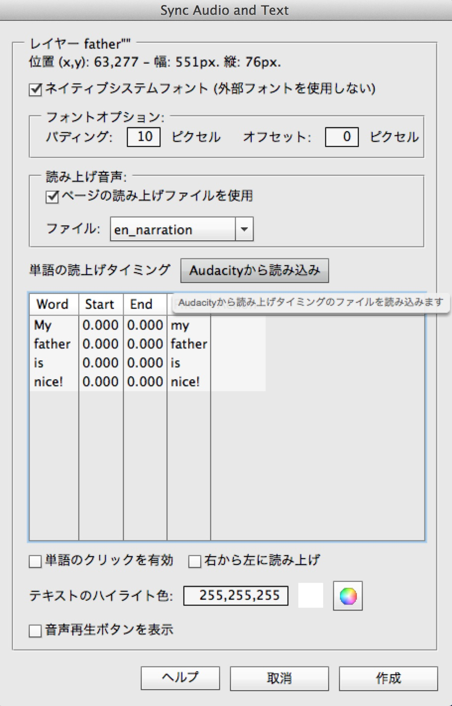

読み上げ音声は、ページの読み上げファイルを使用にチェックを入れて、 登録されている en_narrationを選択します。
Audacityから読み込みをクリックして、読み上げタイミングのAudacityのラベルファイルを選択します。

en_labels.txtを読み込むと下記のようになります。

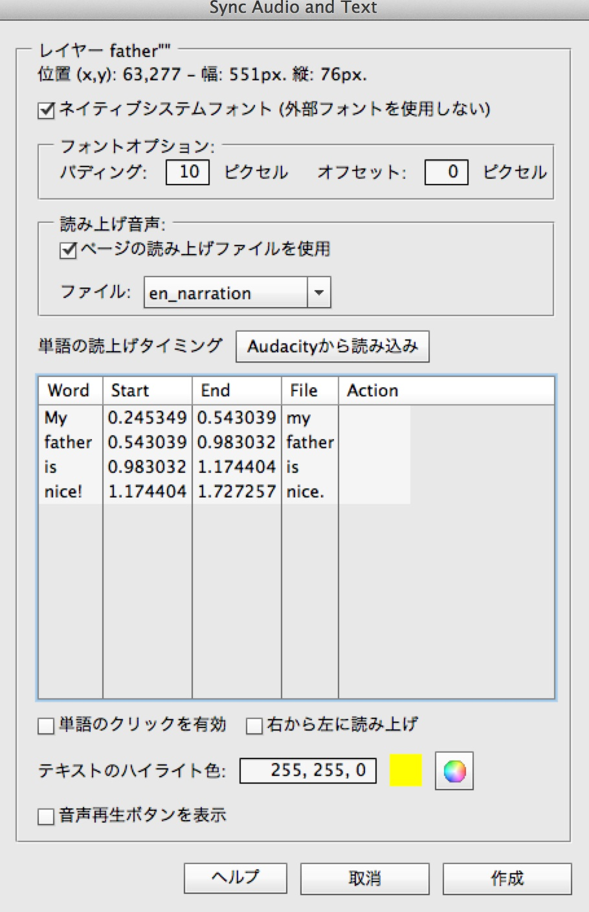

テキストのハイライト色には、黄色を設定します。作成ボタンをクリックして、完了です。

同様に、father_ja, father_sp, father_ptの各レイヤーを選択して、音声とテキストの同期を設定してください。

### ９ 言語による切り替え - Set Language
ユーザが最初のpage1のボタンで言語を選択しています。この選択された言語によって、page2の表示を選択された言語のみを表示し、他の言語のレイヤーを非表示にします。

page2のレイヤー fatherを選択した状態で、レイヤーと置換 > レイヤーに言語設定をクリックします。

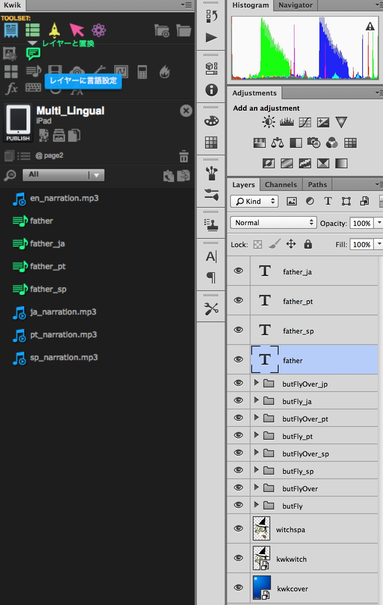

Set Languageのウィンドウが表示されます。

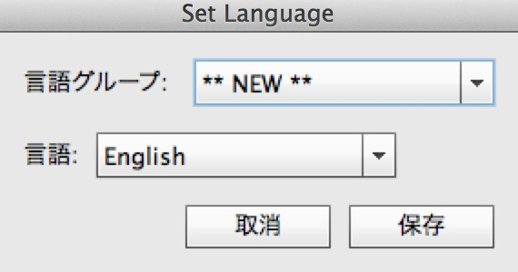

言語グループ:　グループを新規に作成します。このグループには、father, father_ja, fahter_sp, father_ptが所属することになります。
言語: このfatherレイヤーは、英語のときの表示なので、Englishを選択します。

同様に、スペイン語のfather_spレイヤーを選択して、レイヤーに言語を設定します。Set Languageの設定では、言語グループをfatherを選択して、言語をSpanishを選びます。

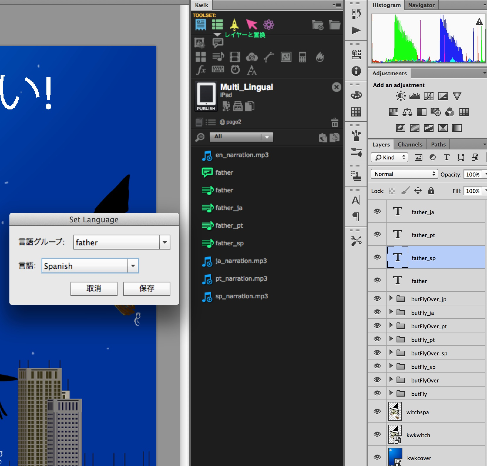

同様に、ポルトガル語のfather_ptレイヤーを選択して、レイヤーに言語を設定します。Set Languageの設定では、言語グループをfatherを選択して、言語をPortugalを選びます。

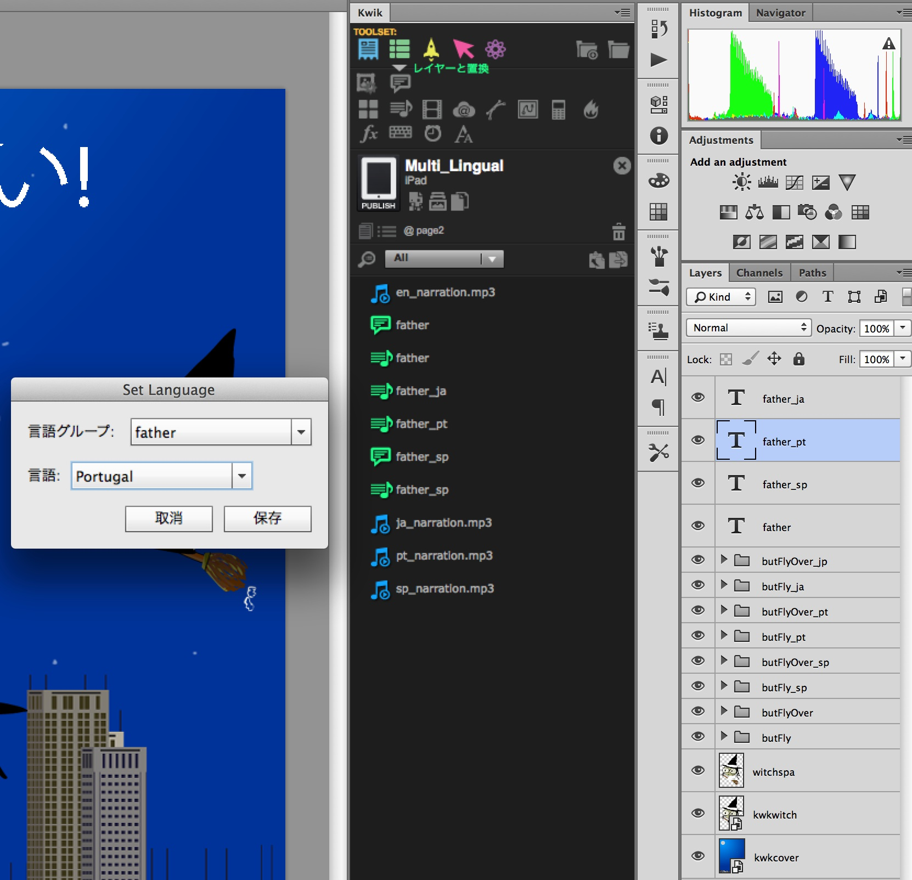

同様に、日本語のfather_jaレイヤーを選択して、レイヤーに言語を設定します。Set Languageの設定では、言語グループをfatherを選択して、言語をJapaneseを選びます。

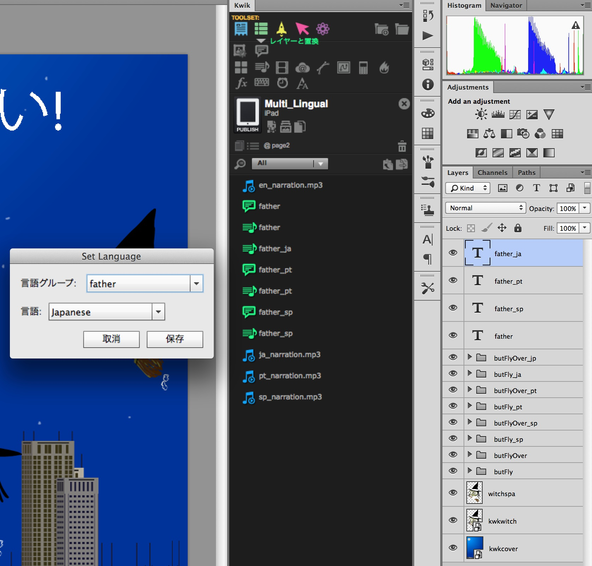

以上でpage1でユーザが選択した言語によって、page2で表示されるレイヤが切り替わることになります。

### 10 言語切り替えによるアニメーション
魔法使いのアニメーションを作成します。魔法使いが飛んでいくアニメーションを、言語によって切り替えて表示します。アニメーションの設定は、英語のwitchレイヤーに設定されたものを、他のwitch_ja, witch_pt, witch_spにも適用します。４つのアニメーションを作成する必要はありません。witchレイヤーを選択して、アニメーションを作成します。

アニメーション > 線形アニメーションをクリックします。

Linear Animationのウィンドウが表示されます。

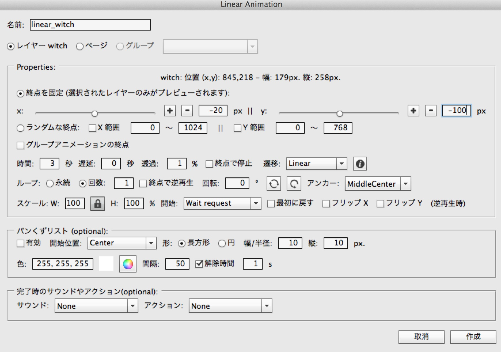

名前をlinear_witch
x: -20を入力
y:-100を入力
透過の値を１％にします。
ループを１回に設定
開始をWait requestにします。

作成をクリックして、完了します。

### 11 言語で切り替えアニメーション
一つのアニメーションを言語毎のレイヤーに適用するためには、レイヤーに言語設定を利用します。アニメーションを作成したレイヤー witchを先ず英語に割り当てます。

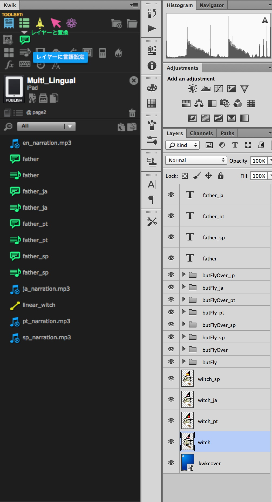

Set Languageのダイアログが表示されます。

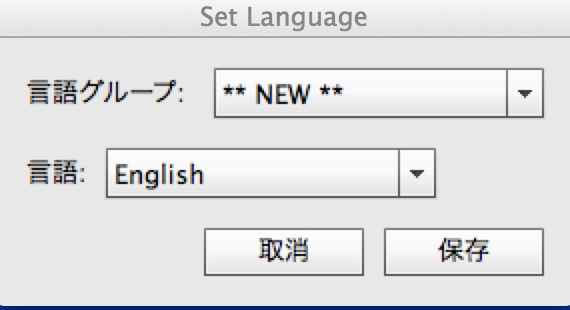

言語グループを新規作成（** NEW **)にし、言語をEnglishにして、保存します。
グループには、witch, witch_sp, witch_ja, witch_ptが所属することになります。

つぎにポルトガル語のレイヤー witch_ptを選択して、レイヤーに言語設定をします。

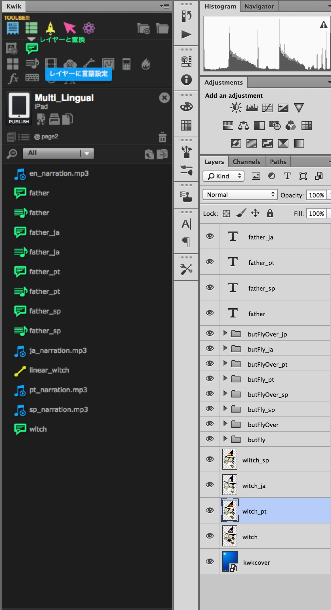

Set Languageのダイアログが表示されます。

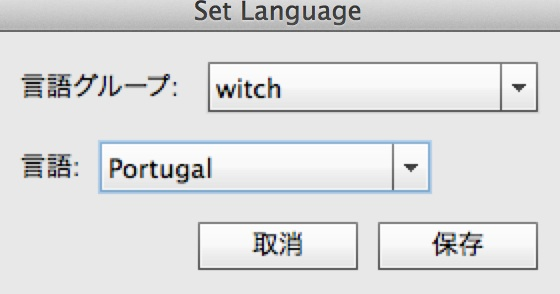

言語グループには、さきほど設定を行ったwitch がリストボックスから選択可能です。witchを指定してください。
言語には Portugalを選択します。保存します。

同様にwitch_ja, witch_spのレイヤーに言語を設定して、言語グループに共通のwitchを指定します。

### 12 言語で切り替えボタン
英語のFlyのボタン(butFlyレイヤー）、日本語の飛ばす、スペイン語のvolar、ポルトガル語のVoarの各ボタンをクリックすると、魔法使いが飛んでいくアニメーションを再生します。ボタン追加のダイアログの中に、言語と言語グループの設定が用意されています。

レイヤー butFlyを選択して、インタラクション >　ボタンの追加をクリックします。

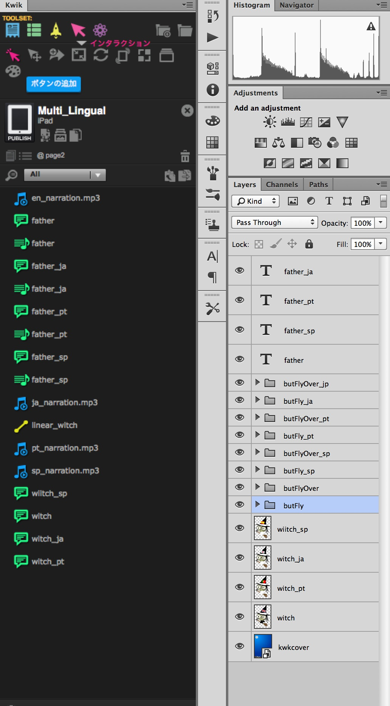

Add Buttonのウィンドウが表示されます。Flyボタンは、レイヤー butFlyとオーバレイヤーのbutFlyoverを使用します。

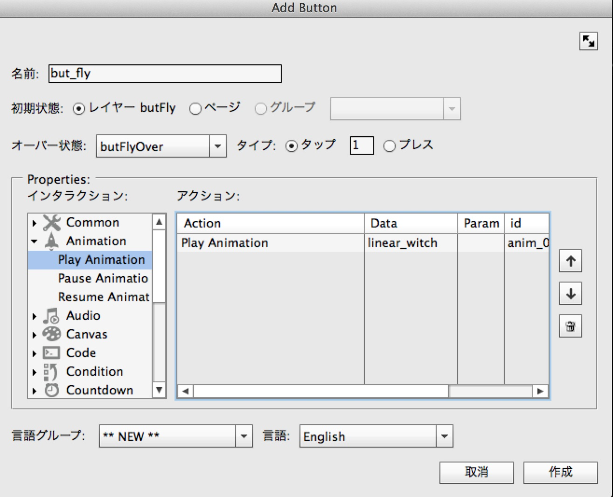

名前をbut_flyにします。
オーバ状態には、butFlyOver レイヤーを選択してください。
インタラクションから AnimationのPlay Animationをクリックして、アクションとして登録します。
先ほど作成してwitchの魔法使いが飛んでいくアニメーションを選択します。
Language groupの新規作成（** NEW **)を選択して、言語には、Englishを指定します。butFly_pt, butFly_sp, butFly_jaがこのグループに所属します。

作成をクリックします。

つぎにスペイン語のボタンである butFly_spを設定します。レイヤー butFly_spを選択して、ボタンのを追加クリックします。

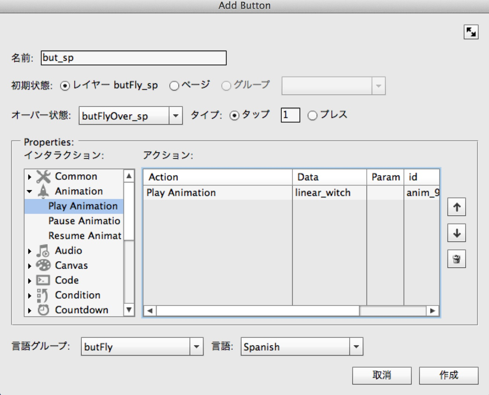

名前は、but_spとします。
オーバー状態は、butFlyOver_spとします。
アクションに、アニメーションを登録しますが、英語のbutFlyボタンで登録したときと同じ、linear_witchを指定します。このlinear_witchを各言語のアニメーション設定に流用します。
言語グループには、さきほど作成したbutFlyが選択可能です。butFlyを指定してください。言語には、Spanishを指定します。
作成（Create)をクリックします。

ポルトガル語のbutFly_ptレイヤーのボタン設定も同様です。

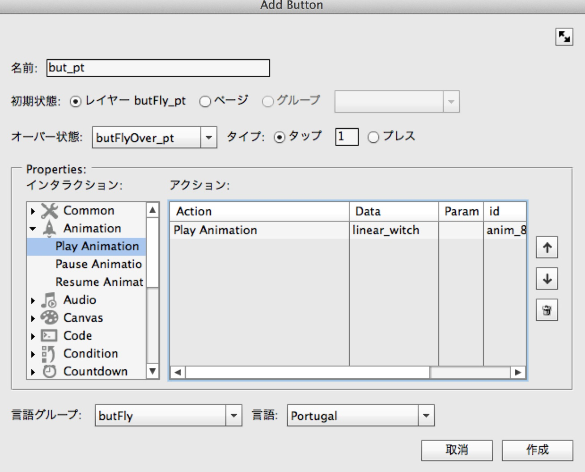

日本語のbutFly_jaレイヤーのボタン設定も同様です。

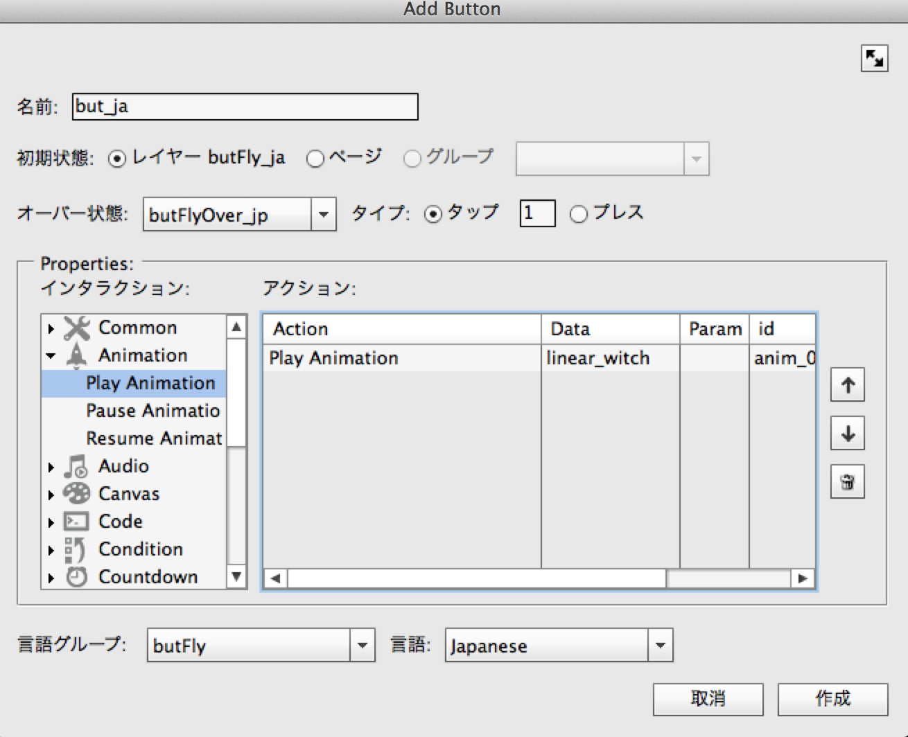

### 補足
iOSでは、ポルトガル語の言語コードが pt と pt-BR の２つが存在します。ポルトガル本国とブラジル諸国の２つが意識されているようです。このため、以下のfix_pt.luaのパッチをあてる必要があります。fix_pt.luaは、Multi_Lingual_Samplei.zipに格納されています。

### パブリッシュとデバイスビルド
パブリッシュを行い、Corona Simulatorで動作を確認しましょう。

iPhone/iPadやアンドロイドのデバイス上では、デバイスに設定されている言語設定がデフォルトの値となります。デバイスで動作させると、１ページ目langTxtレイヤーに言語識別市が表示されます。下記の例ですと、日本語のjaが表示されています。

