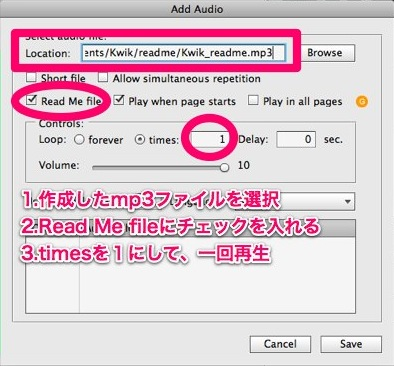

# Read Me
読み上げの作成

前章で準備したMP3ファイルを使って、Kwikで読み上げを行うアプリケーションを作成しましょう

### 1.新規プロジェクト作成
Kwikのプロジェクトを新規作成します。作成したMP3ファイルと同じフォルダを指定して、プロジェクトを作成します。Project Infoは、下記の通り設定します。
* Name：readme
* Device：iPad
* Orientation：横画面

### 2.テキストを追加
1.テキストレイヤーを作成します
2.「こんにちは」「Kwikで」「読み上げしましょう」と入力します。
各フレーズの後には、半角スペースをいれます。
3.レイヤ名をreadmeTxtに変更します。

### 3.サウンドを追加
KwikパネルのAdd audioをクリックします

### 4.Add Soundダイアログ
1.作成したMP3ファイルを選択します
2.Read Me fileにチェックを入れます
3.Loopのtimesを1にします。これでMP3ファイルを1回再生します。

### 5.Sync Audio and Textの作成
1.readmeTxtレイヤーを選択します。
2.KwikパネルのSync audio and text replacementをクリックします

### 6.Sync Audio and Textのダイアログ
1.AudioにKwik_readmeファイルが選択されていることを確認します
2.Import from Audacityをクリックします

### 7.readme.txtを選択
7-1.kwik_readme.txtを選択します

### 8.ダイアログを完了
1.ラベルが読み込まれ、再生位置のラベルが文字に割り当てられたことを確認します。
2.Show Play buttonにチェックを付けます。
3.Createボタンをクリックしてダイアログを完了します

※再生位置のリストの表示が乱れている場合は、列幅を広げると表示がきれいになります。

### 9.コードを追加
KwikパネルのAdd External Codeをクリックします

### 10.コードを入力
syncSound.kwk_readMe=1と入力します。

### 11.パブリッシュ
Kwikパネルからパブリッシュを行います

### 12.Corona Simulatorで確認
再生ボタンを押して動作を確認します。

