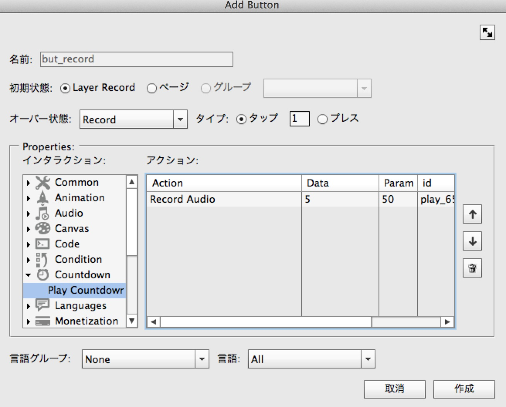
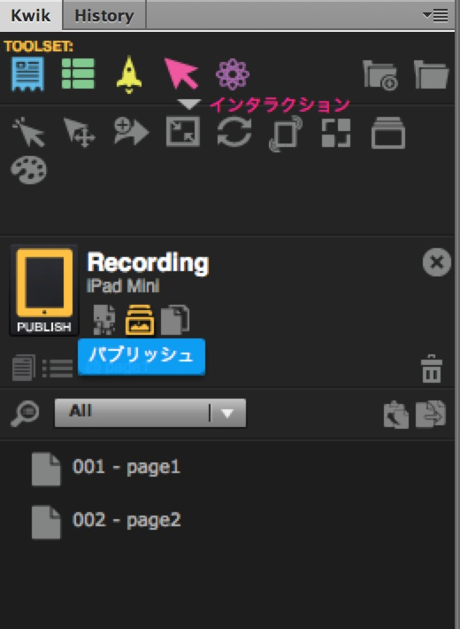
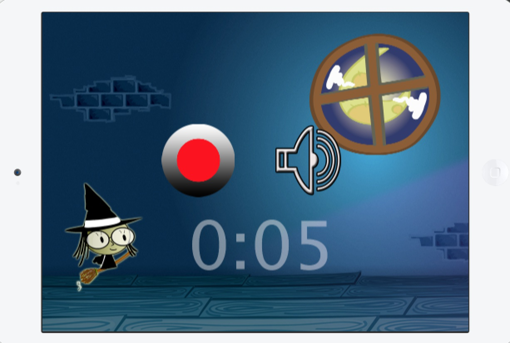
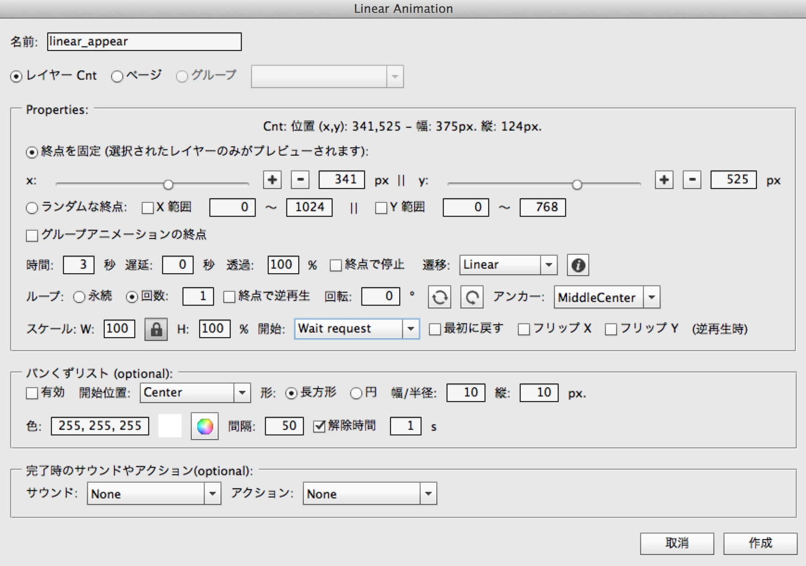

# Recording

http://www.kwiksher.com/tutorials/Multi/Recording_Sample.zip
page1.psdとpage2.psdを開きます。

page1.psdを開いた状態で、Kwikパネルから新規プロジェクトを作成します。

名前:Recording
デバイス:iPad Mini
Use page1.psdにチェック

Recordレイヤーを選択して、音声を録音するボタンを作成します。

Add Buttonのウィンドウ

名前：but_record
インタラクション: Audio > Record Audio

Record and Play Audioのダイアログが開きます

時間を５秒にして、登録して、ボタンを作成してください。
録音ボタンの設定は以上となります。

次にPlayレイヤーを選択して、録音した音声の再生ボタンを作成します。

Add Buttonのウィンドウが開きます。

名前をbut_playとします
インタラクションのCode > External Codeを選択します。

Add External Codeのダイアログが開きます。

Recording_Sample.zipを展開したフォルダにmyvoice.luaが含まれていますので、それを選択してください。
External Codeを作成して、ボタンの作成を完了して閉じます。
再生ボタンの設定は以上となります。

次に録音の残り時間を表示するカウントダウンを作成します。Cntレイヤーを選択して、レイヤーと置換 > カウントダウンに置換をクリックします。

Countdown Replacementのウィンドウが開きます。

時間を５秒にします。
開始はWait requestにします。録音ボタンの設定で、このカウントダウンを開始することになります。
作成ボタンをクリックして完了します。

but_recordの設定を開いて、インタラクションのCountdownからPlay Countdownを追加してください。

Play Countdownのダイアログでカウントダウン Cntを選択します。

作成ボタンを押して、設定を完了します。

ページが表示されたときに、音声再生を開始するようにします。このためには、再生のアクションを作成して、タイマーで実行させます。
プロジェクトとページ > アクションをクリックします。

Add Actionのウィンドウが開きます。

名前をact_playにします、
インタラクションのCodeからExternal Codeを選択します。myvoice.luaを選択してください。

次にページ開始時のタイマーを作成します。プロジェクトとページ > タイマーをクリックしてください。

Add Timerのダイアログが開きます。

名前をtimer_startにして、遅延を０秒に設定。
アクションは先ほど作成した act_playを選択します。
ループ回数は１回です。
保存します。

## Page2の作成
page2.psdを開き、プロジェクトとページ > 新規ページの作成を行います。

Add Pageのダイアログではタイトルにpage2を入力して、Use page2.psdのチェックを有効にします。

Page2が登録されたら、画像出力を有効にして、パブリッシュを行っておきましょう。画像の出力のアイコンがオレンジ色になっていることを確認して、パブリッシュします。

### page2の設定
page1のときと同様に、録音ボタン、再生ボタン、カウントダウン、ページ表示時に音声再生を作成します。

page2では、録音ボタンを押したら、カウントダウンの表示が現れ、録音終了で消えるというアニメーションを設定します。
レイヤー Cntを選択して、アニメーション > 線形アニメーションをクリックします。

Linear Animationのウィンドウが開きます。まず透過値が100%で表示されるアニメーションを作成します。

名前をlinear_appearとします。
透過の値を１００％にします。
ループ回数を１回にします。
開始はWaite requestにします。
作成ボタンで完了します。

同様にCntレイヤーを選択して、透過度が０％の非表示となるアニメーションを作成します。

ｃ

名前をlinear_appearとします。
透過の値を０％にします。
ループ回数を１回にします。
開始はWaite requestにします。
作成ボタンで完了します。

but_recordの録音ボタンの設定を開きます。先ほど作成したlinear_appearのアニメーションを設定します。

インタラクションのAnimation > Play Animationをクリックして、Play Animationのダイアログを開き、アニメーションからlinear_appearを選びます。作成ボタンをクリックして、完了してください。

カウントダウンが終了したときに先ほどのlinear_disappearのボタンを消すアニメーションを実行させます。このためには、アニメーションをアクションとして登録しておく必要があります。プロジェクトとページ > アクションをクリックしてください。

Add Actionのウィンドウが開きます。

名前をact_disappearとします。
インタラクションのAnimationからPlay Animationをクリックして、Play Animationからアニメーション linear_disapperを選択します。
作成ボタンを押して、登録を完了してください。

次にCntのカウントダウンの設定を開き、完了時のアクションで、作成したact_dispapearを選択します。

以上でカウントダウン終了時に、カウントダウンが自然と消えることになります。

最後にページ２が表示されたときに、カウントダウンが透明になっている状態にしておきます。ここでは、レイヤーの不透明度(Opacity)を0%にして、パブリッシュすることのよって実現します。フォトショップのレイヤーパネルでCntレイヤーを完全に透過にしてください。

パブリッシュの設定で画像出力をオフにして、パブリッシュを行います。画像の出力アイコンが灰色の状態になっていることを確認して、パブリッシュするところがポイントです。

以上です。
